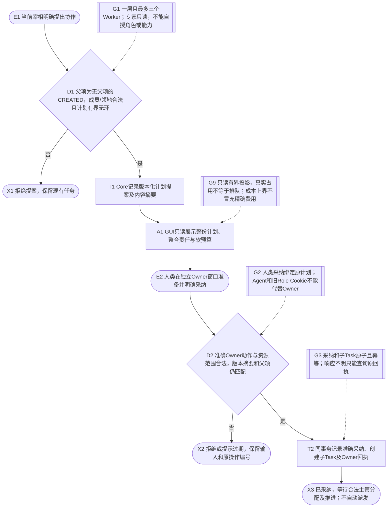
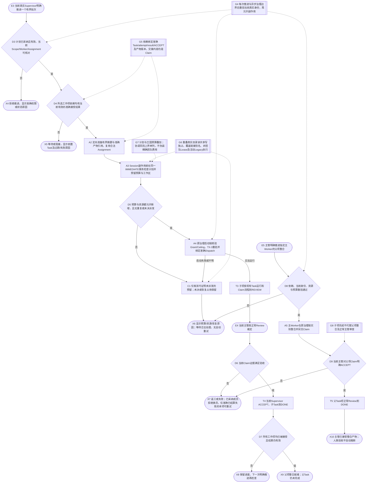
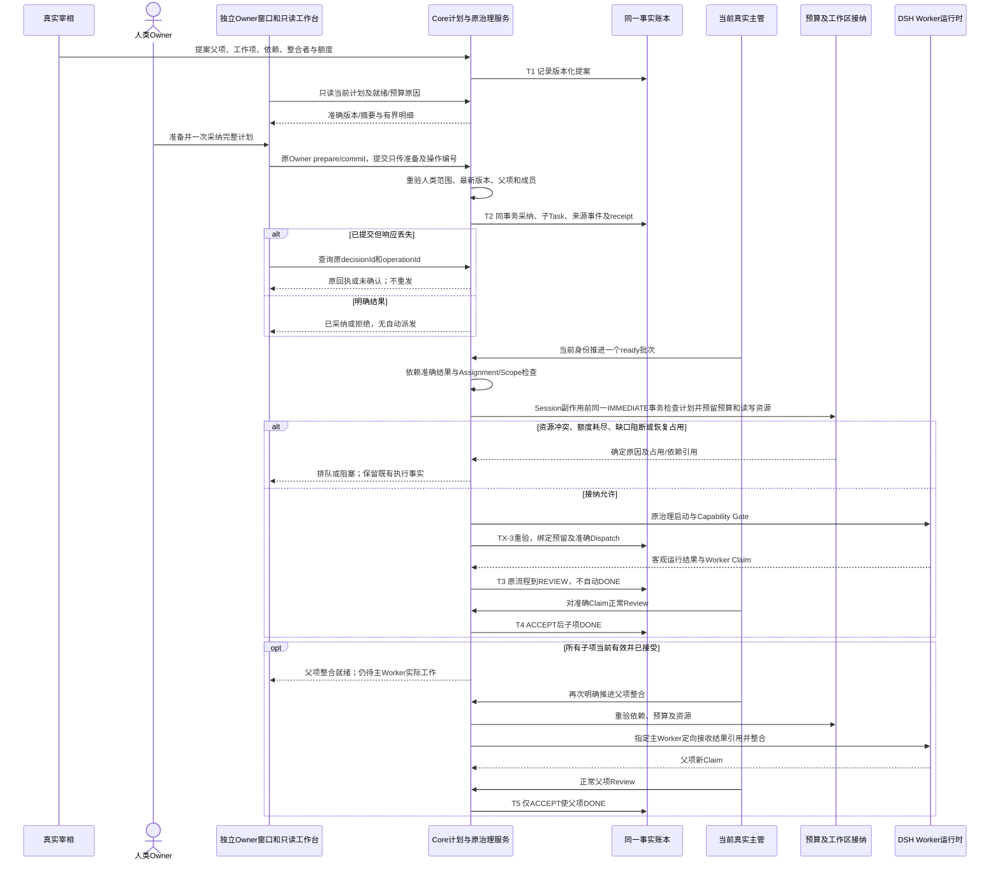
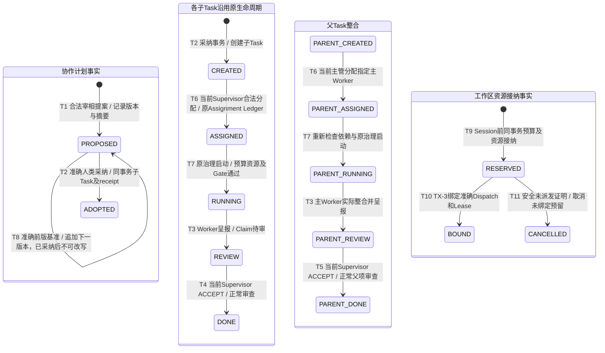

# 个人有界协作计划

## 设计范围与证据状态

依据 .local/construction-audit/20260912-v15-bounded-collaboration/00-WORK-ORDER.md。本合同已对照当前Core计划、资源接纳、advanceCollaboration、Owner及GUI源码核对，主流程全量460/460、官方DSH隔离旅程、16场景浏览器和Flow finalize通过。现有身份、Task、Owner prepare/commit/receipt、Capability Gate、预算及恢复机制继续作为权威接缝；本地测试和合成浏览器证据不等于真实Provider收益或人类验收。

单 Worker 仍是默认。需要协作时，宰相提出一层 EXPERT 或 TEAM 计划，人类在独立 Owner 窗口一次采纳整份确定内容。计入主整合者后最多三个不同 Worker。EXPERT 的专家强制只读；TEAM 使用明确资源范围。没有递归扩队、后台无界调度、自动 ACCEPT、角色升级或跨任务记忆。

计划包含父 Task、ID/版本/摘要、拆分理由、工作项 key/TaskID、范围、验收、领地和 Worker、访问模式、依赖、预期产物、整合者以及整项软额度/单次估计。文件列表表达责任，实际隔离以规范化真实工作区及运行时限制为准。

## 提案与一次采纳

## 有界推进与整合

## 组件时序

## 持久状态与推导状态

子项和父项图复用原Task成功状态链，不允许跨越ASSIGNED或RUNNING。STALE、依赖就绪、资源是否仍占用、预算阻断、整合就绪均是当前事实推导，不写作新计划持久状态。BOUND资源是否释放由准确终态Dispatch和已释放Lease决定，不虚造资源RELEASED事件。返工、失败、交接及恢复沿用原服务和原合同；本流程不发明取消恢复的捷径。

## 失败、安全收缩与可观察结果

- 发布审查修复：已采纳成员的 HANDOFF 在写事务内拒绝，Task、Assignment 和事件不变。FAILED/ABORTED 仅在当前项最新 Claim、attempt、Execution 与 REWORK 摘要完全匹配且执行/Dispatch/Lease 均已结算时允许本项重试；普通未失败兄弟仍被阻断；多个已明确返工且已结算的失败成员可逐个重试，避免相互等待。TX-3仅排除当前调用准确下一尝试的DISPATCH_READY Lease，历史未决锁仍阻断。无资源记录的活动 Legacy 执行保守视为写占用，Legacy 启动与 governed 预留双向检查真实目录，检查与创建执行事实同处 IMMEDIATE 事务。

- 未采纳、版本被替换、父项或成员事实改变时拒绝推进；采纳过期须重新读取和准备。一次用户采纳不代替主管Assignment、Grant、Owner Ceiling或产物Review。
- index的runGovernedStart向runGovernedTask、Gate与派发传递内部stillAuthorized校验；S4、Session、preflight、materialize及trustFence等await之后，在后续副作用前重查当前Supervisor身份和范围。此内部回调不是模型可提供的权限参数，异步期间撤销不因旧的批次校验而失效。
- 准确依赖至少绑定计划版本、Task、最新attempt、result引用与有效主管ACCEPT；产物携带版本/内容摘要和引用，有限摘要定向进入Worker上下文。缺失、失败、过期或验收不明都会阻断后继；多数模型同意不构成验收。
- 无Task文件级enforcement时，重叠真实工作区实行读共享/写独占；目录链接和别名必须归一，非团队未释放Lease和旧尚未派发预算预留按独占保守参与冲突。计划检查、预算和资源预留在Session副作用前的同一IMMEDIATE事务完成，TX-3重新核验并绑定准确Dispatch，不能仅比较用户填写的文件清单。
- 王国与整项软预算同时约束新增工作。预算视图明确标为 PLAN_WITH_KINGDOM_COORDINATION_UPPER_BOUND：Worker准确实报、同期王国协调成本保守上界、估计预留和归属缺口分别显示，金额保持未测。不把协调共享来源重复累加或精确摊给某个工作项。
- 到达上限、发现依赖风险或无法证明收益时停止新增并行；既有工作仍按原治理对账。只有能证明未派发且无未结算运行/Lease的预留才允许取消；RECOVERING和未确认结果保留占用。缩为串行不等于终止所有Agent。
- 现阶段没有后台调度循环、自动重试或新增计时器。kingdom_advance_collaboration经真实调用身份进入advanceCollaboration：SERIAL一次一个且等待已有执行/预留结算，PARALLEL一次最多两个独立子项，父项整合单独推进。批次先同事务核验范围并完成正常分配，每次启动再次读取真实身份；首项立即拒绝可停止后续启动，已接纳独立工作不因另一项失败被取消。重复调用及RUNNING无最新准确REWORK均拒绝。运行超时、派发不明、恢复和清理沿用原governed路径；Owner准备验证沿用有界超时，过期和撤销继续生效。
- GUI只读显示计划摘要、采纳状态、各项依赖/预算原因、整合者和费用缺口。计划显示至多40份，Owner待采纳总数仍计全部提案；资源显示至多80项，只含Task/attempt、访问模式、接纳状态和恢复标记，不泄漏工作路径。无持久排队事实时只展示实际占用，无记录不代表空闲或自动排队。Owner仅从服务端完整Scope过滤目录中选择PROPOSED计划，version/digest只读，payload精确三字段；最终完整内容在服务端prepare预览重新确认，commit仍只带原准备/操作编号。
- 计划事实和决定属于Core事件，子项归Tasks、分配归Assignment Ledger，执行和资源归原执行服务及新增接纳事实；Adapter仅提供运行证据，不持有另一份治理真相。

## 验证与实际边界

测试映射覆盖：未采纳、错角色/范围、环及递归/成员超限、版本替换、父项变化、原子采纳及重放；依赖失败/过期/错误attempt、重复推进；同目录/重叠目录/链接别名/非团队Lease竞争及恢复占用；预算耗尽/缺失观测；所有子项接受后父项仍须实际整合及正常Review。代码映射只指实际文件和符号，完整验证由主流程统一记录。

- GUI专属5项及受影响成本/工作台/Owner回归37/37通过；资源GUI夹具必须先经真实Supervisor分配再申请接纳，不能跳过Core规则。
- browser-collaboration-report.json记录16个Owner/console四主题×1366/390场景，无水平溢出或JavaScript错误；键盘计划选择、预览、提交后只有1次采纳和2个子Task，Execution/Dispatch均为0，父项仍CREATED。另记录真实资源预留展示、合成缺失usage导致BLOCK_UNKNOWN及减少动态偏好。截图位于同run的screenshots-collaboration。浏览器使用独立库和synthetic canonical direct，不是实际真人或Provider请求；本轮不把截图结构检查称为像素复核。
- 官方闭包或本机脚本模型只能证明接缝，真实交付质量、人工协调时间、端到端时间和总成本需另行代表任务对照，未证明收益前协作不自动默认。主流程负责Flow最终验证/finalize、官方探针及独立视觉复核。
