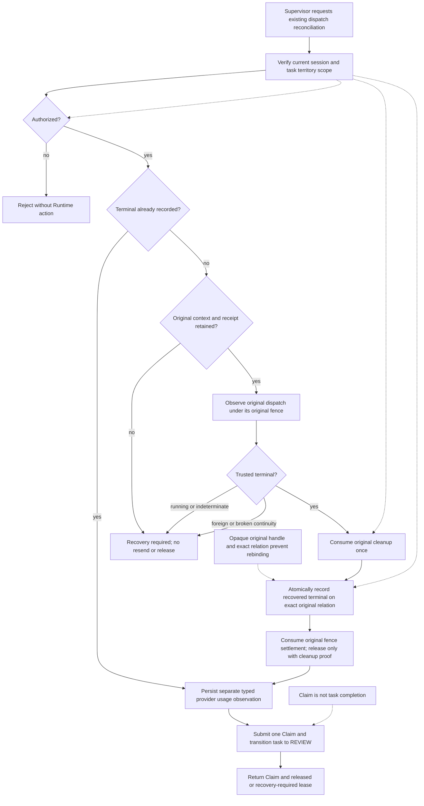
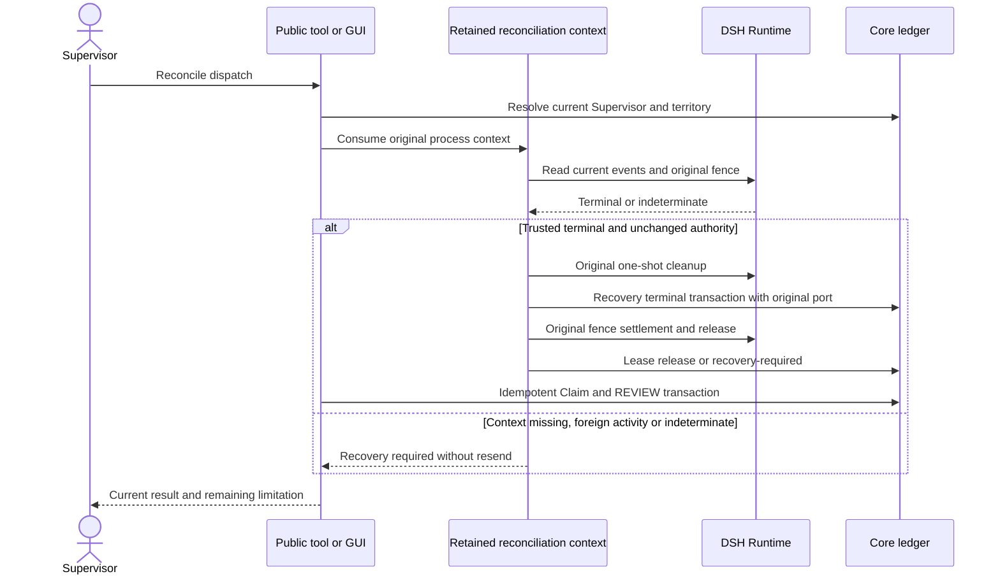
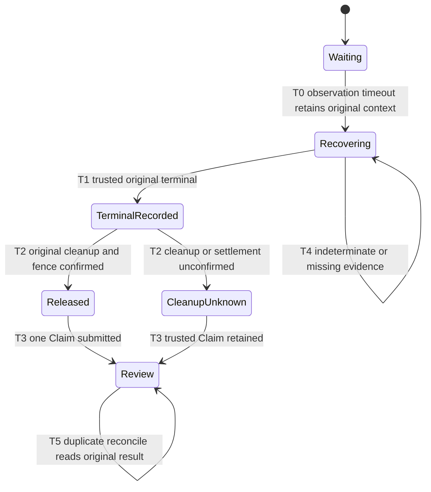

# Governed reconcile

An authenticated, currently scoped Supervisor explicitly reconciles an existing dispatch through the tool or local GUI. Reconciliation never dispatches another prompt. The original process may retain the exact RunnerContext, Runtime fence and one-shot cleanup callback after an observation timeout. Only that original context may consume late terminal evidence. Missing receipt, lost process context, unreadable events and foreign activity remain recovery-required. No restart cleanup is inferred from an empty disposer registry.

The recovery-specific methods do not enable normal RunnerContext recreation. They accept the same opaque handle/version held at timeout. Unrelated ledger revisions may advance while waiting; any change to the exact task, execution, lease or dispatch tuple invalidates recovery. The GUI cannot supply Runtime evidence, a Session, a role or a cleanup receipt.

Validation covers late-terminal completion, duplicate requests, authorization loss, cross-territory access, lost process context, foreign activity, unconfirmed cleanup, atomic rollback and failure after Runtime fence release. Public Tool and loopback HTTP tests exercise the registered routes; WAIT and missing dispatch return `ok=false / RECOVERY_REQUIRED` in the GUI. Provider/runtime usage is persisted separately as typed runtime-observation events and never used as terminal or cleanup proof. Usage observations also occur after unsuccessful starts and WAIT results when the same receipt is observable; missing usage is never interpreted as zero cost.
