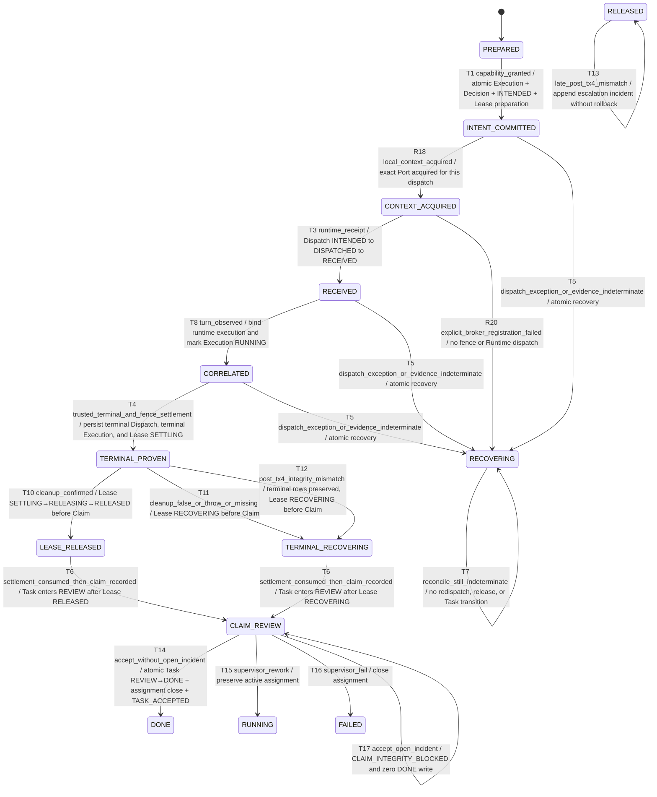

# Governed-start Supervisor caller authorization and persistent dispatch

- Feature ID: `governed-start.supervisor-authz`
- Status: `implemented` (R02 reconciled against the final candidate source and
  isolated verification evidence)
- Impact: `updated`

## Scope and classification

`kingdom_start_task_governed` is the canonical headless execution route after
plan and assign. It derives the caller only from the DSH execution context,
forces `session-bound` authorization, resolves the active `SUPERVISOR` binding
for the Task Territory, validates the Supervisor Grant, and then enters the
existing persistent Session, Capability, Lease, Dispatch, terminal-evidence,
Claim, and REVIEW pipeline.

`kingdom_start_task` remains an explicit `LEGACY_COMPAT` one-shot path. A
persistent failure, response loss, missing terminal evidence, or recovery state
never selects it automatically.

Before any Runtime lookup, Worker Session create/resume, Lease acquisition,
Capability Decision, Execution, or Dispatch write, the entry re-reads the Task
and rejects a new attempt when the latest nonterminal
`GOVERNED_PERSISTENT` Execution is `STARTING`, `RUNNING`, `PAUSED`, or
`RECOVERING`. A missing active Lease does not bypass this Task-level exclusion.

The Capability Gate computes `Effective = Grant ∩ Ceiling ∩ EnforceableSet`;
coverage is informational and never substitutes for effective capability.
The Runtime EnforceableSet is rebuilt from the current context-bound Session;
constructor-time policy setter presence is not capability evidence.
`filesystem.write` is an explicit member of that intersection: a requested
`workspace-write` mode is retained only when the effective set contains write.
If write is not required, a missing write capability bounds the request to
`read-only` and records `boundedNarrowing`; if required write is missing or
the requested mode is `read-only`, the Gate fails closed with DENIED and zero
dispatch. Missing intersection or uncertain materialize/enforcement fails
closed, while terminal teardown consumes the exact materialized request exactly
once. A `CONFIRMED` cleanup receipt with bounded evidence is required for
`RELEASED`; false, throw, or missing evidence preserves the Claim/REVIEW
attempt as `RECOVERING` with an explicit reason.
When the ceiling is absent, the Gate records `DENIED + NOT_ATTEMPTED` without
calling Runtime capability inspection. Materialize requires direct sandbox and
approval setters to append exact current-session policy events and verifies the
resulting effective state; a direct no-op or mismatched setter cannot produce
`ENFORCED`, including for `read-only`. When the optional `presetId` seam is
supplied, the Permission Preset setter is checked against the current
sandbox/approval/preset state; a valid repeated preset selection may be an
idempotent no-new-event path, but the state must still match. The current
canonical governed-start route does not pass `presetId`; this branch is only a
bounded adapter seam/test contract, not a real DSH runtime execution claim in
this run. A successful Capability Gate returns the exact EnforcementRequest
object used by both preflight and materialize so later teardown cannot
recompute a drifting target. Before the Runtime dispatch side effect, Primary
opens a module-private, session-bound trust fence, then binds the accepted
Runtime dispatch reference to that fence. After trusted terminal evidence, the
same fence is checked, held as a cleanup reservation, and consumed by exactly
one cleanup call with that request and the same context. The fence remains held
through terminal settlement and release; settlement consumes the bounded
receipt and never treats a bare boolean as release evidence.
If the Runtime maintenance reservation rejects, throws synchronously, or
enters cleanup with an already-aborted signal, the Adapter taints this exact
fence before propagating the error; the subsequent settlement check therefore
fails closed before terminal persistence or release, and the disposer is not
called.
After Capability is `GRANTED + ENFORCED`, one TX-3 transaction creates the
governed Execution, binds `Decision.execution_id`, persists `Dispatch INTENDED`,
and advances the Lease from `DISPATCH_READY` to `EXECUTING`. Runtime identity is
resolved before that transaction, and the Runtime side effect starts only after
all four writes commit. A Dispatch Receipt only proves Runtime acceptance; it is
not terminal evidence. If turn and terminal evidence first appear together, the
turn is correlated and the Execution becomes `RUNNING` before terminal evidence
is written. A bounded poll/reconciliation ambiguity or any post-commit dispatch,
receipt, correlation, or terminal-write exception atomically moves Dispatch,
Lease, and Execution to `RECOVERING`; Task governance remains unchanged and the
system does not redispatch, release the Lease, create a new attempt, or fabricate
a terminal result.

Capability ceiling setup is an independent direct Owner Slash flow, not a call
inside governed start. `/kingdom ceiling` may persist a boolean map (including
an empty map) or `clear=true`; the Capability Gate later reads that persisted
fact and fails closed when it does not authorize the Grant. Agent Tool and
GUI/HTTP spellings remain zero-write denied. The separate `kingdom_start_task`
Tool is likewise an independent `LEGACY_COMPAT` entry and requires
`legacy_opt_in=true`; governed failure never selects it.

After TX-3, every dispatch creates and acquires its exact local canonical
`RunnerContext` before `openTrustFence` or Runtime dispatch. Normal plugin
`apply()` neither creates nor owns a broker epoch, so repeated lawful governed
starts cannot consume a process-wide registration slot. Only a caller that
explicitly creates the public run-scoped Product lifecycle activates one broker
epoch; that explicit lifecycle may register exactly one Port, issue one ticket,
and expose a serialized transport bootstrap to a cross-realm consumer. Without
that explicit lifecycle the local Port is sufficient and no epoch, ticket, or
cross-realm bootstrap exists.

R20 closes the optional cross-realm consumer seam: the parent passes only a
serialized Product-issued environment (or an exact `{environment, descriptor}`
bootstrap) to the root `connectRunnerContextBroker` API. That connector reads
the current Product-owned descriptor, validates its exact endpoint/instance
binding, and performs the existing challenge/HMAC exchange; it never looks up a
launch object or creates a second broker. Tampered, stale, foreign, or
extra-field bootstrap fails closed. The bounded wire view contains
phase/revision/state observations only; ticket, nonce, and revision are
transport capabilities and never Governance Authority. A registration or ticket
failure on the explicit lifecycle enters the existing three-ledger RECOVERING
path without opening a Runtime fence or calling dispatch. A crash after
settlement but before Claim remains a bounded handoff to existing
reconciliation/Claim recovery; this flow does not add crash persistence or a
new schema transaction.

The governed runner first proves the same fence at the terminal-write,
cleanup-reservation, and pre-terminal settlement checks, then current source
records terminal Dispatch/Execution/Lease evidence. The public entry next
derives the canonical Runner context from that committed exact relation and
consumes the same opaque handle/version through `settleAndRelease` **before**
recording the Worker Claim and Task `REVIEW`. Ordinary cleanup failure may
therefore leave the terminal rows plus Lease `RECOVERING` while still allowing
the Claim; an unprovable exact relation or incident write fails before Claim.
It emits the `SESSION_STOPPED` event label only after confirmed cleanup, fence
release, and `Lease=RELEASED`; that label records the settled Execution path, it
does not invoke Runtime Session stop and does not prove the persistent Worker
Session was disposed. On a late foreign ingress, unrecognized/tainted fence, or
cleanup false/throw/missing evidence, the bounded observation is retained but
the relevant ledgers remain `RECOVERING`, no stop label is emitted, and the
Session remains ineligible for reuse until reconciliation.

Before the terminal Claim/REVIEW relation exists, the R11 product port
revalidates the exact Dispatch→Task/attempt→Execution→Lease relation and
consumes the same Adapter-instance/lease/Session fence through settlement. A
post-TX-4 identity or fence mismatch is handled by
`recordDispatchTerminalIntegrityIncident` in one
`BEGIN IMMEDIATE`: terminal Dispatch and terminal Execution remain immutable,
`SETTLING`/`RELEASING` Lease rows move to `RECOVERING`, and one bounded,
redacted, replay-idempotent incident is appended. A `RELEASED` row is never
rolled back; a later mismatch only appends an escalation incident. The public
Supervisor `ACCEPT` gate re-reads the exact Task and Claim in its own write
transaction and rejects an open incident as `CLAIM_INTEGRITY_BLOCKED` without
`TASK_ACCEPTED`, `DONE`, or assignment closure. `REWORK` and `FAIL` remain
explicit recovery decisions and are not blocked by that incident.

## Runtime flow

```mermaid
flowchart TD
    E0(["E0 Human Owner invokes direct /kingdom ceiling"]) --> D5{"D5 Direct Owner capability and valid ceiling set/clear request?"}
    D5 -->|No| X6(["X6 CONFIG_DENIED or INPUT_DENIED; no ceiling write"])
    D5 -->|Yes| A5["A5 Persist or clear ceiling and append audit event"]
    A5 --> X9(["X9 Ceiling fact updated; governed execution remains subject to Capability Gate"])

    E2(["E2 Caller invokes separate kingdom_start_task Tool"]) --> D0{"D0 legacy_opt_in is exactly true?"}
    D0 -->|Yes| X0(["X0 Explicit one-shot compatibility path"])
    D0 -->|No| X10(["X10 LEGACY_COMPAT_REQUIRED; zero one-shot execution"])

    E1(["E1 Headless user invokes kingdom_start_task_governed"]) --> A0["A0 Enter canonical governed persistent start seam"]
    A0 --> A1["A1 Resolve trusted caller session through the complete DSH registry seam"]
    A1 --> D1{"D1 Trusted DSH caller session classification is ACTIVE"}
    D1 -->|No| X1(["X1 AUTHZ_DENIED; zero governed preparation"])
    D1 -->|Yes| A2["A2 Resolve caller-owned Supervisor binding and Task Territory scope"]
    A2 --> D2{"D2 Caller is the active Supervisor for the Task Territory"}
    D2 -->|No| X2(["X2 AUTHZ_DENIED; zero governed preparation"])
    D2 -->|Yes| A3["A3 Parse authenticated Supervisor Grant"]
    A3 --> D3{"D3 Grant is a non-empty boolean capability object"}
    D3 -->|No| X3(["X3 INPUT_DENIED; zero governed preparation"])
    D3 -->|Yes| D6{"D6 Latest GOVERNED_PERSISTENT Execution is terminal or absent"}
    D6 -->|No| X7(["X7 EXISTING_EXECUTION_UNSETTLED or RECOVERING; no Runtime, Session, Lease, or ledger side effect"])
    D6 -->|Yes| D11{"D11 Worker affinity/Runtime has no active or recovering Lease before Session side effect"}
    D11 -->|Guard passes| A4["A4 Establish or resume Worker Session and run Capability Gate with bounded sandbox mode"]
    D11 -->|active/recovery/orphaned Lease or identity unresolved| X12(["X12 RECOVERING guard; no Session reuse/create/resume or Dispatch"])
    A4 --> D4{"D4 Context-bound effective capability and required write are enforceable"}
    D4 -->|No| X4(["X4 CAPABILITY_DENIED with existing zero-execution cleanup"])
    D4 -->|Yes| D9{"D9 Requested sandbox mode is within the effective write upper bound"}
    D9 -->|workspace-write with effective filesystem.write| T1["T1 Atomically create STARTING Execution, bind Decision, persist INTENDED, and advance Lease to EXECUTING"]
    D9 -->|workspace-write without required write| A8["A8 Bound request to read-only and record boundedNarrowing"]
    D9 -->|read-only without required write| T1
    D9 -->|read-only with required write| X4
    A8 --> T1
    T1 --> A17["A17 Create and acquire the exact local canonical RunnerContext for this dispatch"]
    A17 --> D20{"D20 Caller explicitly created an active public run-scoped Product lifecycle"}
    D20 -->|No| A11["A11 Open module-private fence bound to exact Adapter instance, lease, and Session before dispatch"]
    D20 -->|Yes| A18["A18 Register the exact Port once in that explicit epoch and issue one transport ticket/bootstrap"]
    A18 -->|registration and ticket succeed| A11
    A18 -->|registration, relation, or ticket failure| C1
    A11 -->|fence opened and reservation seam proven| A6["A6 Invoke Runtime dispatch only after the complete TX-3 commit"]
    A11 -->|identity, baseline, or reservation indeterminate| C1
    A6 --> T3["T3 Record Receipt: Dispatch INTENDED to DISPATCHED to RECEIVED; Receipt is not Terminal"]
    A6 -->|post-commit dispatch exception| C1
    T3 -->|receipt exception| C1
    T3 --> A12["A12 Bind the accepted Runtime dispatch reference with the exact Adapter/lease/Session expectation"]
    A12 -->|exact ref and fence valid| D8{"D8 A turn for this dispatch is observed before bounded polling is exhausted?"}
    A12 -->|foreign, ref mismatch, or indeterminate fence| C1
    D8 -->|No or indeterminate| C1
    D8 -->|Yes| T8["T8 Correlate Dispatch RECEIVED to CORRELATED and Execution STARTING to RUNNING"]
    T8 -->|correlation exception| C1
    T8 --> D7{"D7 Trusted terminal evidence is observed within the bounded window"}
    D7 -->|Yes, exact correlated terminal and no foreign user message| A7["A7 Check exact Adapter/lease/Session fence, reserve Runtime ingress, and invoke exact cleanup once"]
    A7 -->|cleanup Promise pending| A13["A13 Hold the same reservation and prevent or queue unmanaged ingress until cleanup resolves"]
    A13 -->|cleanup resolved and ingress isolated| D14
    A13 -->|unmanaged ingress not isolated or fence indeterminate| C1
    A7 -->|bounded cleanup receipt returned; reservation remains held| D14{"D14 Same fence remains valid at settlement check?"}
    A7 -->|fence tainted/indeterminate or reservation failure| C1
    D14 -->|Yes| T4["T4 Persist terminal Dispatch, terminal Execution, and Lease SETTLING"]
    D14 -->|No| C1
    T4 -->|terminal write exception| C1
    T4 --> A16["A16 Derive exact RunnerContext and consume its same handle/version for settlement before Claim"]
    A16 --> D10{"D10 Cleanup receipt is CONFIRMED with bounded evidence?"}
    D10 -->|Yes| D15{"D15 Exact post-TX-4 Dispatch/Task/attempt/Execution/Lease and fence still match before release?"}
    D15 -->|Yes| A9["A9 Settle Lease through RELEASING to RELEASED; emit SESSION_STOPPED label without stopping persistent Session"]
    A9 --> A10["A10 Persist Worker Claim and Task REVIEW only after settlement outcome is known"]
    A10 --> D19{"D19 Settlement result is RELEASED, ordinary recovery, or integrity recovery?"}
    D19 -->|RELEASED| X5(["X5 Claim awaits Supervisor review; Runtime terminal is not DONE"])
    D19 -->|ordinary cleanup recovery| X11(["X11 Recovery required; Claim/REVIEW retained; no stop label or Session reuse"])
    D19 -->|integrity incident recovery| X13(["X13 Integrity incident open; Claim/REVIEW retained; no release assertion or Session reuse"])
    X5 --> D16{"D16 Supervisor review decision is ACCEPT?"}
    X11 --> D16
    X13 --> D16
    D16 -->|No: explicit REWORK or FAIL| A14["A14 Apply REWORK or FAIL governance decision; the integrity gate is ACCEPT-only"]
    A14 --> X14(["X14 Task follows the explicit REWORK or FAIL decision"])
    D16 -->|Yes| D17{"D17 Exact current Task/Claim has no open terminal-integrity incident?"}
    D17 -->|Yes| A15["A15 In one transaction transition REVIEW to DONE, close assignment, and emit TASK_ACCEPTED"]
    A15 --> X15(["X15 Task DONE; accepted Claim becomes organization fact"])
    D17 -->|No: exact incident is open| X16(["X16 CLAIM_INTEGRITY_BLOCKED; zero TASK_ACCEPTED, DONE, and assignment close"])
    D15 -->|No: post-TX-4 identity or fence mismatch| C3["C3 In one BEGIN IMMEDIATE revalidate the exact relation; preserve terminal Dispatch/Execution, recover the Lease, and append one bounded incident"]
    C3 --> A10
    D10 -->|No: false, throw, or missing evidence| C2["C2 Preserve Claim/REVIEW and move Lease to RECOVERING"]
    C2 --> A10
    D7 -->|No, indeterminate, or foreign user message| C1["C1 Atomically move Dispatch, Lease, and Execution to RECOVERING"]
    C1 --> X8(["X8 Task unchanged; no redispatch, Lease release, new attempt, or fake terminal"])

    G1[["G1 Only the current initiator plus exact Agent/Session registry identity, running status, and non-aborted signal can establish the caller target"]] -.-> A1
    G1 -.-> D1
    G2[["G2 Exact caller-owned Supervisor binding and Territory scope precede Grant and executor"]] -.-> A2
    G2 -.-> D2
    G2 -.-> A4
    G3[["G3 Capability Gate is the sole capability authority"]] -.-> D4
    G3 -.-> T1
    G4[["G4 Governed and LEGACY_COMPAT are independent entries; persistent failure never selects one-shot"]] -.-> E2
    G4 -.-> D0
    G4 -.-> A0
    G5[["G5 Only direct Slash-minted Owner capability may write the ceiling"]] -.-> A5
    G5 -.-> D5
    G6[["G6 Unproven external outcome stays fail-closed and never selects retry or one-shot"]] -.-> D7
    G6 -.-> X8
    G7[["G7 Runtime identity precedes one atomic TX-3 commit; Runtime dispatch follows it"]] -.-> T1
    G7 -.-> A6
    G8[["G8 Receipt, Correlation, and Terminal are distinct; an observed turn is correlated before trusted terminal settlement"]] -.-> T3
    G8 -.-> D8
    G8 -.-> T8
    G8 -.-> D7
    G8 -.-> T4
    G9[["G9 Any latest nonterminal persistent Execution excludes a new attempt before all Runtime and ledger effects"]] -.-> D6
    G9 -.-> X7
    G10[["G10 Recovery is atomic and idempotent; RECOVERING forbids redispatch, release, and Task mutation"]] -.-> C1
    G10 -.-> X8
    G11[["G11 Direct Owner ceiling setup is independent; Capability Gate alone consumes the persisted ceiling fact"]] -.-> A5
    G11 -.-> D4
    G12[["G12 Requested workspace-write never exceeds effective filesystem.write; non-required write loss narrows to read-only and required write loss denies"]] -.-> D4
    G13[["G13 Current Session state proves direct setter events or matching idempotent preset state; canonical route preset evidence remains bounded"]] -.-> D4
    G13 -.-> D9
    G14[["G14 Adapter-instance-private fence binds exact Adapter, lease, Session, and monotonic generation from pre-dispatch through cleanup/release; only its exact request/context may reach one cleanup call, including a pending cleanup Promise window"]] -.-> A11
    G14 -.-> A12
    G14 -.-> D10
    G14 -.-> A7
    G14 -.-> A13
    G14 -.-> D14
    G14 -.-> T4
    G14 -.-> A9
    G15[["G15 Only a bounded CONFIRMED cleanup receipt permits RELEASED; every other receipt preserves RECOVERING and blocks reuse"]] -.-> D10
    G15 -.-> A9
    G15 -.-> C2
    G15 -.-> T10
    G15 -.-> T11
    G16[["G16 Current Worker affinity and Runtime identity are checked against every non-RELEASED Lease before getLiveHandle, resume, or create; RECOVERING blocks reuse"]] -.-> D11
    G16 -.-> A4
    G16 -.-> X12
    G17[["G17 Foreign user activity or unmanaged ingress taints the same exact fence; pending cleanup ingress is prevented/queued; pre-terminal taint recovers all three ledgers, while post-TX-4 mismatch preserves terminal ledgers, recovers the Lease, and records an incident"]] -.-> A12
    G17 -.-> D7
    G17 -.-> C1
    G17 -.-> A7
    G17 -.-> A13
    G17 -.-> D14
    G17 -.-> D15
    G17 -.-> C3
    G18[["G18 Supervisor ACCEPT is the only incident-gated review decision; it re-reads the exact Task and Claim in the same transaction, while REWORK and FAIL remain explicit alternatives"]] -.-> D17
    G18 -.-> A15
    G18 -.-> T14
    G18 -.-> T17
    G12 -.-> D9
    G12 -.-> T1
    G19[["G19 The product RunnerContext factory derives one exact Task/Execution/Lease/Dispatch relation; every operation consumes the same opaque handle and internal-metadata monotonic version, rereads the relation, and rejects stale, copied, cross-target, duplicate, recovery, or released use"]] -.-> A16
    G19 -.-> D15
    G19 -.-> D19
    G19 -.-> A10
    G20[["G20 Normal apply owns no broker epoch; only an explicit run-scoped lifecycle may register one Port/ticket. Any active broker remains transport-only with one epoch, one authenticated connection, strict bootstrap validation, bounded DTOs, and no wire governance mutation"]] -.-> A17
    G20 -.-> D20
    G20 -.-> A18
    G20 -.-> T3
    G20 -.-> T8
    G20 -.-> A16
```



## Component sequence

```mermaid
sequenceDiagram
    actor Caller as DSH caller Agent session
    participant Owner as Direct Owner Slash
    participant Tool as Governed-start Host seam
    participant Auth as Supervisor scope resolver
    participant Store as KingdomStore
    participant Executor as Governed task runner
    participant Broker as Product-child RunnerContext broker
    participant Parent as Parent Runner consumer
    participant Runtime as DeepSeek Harness Runtime Adapter

    opt Independent Owner setup or reset
        Owner->>Store: direct /kingdom ceiling {boolean map} or clear=true
        alt missing direct Owner capability or invalid request
            Store-->>Owner: CONFIG_DENIED or INPUT_DENIED; no write
        else valid direct Owner Slash
            Store-->>Owner: persist/clear ceiling and append audit event
        end
    end
    opt Independent explicit compatibility request
        Caller->>Tool: kingdom_start_task(task, legacy_opt_in)
        alt legacy_opt_in is exactly true
            Tool-->>Caller: enter LEGACY_COMPAT one-shot path
        else opt-in absent or false
            Tool-->>Caller: LEGACY_COMPAT_REQUIRED; zero execution
        end
    end
    Caller->>Tool: kingdom_start_task_governed(task, grant, sandbox_mode)
    Tool->>Auth: resolve activation session to Task Territory Supervisor
    Auth->>Store: read Task, bindings, and Territory
    alt identity, role, scope, or Grant rejected
        Tool-->>Caller: AUTHZ_DENIED or INPUT_DENIED; zero governed preparation
    else caller and Grant accepted
        Tool->>Store: read latest Task Execution
        alt latest GOVERNED_PERSISTENT Execution is nonterminal
            Store-->>Tool: STARTING, RUNNING, PAUSED, or RECOVERING
            Tool-->>Caller: EXISTING_EXECUTION_UNSETTLED or RECOVERING; no Runtime/Session/Lease access
        else no unsettled persistent attempt
            Tool->>Executor: runGovernedTask(caller-resolved binding, Grant)
            Executor->>Runtime: read-only identify Runtime and Store affinity/active-Lease guard
            alt active/recovery/orphaned Lease or identity unresolved
                Executor-->>Tool: RECOVERING guard rejection; no Session side effect or Dispatch
            else guard passes
                Executor->>Runtime: establish or resume persistent Worker Session
            Executor->>Store: acquire Lease and run Capability Gate with requested sandbox mode
            alt Capability denied or cannot be enforced
                Executor-->>Tool: CAPABILITY_DENIED after existing cleanup
            else GRANTED plus ENFORCED
                alt requested workspace-write lacks effective write and write is not required
                    Executor->>Store: persist read-only Enforcement Plan and boundedNarrowing evidence
                else requested mode is within effective write upper bound
                    Executor->>Store: persist the bounded Enforcement Plan and evidence
                end
                 Executor->>Runtime: identify and verify live Session identity before writes
                  Executor->>Store: one TX-3 transaction creates Execution, binds Decision, commits INTENDED, advances Lease EXECUTING
                  Executor->>Executor: create and acquire exact local canonical RunnerContext
                  alt explicit public run-scoped Product lifecycle is active
                      Executor->>Broker: register one exact committed Port and issue one ticket
                      Broker-->>Executor: explicit epoch registration ready; no governance IDs cross wire
                      Broker-->>Parent: serialize Product-issued environment or exact descriptor bootstrap
                      Parent->>Broker: root connectRunnerContextBroker(serialized bootstrap)
                      Broker->>Broker: read/validate current descriptor, then challenge/HMAC authenticate the existing endpoint
                      Broker-->>Parent: bounded state view from the existing Product Port; no new broker or governance mutation
                  else normal apply without a public lifecycle
                      Executor-->>Executor: local Port remains internal; no epoch, ticket, or bootstrap
                  end
                  Executor->>Runtime: open Adapter-instance-private fence bound to exact lease and Session before dispatch
                Runtime-->>Executor: opaque fence reservation
                Executor->>Runtime: dispatch after complete TX-3 commit
                Runtime-->>Executor: Dispatch Receipt
                Executor->>Store: INTENDED -> DISPATCHED -> RECEIVED; Receipt is not Terminal
                Executor->>Runtime: bind Runtime dispatch ref and inspect exact Adapter/lease/Session expectation plus fence generation
                loop bounded correlation and terminal polling
                    Executor->>Runtime: re-read correlated session events
                end
                alt turn observed, including turn and terminal first appearing together
                     Executor->>Store: RunnerContextPort.bindRuntimeReceipt then correlateRuntimeExecution; RECEIVED -> CORRELATED and Execution STARTING -> RUNNING
                    alt foreign user message observed
                        Executor->>Store: Preserve Receipt; atomically move Dispatch, Lease, and Execution to RECOVERING
                        Executor-->>Tool: recovery-required; no terminal, Claim, cleanup, or release
                    else exact trusted terminal with no foreign user message
                        Executor->>Runtime: check exact terminal-write fence and reserve ingress
                        Executor->>Runtime: cleanup exact materialized request + same context exactly once
                        alt cleanup Promise remains pending
                            Runtime-->>Executor: same reservation holds; unmanaged ingress is prevented or queued
                        end
                        Runtime-->>Executor: bounded cleanup receipt
                        alt same fence remains valid at settlement check
                            Executor->>Store: Dispatch TERMINAL + Execution terminal + Lease SETTLING
                            Executor-->>Tool: trusted terminal, bounded cleanup receipt, and Runtime evidence
                            Tool->>Store: RunnerContextPort derives exact relation and rereads its version
                            Tool->>Store: settleAndRelease consumes the same opaque handle/version before Claim
                            alt cleanup CONFIRMED with evidence
                                Executor->>Runtime: settlement check for the same exact Adapter/lease/Session fence
                                alt exact post-TX-4 relation and fence match
                                    Executor->>Runtime: release the same fence
                                    Executor->>Store: SETTLING -> RELEASING -> RELEASED with ReleaseEvidence
                                    Executor->>Store: emit SESSION_STOPPED label without Runtime Session stop
                                    Tool->>Store: Worker Claim + Task REVIEW
                                    Executor-->>Tool: Claim awaiting Supervisor decision
                                else post-TX-4 identity or fence mismatch
                                    Executor->>Store: BEGIN IMMEDIATE; re-read exact Dispatch/Task/attempt/Execution/Lease relation
                                    Executor->>Store: preserve terminal Dispatch/Execution, recover Lease, append one bounded redacted incident
                                    Tool->>Store: Worker Claim + Task REVIEW after incident recovery is recorded
                                    Executor-->>Tool: Claim/REVIEW retained; no release assertion or Session reuse
                                end
                            else cleanup false, throw, or missing evidence
                                Executor->>Runtime: release the same fence as RECOVERING
                                Executor->>Store: Lease -> RECOVERING before Claim; preserve Claim/REVIEW and block reuse
                                Tool->>Store: Worker Claim + Task REVIEW
                                Executor-->>Tool: Claim plus recovery-required notice; no release claim
                            end
                        else late foreign, unmanaged ingress, or fence failure
                            Executor->>Store: atomically mark Dispatch, Lease, and Execution RECOVERING; no terminal evidence
                            Executor-->>Tool: recovery-required; no Claim, cleanup disposer, or release
                        end
                    end
                else post-commit dispatch, receipt, correlation, or terminal-write exception
                    Executor->>Store: atomically mark Dispatch, Lease, and Execution RECOVERING
                    Executor-->>Tool: rethrow original error; AggregateError if recovery also fails
                else terminal evidence absent, indeterminate, or untrusted
                    Executor->>Store: atomically mark Dispatch, Lease, and Execution RECOVERING
                    Store-->>Tool: Task unchanged; no release, redispatch, or new attempt
                end
            end
        end
    end
    opt Supervisor reviews the Claim after the governed run
        Tool->>Store: reviewTask(ACCEPT | REWORK | FAIL)
        alt ACCEPT
            Store->>Store: one transaction re-reads exact Task and Claim and queries the exact open incident relation
            alt no open incident
                Store->>Store: REVIEW -> DONE, close active assignment, append TASK_ACCEPTED
                Store-->>Tool: ACCEPTED / DONE
            else incident exists
                Store-->>Tool: CLAIM_INTEGRITY_BLOCKED; zero TASK_ACCEPTED, DONE, or assignment close
            end
        else REWORK or FAIL
            Store-->>Tool: apply the explicit review decision; incident gate is not used
        end
    end
```

## Persisted state lifecycle



## Safeguards and failure semantics

- `G1` and `G2` ensure caller identity, active Supervisor binding, and exact
  Territory scope are resolved before Grant parsing and executor entry.
- `G3` keeps authorization separate from capability enforceability.
- `G4` and `G6` prohibit automatic one-shot fallback or write retry after an
  uncertain persistent outcome.
- `G7` resolves Runtime identity before writes, then commits Execution,
  Decision binding, `Dispatch INTENDED`, and Lease progression as one TX-3
  unit before the Runtime side effect.
- `G8` keeps Receipt, Correlation, and Terminal as distinct transitions; when
  turn and terminal first appear together, correlation and
  `STARTING -> RUNNING` happen before terminal settlement. Foreign user
  activity is checked before correlation and terminal settlement, and the
  Adapter-instance-private fence checks exact Adapter/lease/Session identity
  and the live prefix again at bind, cleanup reservation, and settlement.
- `G9` blocks any new attempt while the latest persistent Execution is
  nonterminal, even when its active Lease is missing.
- `G10` moves the three related ledgers and recovery events in one transaction
  for poll/reconciliation ambiguity, foreign activity, and post-commit
  exceptions; repeated recovery is a zero-write, zero-event readback.
  `RECOVERING` never changes Task governance or authorizes dispatch/release. If
  recovery itself fails, both the original and recovery errors remain visible
  through `AggregateError`.
- R6 maintenance reservation rejection, synchronous throw, and
  aborted-at-entry all taint the same fence before cleanup error propagation;
  the subsequent settlement check goes to the existing pre-terminal atomic
  recovery path, with no disposer call, terminal evidence, or release.
- `G11` keeps direct Owner ceiling administration separate from start; the
  Capability Gate consumes the persisted fact and remains the only capability
  authority for a governed attempt.
- `G12` treats `filesystem.write` as an effective capability, not as a
  consequence of the caller's requested mode: `workspace-write` is retained
  only when Grant, Ceiling, and Runtime all contain write. Otherwise a
  non-write-required attempt is materialized read-only with explicit bounded
  narrowing, while a required-write gap or read-only request for a write-required
  Task is DENIED before dispatch.
- `G13` treats the current Session policy state as the materialization evidence:
  each direct sandbox/approval setter must append the exact requested event and
  the resulting effective state must match. A direct no-op or mismatched
  setter remains DENIED before dispatch, even when an approval event already
  exists. An optional PermissionPresetService path may accept a repeated valid
  preset with no new event only when sandbox, approval, and preset state all
  match; this run's canonical route does not pass `presetId`, so that branch is
  only a bounded seam/test mapping and not a real DSH proof.
- `G19` is the product-side Runner context boundary. After the canonical
  Dispatch terminal commit, `createRunnerContextPort` derives all IDs from the
  exact Dispatch relation. Its opaque handle and monotonic version are consumed
  by `read` and `settle` (and by the receipt/terminal mutation methods for a
  connected Runner), with a fresh exact reread after every operation. A copied
  handle/version, cross-target relation, stale revision, duplicate/out-of-order
  call, or `RECOVERING`/`RELEASED` context cannot reach settlement or Claim.
- `G20` keeps the optional parent Runner bridge transport-only. Normal
  `apply()` owns no broker epoch; every dispatch instead acquires its own local
  canonical Port. Only an explicit public run-scoped lifecycle may consume one
  Port registration/ticket and expose a named pipe/UDS bootstrap. That optional
  bridge uses a fresh nonce and challenge/HMAC, rejects stale/copy/second-
  connection or out-of-order requests, bounds every NDJSON frame/observation,
  and exposes no Task/Lease/Session/Dispatch IDs, raw evidence, prompt,
  provider, path, or credential. Explicit-registration failure after TX-3 uses
  the existing atomic three-ledger recovery path before any fence or Runtime
  dispatch. A settlement-to-Claim crash is deliberately handed to existing
  reconciliation rather than claiming a new crash-persistent bridge in R18.
- The Capability Gate also returns the exact request consumed by preflight and
  materialize. Only an exact correlated terminal with no foreign user activity
  may hand that request and the same context to one terminal `adapter.cleanup`
  call. The cleanup reservation is held until settlement/release, including
  while the cleanup Promise is pending; Runtime ingress must be prevented or
  queued in that window. An
  unrecognized,
  cross-Adapter, cross-lease, cross-Session, tainted, or generation-mismatched
  fence fails closed before the disposer.
  Only a bounded `CONFIRMED` receipt releases the Lease; false, throw, or
  missing evidence keeps the Lease `RECOVERING` while preserving the terminal
  Claim/REVIEW path. A late foreign or unmanaged ingress taints the fence and
  preserves only the Receipt observation while all three ledgers recover.
  After terminal persistence, a cross-target or otherwise mismatched
  settlement enters the R8 Core incident seam: the exact relation is checked
  inside one `BEGIN IMMEDIATE`, terminal Dispatch/Execution rows remain
  unchanged, and only a non-released Lease is moved to `RECOVERING`. The
  incident payload is bounded and redacted, replay is zero-event, and a
  `RELEASED` Lease is retained as immutable history while the mismatch is
  escalated. The Supervisor `ACCEPT` gate consumes the same exact relation and
  blocks only the incident-correlated Claim; `REWORK` and `FAIL` remain open.

The machine-readable implementation and test mapping is maintained in
`traceability.yaml`. This contract describes the current source seam exactly;
in particular, `SESSION_STOPPED` is an event label rather than evidence of a
Runtime Session stop.
