# Local GUI Control Session

## Purpose and boundary

This flow turns a direct `/kingdom gui` command into a short-lived, loopback-only
browser control session. The direct DSH `CommandInvocation.agent` is captured at
activation time; the browser is only an untrusted transport client. The flow
covers activation, task planning/assignment, governed start
with an explicit existing sandbox mode, Claim review including atomic HANDOFF,
and fail-closed execution pause/resume/abort controls. It also records the
shared persistent recovery behavior reached by GUI governed start and startup
orphan reclaim. Owner-only actions are
advertised as discoverable but remain non-executable direct-Slash operations;
the retired `setup.basic` HTTP spelling is not advertised and is deny-only.

Relevant invariants: `GI-OWNER-001`, `GI-OWNER-002`, `GI-OWNER-003`,
`GI-CAP-001`, `GI-CAP-002`, and `GI-EVIDENCE-002`.

The flow does not add schema, dependencies, a second launch API, an Owner Port,
or a DSH Host capability. It does not turn a Worker Claim or Runtime completion
into `DONE`; Supervisor review remains the existing Core decision.

## Entry, preconditions, and terminal outcomes

- Entry: direct `/kingdom gui` or `/kingdom gui start`; `/kingdom gui stop`
  revokes active sessions and closes the local server when present.
- Preconditions: the local server must bind `127.0.0.1`; activation must resolve
  its actual listening Origin; the direct invocation must provide an exact Agent
  reference (and, for Role operations, a non-empty `agent.session.id`).
- Success outcome: the browser redeems one ticket, receives an HttpOnly,
  `SameSite=Strict` cookie and page CSRF token, and authorized commands enter the
  existing Core pipeline. The control view advertises HANDOFF, execution
  controls, the two existing sandbox modes, and Owner-only
  `executable=false / DIRECT_SLASH_REQUIRED` actions. The direct command result
  contains only a clean URL, expiry, and launch status.
- Rejection outcome: wrong loopback/Origin, missing or stale ticket/session,
  CSRF failure, replay, concurrent mutation, forged browser identity, an
  Owner-only command spelling, duplicate/unrecognized/wrong-type payload field, or a
  missing capability prerequisite is rejected before the protected Core/Runtime
  side effect. State-bearing GET rejects foreign Origin and missing, invalid, or
  expired read admission before its handler. A valid cookie contributes only an
  opaque activation-captured read context; Host converts it to current Projection
  security and resource `ActionAvailability` without serializing it or turning it
  into POST authority.
- Failure outcome: server startup and browser-launch failures are reported
  without the ticket. A response-loss or external Runtime uncertainty remains
  `RECOVERY_REQUIRED` with its outcome explicitly unproven; the flow does not
  auto-retry or select legacy.

## Runtime flow

```mermaid
flowchart TD
    E1(["E1 direct /kingdom gui activation"]) --> D1{"D1 command action is start, stop, or empty"}
    D1 -->|start or empty| A1["A1 ensure local GUI server and wait for actual onListening Origin"]
    D1 -->|stop| A2["A2 revoke sessions and close the local GUI runtime"]
    D1 -->|other input| X1(["X1 INPUT_DENIED; no GUI state change"])
    A1 --> D2{"D2 actual loopback server Origin becomes available"}
    D2 -->|unavailable| X2(["X2 RECOVERY_REQUIRED with outcome unproven; no ticket is returned"])
    D2 -->|available| A3["A3 capture exact invocation Agent and activate one-time ticket"]
    A3 --> A4["A4 hand ticket URL only to the local browser opener"]
    A4 --> D3{"D3 local browser opener starts"}
    D3 -->|yes| X3(["X3 clean success result with Origin and expiry"])
    D3 -->|no| X4(["X4 clean launch failure and clean Console URL; ticket remains unprinted"])

    E2(["E2 GET /console?ticket or GET /api/control"]) --> D4{"D4 transport is exact loopback and null/exact Origin for read admission"}
    D4 -->|no| X5(["X5 CONTROL_ORIGIN_DENIED; no session or command effect"])
    D4 -->|yes| D5{"D5 ticket/session is present, live, and not replayed"}
    D5 -->|no| X6(["X6 CONTROL_TICKET_INVALID or CONTROL_SESSION_REQUIRED"])
    D5 -->|ticket redemption| A5["A5 consume ticket, create bounded session, set cookie, redirect to clean /console"]
    D5 -->|read inspection| A6["A6 return public control view; GET may omit Origin"]

    E4(["E4 GET /api/snapshot, /api/tasks/:id, or /api/events"]) --> D15{"D15 Origin is absent or the exact local GUI Origin"}
    D15 -->|no| X19(["X19 CONTROL_ORIGIN_DENIED; state handler is not called"])
    D15 -->|yes| D16{"D16 valid control cookie or configured matching bearer"}
    D16 -->|no or expired| X20(["X20 stable read-admission denial; state handler is not called"])
    D16 -->|valid cookie| A15["A15 broker returns opaque activation-captured principalSessionId"]
    D16 -->|configured bearer only| A16["A16 build state response without principal projection context"]
    A15 --> A17["A17 Host revalidates current Supervisor binding and Territory scope for Projection security"]
    A17 --> X21(["X21 snapshot or task detail may advertise only the verified in-scope session actions"])
    A16 --> X21

    E6(["E6 Browser renders a projected organization role"]) --> A22["A22 buildSnapshot projects only ACTIVE bindings through organization projection and projectStage"]
    A22 --> D22{"D22 one exact Stage actor exists for this bindingId + role"}
    D22 -->|exact stage actor| A20["A20 map the evidenced state to the role-specific allowlisted SVG"]
    D22 -->|bound but stage evidence missing| A21["A21 render the role's idle SVG with realtime-unavailable wording"]
    D22 -->|absent or unbound| X29(["X29 hide the character; do not infer an actor"])
    A20 --> D23{"D23 requested asset is an exact allowlist member and readable"}
    A21 --> D23
    D23 -->|allowlisted and readable| D24{"D24 browser image resource loads"}
    D23 -->|not allowed or unavailable| X31(["X31 GUI_ASSET_NOT_FOUND or GUI_ASSET_UNAVAILABLE; no inline placeholder"])
    D24 -->|yes| X30(["X30 render the transparent animated role asset"])
    D24 -->|error or 404| X32(["X32 hide image, clear source, show 角色资源不可用; no same-URL retry"])

    E3(["E3 POST /api/commands/:name"]) --> D11{"D11 command is session-bound, Owner-only, or unrecognized"}
    D11 -->|Owner-only| X15(["X15 DIRECT_SLASH_REQUIRED; executable=false and no broker/Core effect"])
    D11 -->|unrecognized| X16(["X16 stable invalid or illegal-state rejection; zero Core/Runtime effect"])
    D11 -->|session-bound| D6{"D6 exact Origin, cookie, CSRF, unique request id, and no mutation in flight"}
    D6 -->|no| X7(["X7 stable admission failure; no Core or Runtime call"])
    D6 -->|yes| A7["A7 authorize captured Agent/session context and serialize one mutation"]
    A7 --> D7{"D7 strict JSON, exact top-level schema, and captured Role identity pass Host validation"}
    D7 -->|no| X8(["X8 domain/authentication rejection; zero-effect"])
    D7 -->|yes| D8{"D8 command branch"}
    D8 -->|plan| A10["A10 GUI forwards the optional requirement to core planTask; Task and requirement insert in one transaction"]
    D8 -->|assign| A11["A11 enter existing session-bound assign command"]
    D8 -->|review| D12{"D12 REVIEW state, scope, decision, reason, and HANDOFF target are valid"}
    D8 -->|execution control| D13{"D13 current LEGACY_COMPAT control semantics and Supervisor scope admit the request"}
    D8 -->|start| D14{"D14 sandbox_mode is workspace-write or read-only"}
    A10 -->|transaction commits| X11(["X11 Task is planned with optional capability requirement"])
    A10 -->|Task or event write fails| X28(["X28 transaction rolls back; no partial Task or requirement"])
    A11 --> X12(["X12 assignment result; projection can refresh live allowedActions"])
    D12 -->|invalid| X16
    D12 -->|ACCEPT, REWORK, or FAIL| A13["A13 call reviewTask with the complete decision payload"]
    D12 -->|HANDOFF with reason and to_binding_id| A13
    A13 --> X18(["X18 review settles; HANDOFF atomically closes old assignment and opens the target assignment"])
    D13 -->|no| X16
    D13 -->|yes| D17{"D17 Execution contract has verifiable Runtime control and reconcile evidence"}
    D17 -->|no; GOVERNED_PERSISTENT| X22(["X22 EXECUTOR_UNAVAILABLE; Execution, Task, and events unchanged"])
    D17 -->|yes; LEGACY_COMPAT| A14["A14 call pauseExecution, resumeExecution, or abortExecution"]
    A14 --> X17(["X17 execution control settles; Task governance state is not invented"])
    D14 -->|invalid| X16
    D14 -->|valid| D20{"D20 no nonterminal GOVERNED_PERSISTENT Execution exists for this Task"}
    D20 -->|no| X26(["X26 EXISTING_EXECUTION_UNSETTLED or RECOVERING; Task and governed ledgers unchanged"])
    D20 -->|yes| A12["A12 call shared runGovernedStart with captured Agent and exact sandbox_mode"]
    A12 --> D10{"D10 existing Supervisor and Capability gates allow governed execution"}
    D10 -->|no| X13(["X13 fail-closed denial; no legacy fallback"])
    D10 -->|yes| T26["T26 atomically create Execution, bind Decision, persist INTENDED, and advance Lease EXECUTING"]
    T26 --> A19["A19 invoke Runtime dispatch only after the complete TX-3 commit"]
    A19 --> T27["T27 record Receipt: Dispatch INTENDED to DISPATCHED to RECEIVED; Receipt is not Terminal"]
    A19 -->|post-commit dispatch exception| A18
    T27 -->|receipt exception| A18
    T27 --> D21{"D21 a turn for this dispatch is observed before bounded polling is exhausted"}
    D21 -->|no or indeterminate| A18
    D21 -->|yes| T31["T31 correlate Dispatch RECEIVED to CORRELATED and Execution STARTING to RUNNING"]
    T31 -->|correlation exception| A18
    T31 --> D18{"D18 trusted terminal evidence arrives within the bounded poll window"}
    D18 -->|yes| T28["T28 persist terminal Dispatch, terminal Execution, and Lease SETTLING"]
    T28 -->|terminal write exception| A18
    T28 --> X14(["X14 Worker Claim enters REVIEW; only existing Supervisor review can decide DONE/REWORK/FAIL/HANDOFF"])
    D18 -->|no| A18["A18 atomically move Execution, Lease, and Dispatch to RECOVERING"]
    A18 -->|poll or reconciliation ambiguity| X23(["X23 terminal remains null; Task unchanged; no retry, release, or fake terminal"])
    A18 -->|post-commit exception recovered| X27(["X27 original exception is rethrown; Task unchanged and all three ledgers stay RECOVERING"])

    E5(["E5 plugin startup reclaims live orphan Executions"]) --> D19{"D19 Execution contract"}
    D19 -->|LEGACY_COMPAT| T21["T21 live Execution to ABORTED and emit SESSION_STOPPED"]
    D19 -->|GOVERNED_PERSISTENT| T22["T22 live Execution to RECOVERING and emit recovery-required event"]
    T21 --> X24(["X24 legacy one-shot runtime fact is stopped; Task unchanged"])
    T22 --> X25(["X25 persistent Runtime outcome remains unproven; Task and Lease unchanged"])

    G1[["G1 Direct Slash activation captures Agent/session but does not place Owner capability in GUI context"]] -.-> A3
    G1 -.-> D7
    G2[["G2 Exact 127.0.0.1 Host/remote and null-or-exact Origin read policy; mutation requires exact Origin"]] -.-> D4
    G2 -.-> D6
    G3[["G3 One-time ticket, HttpOnly SameSite cookie, CSRF, bounded request-id window, and one in-flight mutation"]] -.-> D5
    G3 -.-> D6
    G3 -.-> A7
    G4[["G4 Ticket, cookie, CSRF, and request id never enter command result, logger, Projection, or event payload"]] -.-> A4
    G4 -.-> X3
    G4 -.-> X4
    G5[["G5 GUI execution context contains no Owner capability; browser identity fields never construct authority"]] -.-> A7
    G5 -.-> D7
    G7[["G7 GUI plan validates its Role/Territory inputs and cannot initialize Owner facts; ceiling/profile fail closed later at governed start"]] -.-> A10
    G7 -.-> A12
    G7 -.-> D10
    G8[["G8 GUI start reuses canonical governed persistent orchestration and never auto-falls back to LEGACY_COMPAT"]] -.-> A12
    G8 -.-> D10
    G9[["G9 Owner-only HTTP names are deny-only and the control view advertises direct Slash guidance"]] -.-> D11
    G9 -.-> X15
    G10[["G10 Review forwards reason and to_binding_id; Core validates scope/state and commits HANDOFF atomically"]] -.-> D12
    G10 -.-> A13
    G10 -.-> X18
    G11[["G11 Same-request replay, expiry/revoke, illegal/terminal state, and unauthorized controls are zero-effect; distinct valid legacy pause requests may refresh pending time"]] -.-> D6
    G11 -.-> D7
    G11 -.-> D13
    G11 -.-> A14
    G11 -.-> X17
    G12[["G12 sandbox_mode uses an exact two-value allowlist before executor, lease, or dispatch preparation"]] -.-> D14
    G12 -.-> A12
    G13[["G13 State-bearing GET rejects foreign Origin and missing, invalid, or expired read admission before raw output"]] -.-> D15
    G13 -.-> D16
    G13 -.-> A15
    G14[["G14 Payload duplicate keys, unrecognized fields, wrong types, nested authority aliases, and browser identity injection are rejected before handler"]] -.-> D7
    G14 -.-> X8
    G15[["G15 One atomic recovery seam handles ambiguity and post-commit exceptions; repeated recovery is zero-event idempotent"]] -.-> A18
    G15 -.-> X27
    G16[["G16 An unsettled persistent Execution blocks a new governed attempt before Runtime, Session, Lease, or Dispatch access"]] -.-> D20
    G16 -.-> X26
    G17[["G17 Runtime identity precedes one atomic TX-3 commit; Receipt, Correlation, and Terminal remain distinct"]] -.-> T26
    G17 -.-> A19
    G17 -.-> T27
    G17 -.-> D21
    G17 -.-> T31
    G17 -.-> D18
    G17 -.-> T28
    G18[["G18 Opaque readContext is Host-only input to current scope and ActionAvailability; it is never serialized or reused as POST authority"]] -.-> A15
    G18 -.-> A17
    G18 -.-> X21
    G19[["G19 Exact 12-file character allowlist and fail-closed source/package boundary"]] -.-> D23
    G19 -.-> A20
    G19 -.-> A21
    G19 -.-> X31
    G20[["G20 ACTIVE binding maps to one exact organization role and Stage actor; RETIRED roles stay absent; WORKER_EXECUTION_FAILED also requires an ACTIVE SUPERVISOR whose bindingId equals the Territory current pointer; indeterminate and unconfirmed evidence stay fail-closed"]] -.-> A22
    G20 -.-> D22
    G20 -.-> A20
    G20 -.-> A21
    G20 -.-> X29
    G21[["G21 One replaceable img.onerror handler and per-URL unavailable cache; only a new URL or explicit recovery may retry"]] -.-> D24
    G21 -.-> X32
```



## Component sequence

```mermaid
sequenceDiagram
    actor Owner
    participant Commands as DSH command registry
    participant Host as src/index.ts
    participant Server as loopback GUI server
    participant Broker as LocalControlManager
    participant Browser as local browser
    participant Store as KingdomStore/Core
    participant Runtime as governed DSH runtime

    Owner->>Commands: /kingdom gui [start]
    Commands->>Host: exact CommandInvocation.agent
    Host->>Server: ensureGuiServer()
    Server-->>Host: onListening(actual 127.0.0.1:port)
    Host->>Broker: activate(exact Agent)
    Host->>Browser: open ticket URL locally; do not return it
    Host-->>Commands: clean Origin/expiry/launch status
    Browser->>Server: GET /console?ticket=secret
    Server->>Broker: redeem(ticket, loopback metadata)
    alt invalid transport or ticket
        Broker-->>Server: stable control failure
        Server-->>Browser: rejection; no cookie/session
    else valid one-time redemption
        Broker-->>Server: cookie + public view
        Server-->>Browser: 303 /console + HttpOnly SameSite cookie
        Browser->>Server: GET /api/control without Origin
        Server->>Broker: inspect(cookie, Origin=null)
        Broker-->>Browser: public view + CSRF token
        Browser->>Server: GET snapshot/task/events with cookie
        Server->>Broker: inspect(cookie, exact/null Origin)
        Broker-->>Server: opaque activation-captured read context
        Server->>Host: snapshot/task detail with opaque context
        Host->>Store: revalidate current Supervisor binding and Territory scope
        Store-->>Browser: projection with bounded executable actions
        Browser->>Server: GET /gui-assets/characters/{allowlisted role/state}
        alt exact allowlist asset is readable
            Server-->>Browser: transparent SVG with its internal animation and reduced-motion rule
        else unrecognized or unavailable asset
            Server-->>Browser: stable 404; role image is hidden or idle fallback remains explicit
        end
        Browser->>Server: POST command with exact Origin/CSRF/request id
        alt Owner-only command name
            Server-->>Browser: DIRECT_SLASH_REQUIRED; no broker/Core call
        else session command name
            Server->>Broker: authorize(cookie, CSRF, request id)
            alt missing/wrong Origin, CSRF, replay, expiry, revoke, or busy
                Broker-->>Server: admission failure
                Server-->>Browser: zero-effect stable error
            else admitted
                Server->>Host: runGuiCommand(name, payload, captured Agent/session context)
                alt plan
                    Host->>Store: planTask inserts Task and optional requirement in one transaction
                    Note over Host,Store: GUI still needs to forward the requirement and remove its legacy second-write call in the integration route
                else assign
                    Host->>Store: existing session-bound assign command
                else review including HANDOFF
                    Host->>Store: reviewTask(reason, to_binding_id)
                    Store-->>Host: decision or atomic assignment handoff
                else execution.pause/resume/abort
                    Host->>Store: state/scope-checked execution control
                    alt GOVERNED_PERSISTENT
                        Store-->>Host: EXECUTOR_UNAVAILABLE; zero Execution/Task/event effect
                    else LEGACY_COMPAT
                        Store-->>Host: pause/resume/abort; RUNNING pausePending set/clear may remain RUNNING
                    end
                else start
                    Host->>Host: validate exact sandbox_mode allowlist
                    Host->>Store: read nonterminal GOVERNED_PERSISTENT Executions for Task
                    alt unsettled persistent Execution exists
                        Store-->>Host: existing STARTING/RUNNING/PAUSED/RECOVERING row
                        Host-->>Server: EXISTING_EXECUTION_UNSETTLED/RECOVERING; zero effect
                    else no unsettled persistent Execution
                        Host->>Runtime: establish/resume persistent Session and run Capability Gate
                        alt Capability denied or cannot be enforced
                            Runtime-->>Host: fail-closed denial; no Dispatch
                        else GRANTED plus ENFORCED
                            Host->>Runtime: identify and verify live Session identity before writes
                            Host->>Store: one TX-3 transaction creates Execution, binds Decision, commits INTENDED, advances Lease EXECUTING
                            Host->>Runtime: dispatch after complete TX-3 commit
                            Runtime-->>Host: Receipt; not Terminal
                            Host->>Store: record Receipt and correlate observed turn
                        alt turn and terminal first appear together
                            Runtime-->>Host: late turn plus terminal evidence
                            Host->>Store: correlate turn and mark Execution RUNNING before terminal write
                            Host->>Store: Dispatch terminal, Execution terminal, Lease SETTLING, then Claim/REVIEW
                        else trusted terminal evidence arrives after correlation
                            Runtime-->>Host: trusted terminal evidence
                            Host->>Store: Dispatch terminal, Execution terminal, Lease SETTLING, then Claim/REVIEW
                        else post-commit dispatch, receipt, correlation, or terminal-write exception
                            Host->>Store: one transaction sets Execution, Lease, Dispatch RECOVERING
                            Host-->>Server: rethrow original error; AggregateError if recovery also fails
                        else terminal poll window exhausts
                            Host->>Store: one transaction sets Execution, Lease, Dispatch RECOVERING
                            Store-->>Host: current RECOVERING rows; Task unchanged
                        end
                        end
                    end
                end
                Host-->>Server: CommandResultView
                Server-->>Browser: settled result; finish admission
            end
        end
    end
    Owner->>Commands: /kingdom gui stop
    Commands->>Host: revoke sessions and close server
```

## State lifecycle

```mermaid
stateDiagram-v2
    [*] --> INACTIVE
    INACTIVE --> LISTENING: T1 gui_start_requested [server may start] / ensureGuiServer
    LISTENING --> T2_TICKET_ISSUED: T2 actual_origin_ready [onListening] / activate Agent
    T2_TICKET_ISSUED --> ACTIVE_SESSION: T3 ticket_redeemed [one-time/live] / create cookie session
    T2_TICKET_ISSUED --> EXPIRED: T4 ticket_ttl_elapsed [not redeemed] / delete ticket
    ACTIVE_SESSION --> MUTATION_IN_FLIGHT: T5 exact_mutation_admitted [CSRF/replay/busy guards pass] / authorize
    MUTATION_IN_FLIGHT --> ACTIVE_SESSION: T6 command_settled [finish] / release in-flight slot
    ACTIVE_SESSION --> EXPIRED: T7 session_ttl_elapsed [or revoke] / abort context
    ACTIVE_SESSION --> REVOKED: T8 gui_stop_or_dispose [owner stop/unload] / abort and clear session
    MUTATION_IN_FLIGHT --> ACTIVE_SESSION: T9 admission_failure [before command] / no Core effect
    ACTIVE_SESSION --> TASK_CREATED: T11 plan_committed [Chancellor and Territory inputs valid] / create Task and optional requirement atomically
    TASK_CREATED --> ASSIGNED: T12 assign_committed [Supervisor scope] / assign Worker
    ASSIGNED --> REVIEW: T13 governed_claim_submitted [shared persistent path] / Claim only
    REVIEW --> DONE: T14 supervisor_accept [existing review gate] / accept Claim
    REVIEW --> RUNNING: T15 supervisor_rework [existing review gate] / retain the active assignment for the next attempt
    REVIEW --> FAILED: T16 supervisor_fail [existing review gate] / fail Task
    REVIEW --> RUNNING: T17 supervisor_handoff [reason and ACTIVE target Worker] / atomically replace assignment
    EXECUTION_STARTING --> EXECUTION_PAUSED: T18 execution_pause [LEGACY_COMPAT; Supervisor in scope] / pause before run
    EXECUTION_PAUSED --> EXECUTION_RUNNING: T19 execution_resume [LEGACY_COMPAT; Supervisor in scope] / resume
    EXECUTION_STARTING --> EXECUTION_ABORTED: T20 execution_abort [LEGACY_COMPAT; Supervisor in scope] / terminate runtime fact only
    EXECUTION_RUNNING --> EXECUTION_ABORTED: T20 execution_abort [LEGACY_COMPAT; Supervisor in scope] / terminate runtime fact only
    EXECUTION_PAUSED --> EXECUTION_ABORTED: T20 execution_abort [LEGACY_COMPAT; Supervisor in scope] / terminate runtime fact only
    EXECUTION_RUNNING --> EXECUTION_RUNNING: T29 execution_pause [LEGACY_COMPAT; no pending request] / record pause_requested_at; pausePending=true
    EXECUTION_RUNNING --> EXECUTION_RUNNING: T30 execution_resume [LEGACY_COMPAT; pending request] / clear pause_requested_at; pausePending=false
    LEGACY_EXECUTION_LIVE --> EXECUTION_ABORTED: T21 startup_reclaim [LEGACY_COMPAT] / one-shot orphan stopped
    PERSISTENT_EXECUTION_LIVE --> EXECUTION_RECOVERING: T22 startup_reclaim [GOVERNED_PERSISTENT] / require evidence
    PERSISTENT_EXECUTION_LIVE --> EXECUTION_RECOVERING: T23 dispatch_exception_or_poll_exhausted / atomic recovery
    LEASE_EXECUTING --> LEASE_RECOVERING: T24 dispatch_exception_or_poll_exhausted / atomic recovery
    DISPATCH_IN_FLIGHT --> DISPATCH_RECOVERING: T25 dispatch_exception_or_poll_exhausted / atomic recovery
    DISPATCH_READY --> INTENT_COMMITTED: T26 capability_granted / atomic Execution + Decision + INTENDED + Lease preparation
    INTENT_COMMITTED --> RECEIVED: T27 runtime_receipt / Dispatch INTENDED to DISPATCHED to RECEIVED
    RECEIVED --> CORRELATED: T31 turn_observed / bind Runtime turn and mark Execution RUNNING
    CORRELATED --> DISPATCH_TERMINAL: T28 trusted_terminal_evidence / settle Dispatch, Execution, and Lease
```



## Safeguards

- `G1` separates the human direct Slash from the receiving Agent and from the
  browser. Activation captures Role identity only; no Owner capability enters
  the GUI execution context, and the broker's HTTP-facing interface has no
  `activate()` method.
- `G2` keeps read usability compatible with browsers that omit `Origin` while
  preserving exact-Origin admission for every mutation.
- `G3` consumes tickets before issuing the session, records request IDs before
  entering a mutation, serializes one mutation, and aborts on expiry/revoke/
  dispose.
- `G4` keeps the launch secret in the local opener call only. The persisted
  command result is clean; server logger output and domain/event payloads carry
  no ticket or transport secret.
- `G5` rejects forged browser identity/authority fields and passes only the
  captured Agent/session context into Host/Core.
- `G7` keeps the Task requirement non-authoritative and writes it with the
  new Task transaction. The GUI route forwards the optional value in the
  single planTask call; no legacy second write remains. Plan cannot initialize or widen
  Owner facts, and missing ceiling/profile remains fail-closed at governed start.
- `G8` uses the same `runGovernedStart` seam as the headless governed tool and
  preserves `RECOVERY_REQUIRED` with the external outcome unproven instead of
  retrying or falling back.
- `G9` makes canonical Owner-only actions discoverable in the control view with
  `executable=false`, `DIRECT_SLASH_REQUIRED`, and bounded direct Slash hints.
  The retired `setup.basic` spelling is not advertised; it and all Owner-only
  HTTP names are rejected before broker/Core dispatch.
- `G10` forwards the complete review payload, including `to_binding_id`, into
  the existing Core transaction. Missing/invalid targets, wrong state, or
  out-of-scope callers return without changing the active assignment.
- `G11` keeps execution controls behind the exact activation session and Core
  state/scope checks. Same-request replay, expiry/revoke, illegal/terminal state,
  and unauthorized callers are zero-effect. A distinct valid `LEGACY_COMPAT`
  pause request while already `RUNNING + pausePending` may refresh its timestamp;
  no stronger cross-request idempotency is claimed.
  `GOVERNED_PERSISTENT` pause/resume/abort remains `EXECUTOR_UNAVAILABLE` until
  verifiable Runtime control plus terminal/reconcile evidence exists.
- `G12` rejects any `sandbox_mode` outside `workspace-write` and `read-only`
  before executor/session/lease/dispatch preparation; mode selection never
  widens the Supervisor Grant or Owner ceiling.
- `G13` admits state-bearing GET only for the exact/null local Origin plus a
  valid control cookie or a configured matching bearer. Only a valid cookie can
  carry broker-originated read context; bearer-only projection stays fail-closed.
- `G14` applies the per-command top-level allowlist and strict duplicate-key
  scanner before the command handler. Unrecognized fields, wrong value types, and
  authority/identity aliases at any depth produce zero domain effect.
- `G15` re-reads and validates the related Dispatch, Lease, and Execution before
  one transaction moves all changed rows to `RECOVERING` for poll/reconciliation
  ambiguity or any post-commit exception. A repeated call performs no writes or
  duplicate event; recovery failure exposes both errors through `AggregateError`.
- `G16` rejects a new governed attempt when any prior `GOVERNED_PERSISTENT`
  Execution for the Task is nonterminal, including `RECOVERING`. The check runs
  before Agent/Adapter access or any Session, Lease, Capability, Dispatch, or
  Execution write; an anomalously missing active Lease cannot bypass it.
- `G17` resolves Runtime identity before writes, then commits Execution,
  Decision binding, `Dispatch INTENDED`, and Lease progression in one TX-3
  transaction before Runtime dispatch. Receipt remains separate from terminal
  evidence; a late co-observed turn is correlated before terminal settlement.
- `G18` keeps broker-issued `readContext` opaque and Host-local. The Host
  re-resolves the captured session against current Supervisor binding, Territory
  scope, command coverage, and resource lifecycle to build
  `ActionAvailability`; browser data never becomes read or write authority.
- `G19` keeps character serving and packaging on one exact 12-file allowlist.
  `package.json#scripts.prepack` invokes the explicit `src/gui/prepare-character-assets.mjs`
  copy into `lib/gui/assets/characters`; unrecognized names, traversal-shaped paths,
  and missing source files return a stable 404; the UI has no inline sprite fallback.
- `G20` is the producer-to-renderer cardinality fence: `buildSnapshot` first
  projects only `ACTIVE` bindings into organization roles, then passes each
  `ACTIVE` binding through `projectStage`; `isActiveRole` is a second renderer
  fence before `renderKingdomMap`/`renderOrganization` can select a role or
  pixel node. `eventBindingId` and `eventMatchesBinding` require the exact role,
  task assignment, Territory, and canonical Supervisor-authored failure payload
  before `exactStageFor`/`visualFor` can select a visual. `RETIRED` bindings are
  absent from both the organization projection and the organogram, multiple
  active executions are indeterminate, foreign/missing/role-mismatch evidence is
  ignored, and an unconfirmed-territory Worker remains visible in an explicit
  unassigned rail. `Task.RUNNING` alone cannot mark a Worker as working; a bound
  role with missing stage evidence is visibly idle and marked realtime-unavailable.
- `G21` treats a browser image error as a client resource failure rather than a
  live-state change: `applyCharacterVisual` replaces one `onerror` property,
  removes the failed source, shows bounded `角色资源不可用`, and caches that URL
  so polling does not repeat the request. A changed URL can recover; the dynamic
  fixture asserts handler/listener count, request count, failure copy, and recovery.

## Failure, recovery, and observability

Startup is awaited only until the actual listening callback; `port=0` never
activates against a guessed Origin. A failed opener does not print the ticket;
the operator can re-run `/kingdom gui` to mint a new ticket. Expiry, revoke,
replacement activation, and plugin disposal abort the in-memory session.

Each admitted mutation finishes its slot in a `finally` path in the server.
Owner-only and retired setup spellings are rejected before broker admission;
they cannot initialize or change topology, role/session, profile, or ceiling
  facts. Core `planTask` now inserts the Task and optional requirement in one
transaction, and the GUI caller passes the value through that same call without
a legacy second write. The organization projection now maps only exact
`bindingId + role` stage evidence to the Owner-authorized role-specific animated
SVGs. A bound role without exact stage evidence may show the allowlisted idle
asset only with `实时状态不可用`; absent or unbound actors do not receive an
  inferred sprite. Character requests use the exact 12-file allowlist and fail
  closed with a stable 404 when the name or source is not available; a loaded
  allowlisted URL that later errors is hidden and marked `角色资源不可用` without
  same-URL polling retries. No inline placeholder is used. The visual evidence is explicitly fixture-only and does
not establish Runtime/provider liveness. Long-running governed start does not auto-retry after response loss; the
terminal poll timeout atomically returns current `RECOVERING` Execution, Lease,
and Dispatch rows while leaving Task governance unchanged. A post-commit
dispatch/evidence exception uses the same atomic recovery seam and then rethrows
the original failure; it is not disguised as a timeout. Startup reclaim
keeps `LEGACY_COMPAT` one-shot orphans as `ABORTED + SESSION_STOPPED`, but moves
`GOVERNED_PERSISTENT` live rows only to `RECOVERING`; it does not stop their
unproven Runtime session, release the Lease, retry, or decide the Task. The
operator must refresh and reconcile evidence before deciding what to do.
The shared governed-start seam also refuses a new attempt while an existing
persistent Execution is unsettled, even when its historical Lease is missing.

The machine-readable implementation and test mapping is maintained in
`traceability.yaml`.
