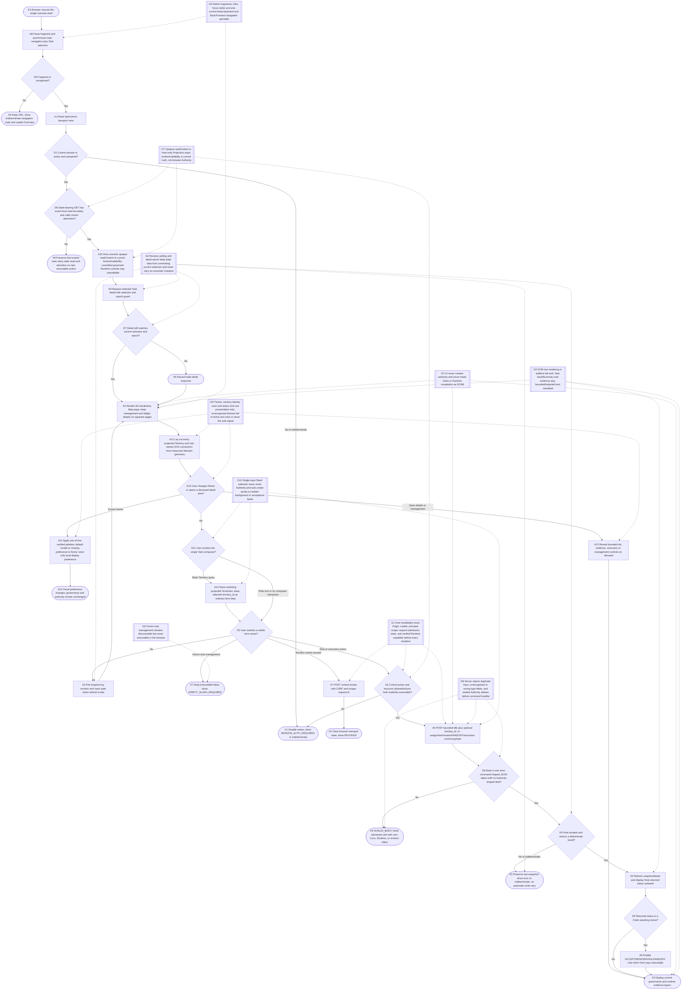

# Operable v1.0 GUI Mainline

## Purpose

为本地操作者提供单一 `/console` 的 v1.0 日常主线。顶层只保留三个互斥视图：`王国地图 / 管理中心 / 王国账本`。
首页本身就是无最外卡片边界的王国地图，按实际领地、主管和骑士数量自适应排布，并按当前元素坐标重画 SVG 组织连线；
不再用固定三列、固定三领地或伪元素线段猜测结构。管理动作全部进入管理中心；UUID、执行编号、Projection、证据分类、
任务/执行/史册详情全部进入王国账本并渐进披露。旧 `organization/tasks/executions/activity/task=` fragment 继续兼容，
但统一投影到王国账本；前进/后退可恢复选择，未知 fragment 会安全回到王国地图且不改写 URL。

界面恢复已验证的羊皮纸、夜蓝、森林墨绿、酒红四主题；首次打开或本地偏好无效时使用森林墨绿，
已有的合法本地主题偏好继续优先。主题只写浏览器本地显示偏好，
不进入 Snapshot、Ledger、Role、Session、Task、Execution 或任何 Authority；领地身份色与任务
状态色使用独立维度。人物卡整卡状态色必须同时显示文字/图标，Task 名称优先于 Task id。

Host control view 只提供 transport admission；state-bearing GET 还必须通过当前本地 Origin 与有效
control admission。broker-issued opaque `readContext` 只在 Host 内转换为当前 Supervisor binding、
Territory scope、command coverage 与资源生命周期的 Projection security，再产生结构化
`allowedActions[].executable`。Task/Execution mutation 必须同时由 control view 与同一最新资源
Projection 显式放行。legacy 字符串 action、缺失字段、过期状态、scope mismatch 或不确定结果均保持
disabled/indeterminate。浏览器不从 command 名称、Task 状态、principal/session 字段或自身表单推导
Authority。

日常创建入口只保留一个人类可读 Task 输入框：输入 `/` 才展开当前投影中的 Territory 列表，选择后把
`territory_id` 作为普通业务字段与 `title` 一起提交；不再在首页或创建入口设置独立的背景、验收标准输入框。
选择 Territory 不产生 Authority，也不改变真实 Supervisor ownership。其余日常操作面包含 assign/start、`sandbox_mode`、Review 的 ACCEPT/REWORK/FAIL/HANDOFF
（HANDOFF 带 `to_binding_id`），以及 execution pause/resume/abort。Owner-only init/reset、ceiling、
territory、role/session 与 execution-profile 只以 `executable=false / DIRECT_SLASH_REQUIRED` 卡片出现。
管理面先呈现现有真实职责链“宰相规划 → 对应领地主管承接并派给 Worker”；它不伪造
Chancellor/Supervisor Task Assignment，canonical `assigned_binding_id` 仍只由 Supervisor 指向 ACTIVE Worker。
首次初始化与组织配置必须由人类 Owner 在 Console 外直接执行 `/kingdom` Slash；Control view 不广告
`setup.basic`，历史 HTTP spelling 也只能 zero-effect 拒绝，Console 只显示可复制的 direct-Slash 引导。
Organization/Task/Execution/Timeline/Attention 对 Projection 新字段 additive fail-soft，并原样展示
indeterminate 状态、`RECOVERING / NOT_RUN / LEGACY_COMPAT` 均原样呈现。旧 Task detail 响应由 selection + epoch 双重校验，
不能覆盖较新的选择。

显式不在本 flow 内：新增 route/framework/dependency、浏览器自行授权、构造 Owner capability、
直接写 DB/Projection、自动切换 LEGACY_COMPAT、将 Runtime completion 或 Worker Claim 升级为 DONE。

## Entry, preconditions, and terminal outcomes

- Entry: Host 在唯一 `GET /console` 返回 Console HTML；浏览器先解析 fragment，再读取
  `/api/control`、snapshot 和当前 Task detail。
- Preconditions: Host bridge endpoint 可达；日常 Task 操作前，Owner 已通过 direct Slash 完成必要初始化；
  control view 明确为 active 或显式返回 inactive/expired/failed/indeterminate；Host 仍是所有写操作的最终授权边界。
- Success outcome: fragment/Task selection 稳定可恢复；受 Host 接受的命令返回结果并按 revision
  刷新 Organization/Task/Execution/Timeline/Attention。Task/Claim/Review 的治理事实由 Host/Core 返回。
- Rejection outcome: control admission 或资源级 allowedActions 缺失、过期、非法状态、范围不足时
  按钮保持 disabled；Owner-only 永远显示 `DIRECT_SLASH_REQUIRED`，不产生 UI 之外的副作用。
- Failure outcome: 读取/命令异常进入 error 或 stale 状态；保留最后可信快照，
  不自动重试写命令，不把未知结果显示为成功；过期 detail response 被静默丢弃。

## Runtime flow



## Component sequence

```mermaid
sequenceDiagram
    actor User as Local operator
    participant Browser as Console browser
    participant Host as Local GUI Host bridge
    participant Broker as LocalControlManager
    participant Core as Kingdom/Core
    participant Runtime as Governed Runtime

    User->>Browser: Open /console#fragment
    Browser->>Browser: parse fragment; set aria-current; synchronize Task selectors
    Browser->>Host: GET /api/control
    Host->>Broker: inspect control cookie and local read transport
    Broker-->>Host: session state + control actions
    Host-->>Browser: actions + reviewDecisions + sandboxModes
    Browser->>Host: state-bearing GET snapshot
    Host->>Broker: validate exact local read boundary and control admission
    alt read admission denied
        Host-->>Browser: bounded control failure; no state handler
    else valid control cookie
        Broker-->>Host: opaque activation-captured readContext
        Host->>Host: projectionSecurityFor current binding, scope and command coverage
        Host->>Core: read bounded evidence and build ActionAvailability
        Core-->>Host: additive schema-v4 projection + allowedActions
        Host-->>Browser: snapshot + revision + truthful states; no opaque identity
    else configured bearer only
        Host->>Core: read bounded evidence without principal Projection context
        Core-->>Host: fail-closed allowedActions
        Host-->>Browser: snapshot + revision + non-executable Role actions
    end
    opt selected Task exists
        Browser->>Host: GET /api/tasks/:taskId with detail epoch
        Host-->>Browser: bounded Task detail + allowedActions
        Browser->>Browser: commit only if Task id and epoch still current
    end
    loop bounded poll
        Browser->>Host: GET snapshot when revision/stale policy requires
        Host-->>Browser: current projection or bounded error
    end
    opt User selects another Task or uses Back/Forward
        Browser->>Browser: update fragment and all data-task-selector controls
        Browser->>Host: GET new Task detail
        Host-->>Browser: current or out-of-order detail response
        Browser->>Browser: discard any stale response
    end
    opt User chooses a theme
        Browser->>Browser: validate parchment/night/forest/wine; missing or invalid preference defaults to forest
        Browser->>Browser: update CSS tokens and local display preference only
        Browser-->>User: same organization and authority with a different palette
    end
    opt User opens member, task, developer, evidence, or management details
        Browser->>Browser: reveal bounded human summary or technical annotations
        Browser-->>User: ids and evidence stay available without occupying the homepage
    end
    opt User enters a Task and types slash
        Browser->>Browser: filter projected Territory choices inside the single input
        User->>Browser: choose one Territory or keep Host selection empty
        Browser->>Browser: retain title plus optional territory_id; remove slash query text
    end
    opt User submits plan/assign/start/review/execution action
        Browser->>Browser: require control action and resource allowedActions executable=true
        Browser->>Host: POST bounded payload with CSRF and unique request id
        Host->>Host: parse strict JSON; reject duplicate, unrecognized, wrong-type, or Authority-shaped fields
        alt invalid body
            Host-->>Browser: INVALID_BODY; zero command/Core effect
        else strict body accepted
            Host->>Host: revalidate capability, principal, scope, expiry and state
            alt denied or indeterminate
                Host-->>Browser: stable rejection or indeterminate; no domain effect
            else accepted
            Host->>Core: persist canonical domain transition
            opt governed start
                Core->>Runtime: governed persistent dispatch with Host-accepted sandbox_mode
                Runtime-->>Core: Claim/terminal observation
            end
            opt HANDOFF
                Core->>Core: atomically close assignment and bind to_binding_id
            end
            opt pause/resume/abort
                Core->>Core: apply legal Execution transition, pausePending request, or clear RUNNING pausePending on resume
            end
            Core-->>Host: CommandResultView
            Host-->>Browser: result + new revision
            Browser->>Host: GET snapshot/detail
            Host-->>Browser: refreshed evidence layers
            end
        end
    end
    opt User opens Owner-only management card
        Browser-->>User: executable=false + DIRECT_SLASH_REQUIRED template
    end
```

## State lifecycle

```mermaid
stateDiagram-v2
    [*] --> CREATED: T3 plan_accepted [Chancellor scope valid] / persist Task CREATED
    CREATED --> ASSIGNED: T4 assign_accepted [Supervisor scope + Worker valid] / persist assignment
    ASSIGNED --> RUNNING: T5 governed_start_accepted [persistent capability enforced] / create governed Execution
    RUNNING --> REVIEW: T6 claim_recorded [structured Claim] / persist Claim and enter review
    REVIEW --> DONE: T7 accept [Supervisor scope + ACCEPT] / persist acceptance
    REVIEW --> RUNNING: T8 rework [Supervisor scope + REWORK] / retain assignment and create next attempt
    REVIEW --> FAILED: T9 fail [Supervisor scope + FAIL] / persist terminal failure
    REVIEW --> RUNNING: T10 handoff [Supervisor scope + ACTIVE to_binding_id] / replace assignment atomically
    STARTING --> PAUSED: T11 pause [Host allowed + legal state] / persist PAUSED
    RUNNING --> RUNNING: T12 pause_requested [mid-turn cannot pause] / persist pausePending without claiming PAUSED
    PAUSED --> RUNNING: T13 resume [Host allowed + PAUSED] / clear pause request
    RUNNING --> RUNNING: T13 resume [Host allowed + pausePending] / clear pause request without inventing a state transition
    RUNNING --> ABORTED: T14 abort [Host allowed + live Execution] / stop Execution; Task governance state unchanged
```



## Safeguards

- `G1`：Host 对每个命令重新校验 capability、Owner/Role principal、scope、CSRF、
  TTL、request admission 和生命周期；浏览器还必须同时看到资源级结构化
  `allowedActions[].executable=true`。HTTP command 名不证明 Runtime control；未验证的
  `GOVERNED_PERSISTENT` pause/resume/abort 固定显示
  `GOVERNED_RUNTIME_CONTROL_UNAVAILABLE`。
- `G2`：命令 payload 只包含表单字段（含 `sandbox_mode`、`to_binding_id`、`execution_id`），
  不包含可被信任的 session/principal；Claim、Runtime Observation、Review Decision 和
  Governance Fact 继续分层。
- `G3`：轮询以 revision/stale 状态为边界；Task detail 以 selection + epoch 为提交边界；
  命令失败或外部副作用未知时不自动重试，只保留错误/indeterminate 并等待 Host 对账。
- `G4`：Organization/Task/Execution/Timeline/Attention 通过 textContent/有界摘要 additive
  fail-soft；Task `resultSummary` 与 event/Claim/Execution 内容在 Projection 输出层先做长度、secret、
  session 和路径脱敏。缺字段显示 indeterminate/NOT_RUN，不执行 HTML 注入，也不把 raw payload、
  完整 session 或路径变成治理事实。
- `G5`：fragment 使用原生链接、focus-visible 和 `aria-current`；统一 `data-task-selector`，
  390px 下内部导航可横向滚动且页面主体不依赖固定宽度。
- `G6`：Owner-only 管理卡固定 `executable=false`，只显示可复制的 direct Slash 提示；
  Control view 不广告 `setup.basic`，历史 HTTP spelling 只能 zero-effect 拒绝，Host action 或浏览器状态
  都不能把初始化、Territory、Role/Session、Ceiling 或 Execution Profile 升级为浏览器可执行。
- `G7`：state-bearing GET 先通过精确本地读边界和 control admission。有效 cookie 只产生不透明、
  不序列化的 `readContext`；Host 使用它重新解析当前 session、Supervisor binding、Territory scope、
  command coverage 与生命周期，再生成资源 `ActionAvailability`。configured bearer 不携带 principal
  Projection context，保持 Role action fail-closed。
- `G8`：HTTP Host 用 strict JSON parser 与每命令 exact field allowlist 拒绝任意深度重复 key、未知字段、
  wrong-type value 和嵌套 Authority/identity alias；失败会释放 admission slot，但不会调用
  `runGuiCommand`、Core 或 Runtime，也不改变 revision。
- `G9`：主题选择、领地身份色与人物/任务状态色完全属于浏览器 Presentation。主题仅允许
  `parchment/night/forest/wine`，未识别值或首次无偏好时回退森林墨绿；已有合法偏好保持不变；领地 identity tone 使用稳定引用分配且随主题
  换色，Task tone 不覆盖领地 identity。所有状态色同时有中文状态和符号，不能由颜色推断
  Authority、Governance Fact 或 Runtime success。
- `G10`：创建任务只有一个可见 Task 输入框；`/` 只过滤当前投影的 Territory 列表，选中值仍是普通
  `territory_id` 表单数据。浏览器不提交独立背景或验收标准字段，不从 Territory 选择推导
  Chancellor/Supervisor/Owner Authority，Host 仍对 `task.create` 重新校验。

## Failure, recovery, and observability

读取失败显示 `ERROR` 并保留最后可信快照；超过 stale window 显示 `STALE` 并提供
Refresh。能力过期/撤销显示 `SESSION_AUTH_REQUIRED`，Owner-only 管理显示
`DIRECT_SLASH_REQUIRED`，资源 allowedActions、reviewDecisions、sandboxModes 或新 Projection
字段缺失时 fail-soft 为 indeterminate/`NOT_RUN`。
尚未初始化时 Console 只显示 direct-Slash onboarding，不发送 `setup.basic` 或任何等价复合写命令。
写命令不由浏览器自动 retry；用户必须通过 Host 的恢复/对账结果再次操作。
`RECOVERING / LEGACY_COMPAT / pausePending` 原样展示；pausePending 不得渲染为 PAUSED。
`LEGACY_COMPAT` 的 `RUNNING + pausePending` 可由合法 resume 清除 pending 标记并继续保持
`RUNNING`；不得伪造一次 `PAUSED -> RUNNING` 状态变化。
Revision、last refresh time、error code、command pending 状态和 evidence kind 只用于有限 UI
观察，不写 Kingdom Ledger。

## Implementation notes

`src/gui/console-app.ts` 提供无依赖 HTML、森林墨绿首次默认与四主题本地显示偏好、三个互斥页面、
无外框且按实际 Territory/Role 数量自适应的组织地图、按元素几何重画的 SVG 连线、单输入框 Slash Territory composer、
稳定领地 identity tone、人类可读状态卡、真实管理职责引导、渐进披露、fragment parser、结构化 allowedActions 归一化、资源级门控和
detail epoch guard；浏览器脚本只管理 DOM/本地显示状态。
`tests/gui-interactive-console.test.ts` 覆盖命令名称不授权、缺 Projection fail-soft、fragment、
旧 detail 抑制、命令 payload 与 390px/可访问性标记。机器可读映射维护在
`traceability.yaml`；最终 reconcile/finalize 由 Coordinator 在串行集成验证后完成。
