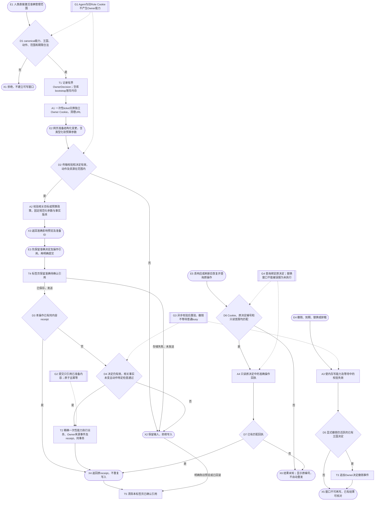
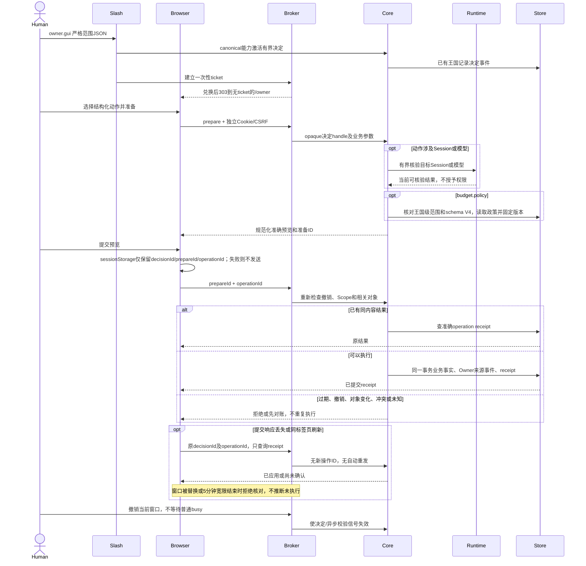
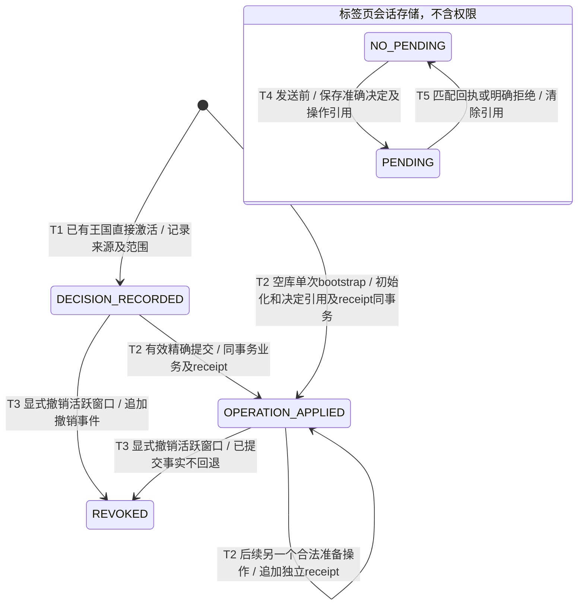

# GUI 人类管理窗口

人类从 canonical 直接 `/kingdom owner.gui` 入口建立范围明确、至多10分钟的 OwnerDecision。浏览器只消费该决定，Owner 永远是稳定的人类 principal。独立于 Role Plane，不创建 Agent 权限、任务裁定或记忆。

1.5 增加 `plan.adopt`：目录只呈现完整 Scope 覆盖的 PROPOSED 计划；预览固定计划 ID、版本、摘要、理由、成员范围/验收/依赖/产物、整合者与预算。提交在同一事务创建子 Task、采纳事件与 Owner 回执，不产生 Assignment、Grant 或 ACCEPT。准确协作流程见[有界协作](../collaboration-bounded-plan/flow.md)。

## 流程

## 组件交互

## 持久事实

## 边界与失败处理

- ticket 30秒、写入授权至多10分钟、服务端时间、固定127.0.0.1 Origin和Host、CSRF、SameSite Strict。Cookie仅引用内存窗口，并额外保留5分钟只读receipt查询期，以支持到期前提交丢响应后的核对；服务端同样检查此宽限，不依靠浏览器删Cookie实施期限。未认证页面不返回scope内目录，旧Role Cookie不接受。URL票据不进入日志、错误、事件、Referer或本地存储。
- first bootstrap只初始化姓名/王国名且OWNER.session_id=null，消费后不能扩大管理范围；重启不恢复可写窗口。历史决定与receipt保留在原事件账本。
- 支持init、territory.create/update/supervisor、非OWNER role.bind、主管/宰相role.session、王国ceiling、execution-profile、budget.policy、revoke。既有Territory路径和Worker affinity不通过便捷配置隐式改变。
- budget.policy 要求明确动作授权、王国级范围及schema V4。表单产生enabled布尔值、limit_tokens/reserve_tokens正安全整数、unknown_policy BLOCK或WARN、warning_percent 1至100（默认80）；预留不能超过额度，关闭也要求合法参数。准备固定当前政策和规范化字段，提交重验相关事实，沿用准确一次性能力、同事务政策事件/Owner来源/receipt。预算接纳计算归runtime.cost-control，不增加便捷写接口。
- 预算是新增执行的软接纳政策，不是供应商费用硬上限。此动作允许调整未来政策而保留在途工作，不使用拓扑变更的未决执行阻断规则；关闭不重置统计起点，不派发、终止、结算或释放工作。
- 创建目录必须存在、规范化且位于明确授权根；不创建目录、不执行命令。改绑、主管分配、ceiling、profile遇受影响的非终态Execution、未释放Lease或未结算Dispatch时拒绝。
- 校验Session只用真实registry，模型核验只证明当前路由元数据有效，保存不等于实际执行成功。默认异步校验10秒、最高30秒；撤销与超时中止校验，回调之后再核验。事务体没有await。
- 规范化参数与相关对象版本固定在服务端。浏览器不能替换业务参数或principal。相同operation与内容只形成一次receipt；异内容拒绝。异常事务回滚；响应丢失只能查询，不换ID重发。
- 查询必须携带原页面固定的decisionId；新窗口替换同名Cookie时返回明确的窗口替换错误，旧页保留原编号，不把跨窗口查不到解释为未执行。到期/替换/卸载只使内存权力失效；显式撤销仍活跃的已有王国决定才另写撤销事件，不虚构其他持久状态迁移。
- authorization_source=LOCAL_DIRECT_SLASH、source_channel=LOCAL_OWNER_GUI，actor_id=稳定Owner principal；不回写历史渠道。短期transport凭据只在内存。
- trusted-local 不等于每次点击真人在场证明；不声称有Windows Hello/WebAuthn。合成传输测试、官方DSH接入、真实人类输入和产品验收分别记录。

实现与测试映射在traceability.yaml按当前源码核对。1.4表单类型化、缺值/小数/预留超额校验映射tests/v14-cost-gui.test.ts；主流程browser-cost-report.json已记录键盘预算准备/提交和Core预算状态验证，Owner及usage为合成输入，不代替真实人类激活或Provider证据。本轮仅维护文档，不重跑产品测试。

发布修复：确定 PREVIEW_STALE 或明确事务回滚时保留输入、清除旧预览并允许重新预览；未知结果保留原引用，刷新优先核对回执，禁止新提交。存储不含票据、Cookie、CSRF或业务参数；新窗口不替代旧决定。窄屏完整显示只读计划指纹。
