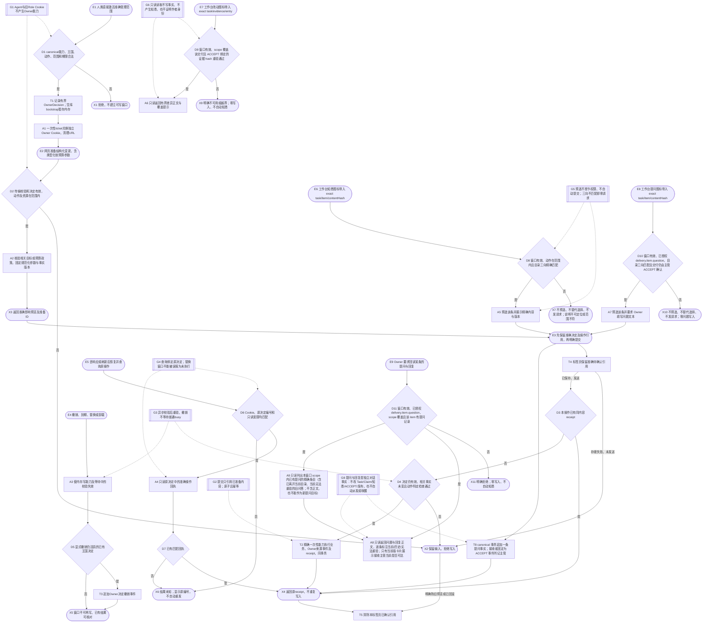
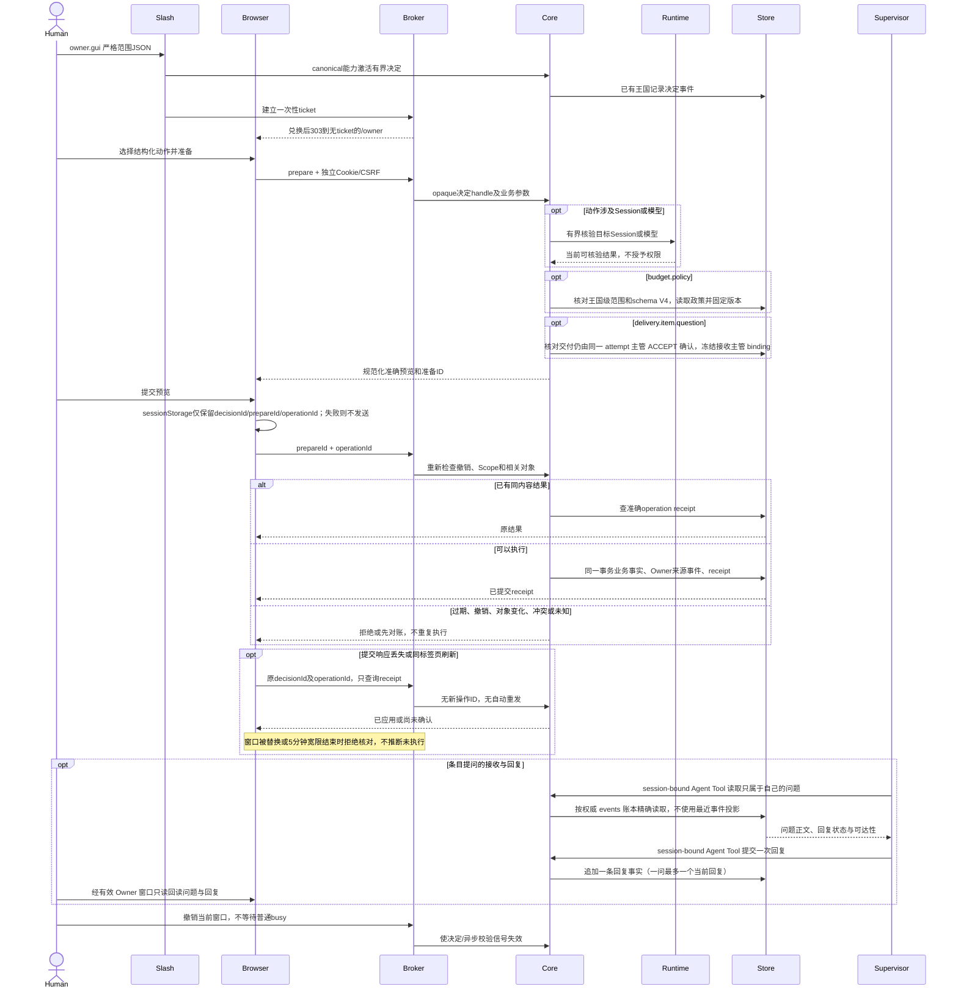
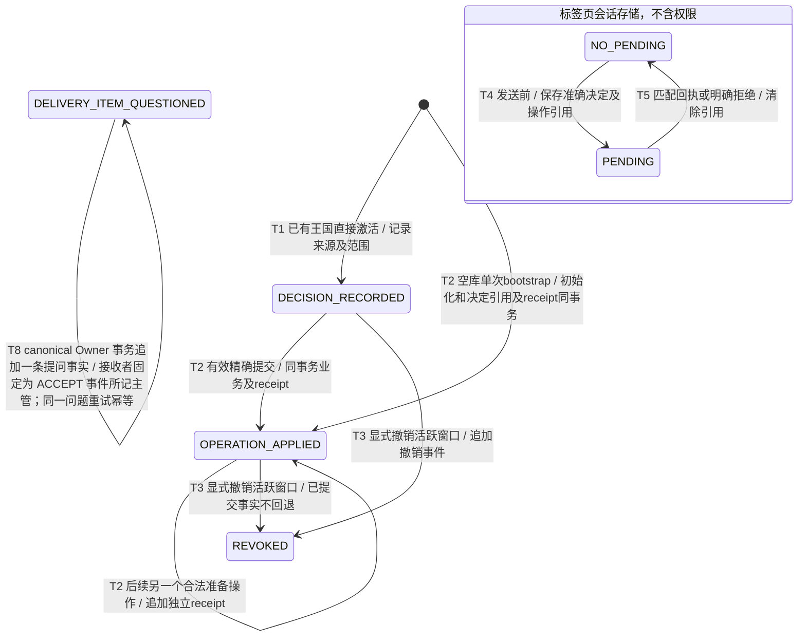

# GUI 人类管理窗口

人类从 canonical 直接 `/kingdom owner.gui` 入口建立范围明确、至多10分钟的 OwnerDecision。浏览器只消费该决定，Owner 永远是稳定的人类 principal。独立于 Role Plane，不创建 Agent 权限、任务裁定或记忆。

1.5 增加 `plan.adopt`：目录只呈现完整 Scope 覆盖的 PROPOSED 计划；预览固定计划 ID、版本、摘要、理由、成员范围/验收/依赖/产物、整合者与预算。提交在同一事务创建子 Task、采纳事件与 Owner 回执，不产生 Assignment、Grant 或 ACCEPT。准确协作流程见[有界协作](../collaboration-bounded-plan/flow.md)。

1.6 增加 `delivery.item.ack` 的准确入口：工作台知悉图标以 exact `task/item/contentHash` 导航到 `/owner?ack_task=…&ack_item=…&ack_hash=…`，本页只在该窗口有效、动作在范围内且目录中三者同时匹配时预选该条。预选不构成授权，也不会自动准备或提交；范围不含该动作、目录无该条，或参数重复/非法时，页面保持不可定位并明确不做替代选择。Owner 仍须自行查看预览、确认提交并核对回执；不新增 sessionStorage、票据别名链或前端写入路径。

1.7 direct `/kingdom owner.gui` 可选携带非授权定位提示 `taskHint`/`itemHint`/`contentHashHint` 与非授权目标动作提示 `hintAction`（只接受 `ack`/`ask`，未携带时为 `ack`）：三个定位字段必须同时提供且格式有效（`item:` 加 32 位小写十六进制、内容版本为 64 位小写十六进制），任一缺失或非法、或 `hintAction` 非法（含显式 `null`）都在激活前整体拒绝并返回 `INPUT_DENIED`，不做「丢掉提示照常激活」。格式有效时提示只随一次性票据在内存中保存，兑换后 303 重定向到不含票据的 `/owner?ack_*`；`hintAction=ask` 时改为 `/owner?ask_*`，使提问入口在被复制的 direct 命令走完后仍回到同一条目与同一个提问动作；未携带提示时重定向地址仍精确为 `/owner`。提示不进入 `OwnerDecisionInput`，不改变授权范围。

1.8 增加「主管确认的改动证据」只读入口：工作台改动图标以 exact `change_task`/`change_evidence`/`change_item` 打开 `/owner`，本页只做格式校验并在有效窗口内调用同源只读接口 `/api/owner/delivery-change?task=…&evidence=…&item=…`。该接口要求且只接受这三个参数，必须存在 ACTIVE 管理窗口、scope 覆盖该交付、证据是同一 Task 且由主管在 ACCEPT 中显式选择、并按内容寻址重验 hash；正文缺失或漂移一律拒绝。读取不写任何事实、不产生知悉、不改变 Task/Claim，页面也不携带差异正文。

1.9 增加 `delivery.item.question`：工作台提问图标以 exact `task/item/contentHash` 打开 `/owner?ask_task=…&ask_item=…&ask_hash=…` 只做预选；与该入口并列的复制控件产生**提问专用**的最小 direct `/kingdom owner.gui` 命令（`actions:["delivery.item.question"]`、`hintAction:"ask"`、同一条领地范围与同一 exact hint），兑换后回到 `/owner?ask_*`，因此被复制的命令不会丢失提问动作或准确目标；Owner 必须自己填写问题文本、查看预览并提交。提交在 canonical 事务里追加**一条**独立、有界、脱敏的 Owner 提问事实（`OWNER_DELIVERY_ITEM_QUESTIONED`，`target_type=delivery`），接收者固定为该交付 `TASK_ACCEPTED` 事件所记的主管 binding；问题身份**以一次 Owner operation 为界**：同一 operation 重放命中同一事件 ID 并原样返回既有事实，不同 operation 即使条目与文本完全相同也各自形成独立问题，绝不按正文去重。同时增加只读接口 `/api/owner/delivery-questions?task=…&item=…`：只接受这两个精确参数，必须存在 ACTIVE 管理窗口且本次授权包含 `delivery.item.question`，返回该条目的提问与主管回复正文，并按「原主管退任/换 session/领地改绑」如实标注不可达。读取不写任何事实、不自动知悉、也不代主管回复。

## 流程

```mermaid
flowchart TD
    E1(["E1 人类直接激活准确管理范围"]) --> D1{"D1 canonical能力、王国、动作、范围和期限合法"}
    D1 -->|否| X1(["X1 拒绝，不建立可写窗口"])
    D1 -->|是| T1["T1 记录有界OwnerDecision；空库bootstrap暂存内存"]
    T1 --> A1["A1 一次性ticket兑换独立Owner Cookie，清理URL"]
    A1 --> E2(["E2 网页准备结构化变更，含类型化软预算参数"])
    E2 --> D2{"D2 传输校验和决定有效，动作及资源在范围内"}
    D2 -->|否| X2(["X2 保留输入，拒绝写入"])
    D2 -->|是| A2["A2 核验相关目标或预算政策，固定规范化参数与事实版本"]
    A2 --> X3(["X3 返回准确影响预览及准备ID"])
    X3 --> E3(["E3 先保留准确决定及操作引用，再明确提交"])
    E6(["E6 工作台知悉图标带入 exact task/item/contentHash"]) --> D8{"D8 窗口有效、动作在范围内且目录三向精确匹配"}
    D8 -->|否| X7(["X7 不预选、不替代选择、不发请求；说明不可定位或范围不符"])
    D8 -->|是| A5["A5 预选该条并展示精确内容与版本"]
    A5 --> E3
    E3 --> T4["T4 标签页保留准确待确认引用"]
    T4 -->|存储失败，未发送| X2
    T4 -->|已保存，发送| D3{"D3 本操作已有同内容receipt"}
    D3 -->|是| X4(["X4 返回原receipt，不重复写入"])
    D3 -->|否| D4{"D4 决定仍有效，相关事实未变且动作特定检查通过"}
    D4 -->|否| X2
    D4 -->|是| T2["T2 精确一次性能力执行业务、Owner来源事件及receipt，同事务"]
    T2 --> X4
    E4(["E4 撤销、到期、替换或卸载"]) --> A3["A3 使内存写能力及等待中的校验失效"]
    A3 --> D5{"D5 显式撤销仍活跃的已有王国决定"}
    D5 -->|是| T3["T3 追加Owner决定撤销事件"]
    D5 -->|否| X5
    T3 --> X5(["X5 窗口不可再写，已有结果可核对"])
    E5(["E5 丢响应或刷新后恢复并查询原操作"]) --> D6{"D6 Cookie、原决定编号和只读宽限均匹配"}
    D6 -->|是| A4["A4 只读原决定中的准确操作回执"]
    D6 -->|否| X6(["X6 结果未知；显示原编号，不自动重发"])
    A4 --> D7{"D7 已有匹配回执"}
    D7 -->|是| X4
    D7 -->|否| X6
    X4 --> T5["T5 清除本标签页已确认引用"]
    X2 -->|明确陈旧预览或已回滚| T5
    G1[["G1 Agent与旧Role Cookie不产生Owner能力"]] -.-> D1
    G1 -.-> D2
    G2[["G2 提交只引用已准备内容；原子且幂等"]] -.-> T2
    G3[["G3 异步校验后重验，撤销不等待普通busy"]] -.-> D4
    G3 -.-> A3
    G4[["G4 查询绑定原决定；替换窗口不能被误报为未执行"]] -.-> D6
    G4 -.-> A4
    G5[["G5 预选不授予权限、不自动提交；三向不匹配即零请求"]] -.-> A5
    G5 -.-> D8
    E7(["E7 工作台改动图标带入 exact task/evidence/entry"]) --> D9{"D9 窗口有效、scope 覆盖该交付且 ACCEPT 绑定的证据 hash 重验通过"}
    D9 -->|否| X9(["X9 明确不可用或越界；零写入、不自动知悉"])
    D9 -->|是| A6["A6 只读返回有界差异正文与覆盖提示"]
    G6[["G6 只读读取不写事实、不产生知悉，也不证明作者身份"]] -.-> D9
    G6 -.-> A6
    E8(["E8 工作台提问图标带入 exact task/item/contentHash"]) --> D10{"D10 窗口有效、已授权 delivery.item.question、目录三向匹配且交付仍由主管 ACCEPT 确认"}
    D10 -->|否| X10(["X10 不预选、不替代选择、不发请求；零问题写入"])
    D10 -->|是| A7["A7 预选该条并要求 Owner 填写问题文本"]
    A7 --> E3
    E3 --> T8["T8 canonical 事务追加一条提问事实；接收者固定为 ACCEPT 事件所记主管"]
    T8 --> X4
    E9(["E9 Owner 要求回读某条的提问与回复"]) --> D11{"D11 窗口有效、已授权 delivery.item.question、scope 覆盖且该 item 有提问记录"}
    D11 -->|否| X11(["X11 明确拒绝；零写入、不自动知悉"])
    D11 -->|是| A8["A8 只读返回问题与回复正文，逐条标注当前/历史/无法重验；只有当前版卡片展示接收主管当前是否可达"]
    D11 -->|是| A9["A9 只读列出本窗口 scope 内已有提问的精确条目（含已离开当前目录、当前无法重验的旧问答；不含正文，也不能作为新提问目标）"]
    A9 --> A8
    G8[["G8 提问与回复是独立对话事实：不改 Task/Claim/知悉/ACCEPT/发布，也不自动派发或唤醒"]] -.-> T8
    G8 -.-> A8
```

## 组件交互

```mermaid
sequenceDiagram
    actor Human
    participant Slash
    participant Browser
    participant Broker
    participant Core
    participant Runtime
    participant Store
    participant Supervisor
    Human->>Slash: owner.gui 严格范围JSON
    Slash->>Core: canonical能力激活有界决定
    Core->>Store: 已有王国记录决定事件
    Slash->>Broker: 建立一次性ticket
    Broker-->>Browser: 兑换后303到无ticket的/owner
    Human->>Browser: 选择结构化动作并准备
    Browser->>Broker: prepare + 独立Cookie/CSRF
    Broker->>Core: opaque决定handle及业务参数
    opt 动作涉及Session或模型
        Core->>Runtime: 有界核验目标Session或模型
        Runtime-->>Core: 当前可核验结果，不授予权限
    end
    opt budget.policy
        Core->>Store: 核对王国级范围和schema V4，读取政策并固定版本
    end
    opt delivery.item.question
        Core->>Store: 核对交付仍由同一 attempt 主管 ACCEPT 确认，冻结接收主管 binding
    end
    Core-->>Browser: 规范化准确预览和准备ID
    Human->>Browser: 提交预览
    Browser->>Browser: sessionStorage仅保留decisionId/prepareId/operationId；失败则不发送
    Browser->>Broker: prepareId + operationId
    Broker->>Core: 重新检查撤销、Scope和相关对象
    alt 已有同内容结果
        Core->>Store: 查准确operation receipt
        Store-->>Browser: 原结果
    else 可以执行
        Core->>Store: 同一事务业务事实、Owner来源事件、receipt
        Store-->>Browser: 已提交receipt
    else 过期、撤销、对象变化、冲突或未知
        Core-->>Browser: 拒绝或先对账，不重复执行
    end
    opt 提交响应丢失或同标签页刷新
        Browser->>Broker: 原decisionId及operationId，只查询receipt
        Broker->>Core: 无新操作ID，无自动重发
        Core-->>Browser: 已应用或尚未确认
        Note over Browser,Broker: 窗口被替换或5分钟宽限结束时拒绝核对，不推断未执行
    end
    opt 条目提问的接收与回复
        Supervisor->>Core: session-bound Agent Tool 读取只属于自己的问题
        Core->>Store: 按权威 events 账本精确读取，不使用最近事件投影
        Store-->>Supervisor: 问题正文、回复状态与可达性
        Supervisor->>Core: session-bound Agent Tool 提交一次回复
        Core->>Store: 追加一条回复事实（一问最多一个当前回复）
        Human->>Browser: 经有效 Owner 窗口只读回读问题与回复
    end
    Human->>Broker: 撤销当前窗口，不等待普通busy
    Broker->>Core: 使决定/异步校验信号失效
```

## 持久事实

```mermaid
stateDiagram-v2
    [*] --> DECISION_RECORDED: T1 已有王国直接激活 / 记录来源及范围
    DECISION_RECORDED --> OPERATION_APPLIED: T2 有效精确提交 / 同事务业务及receipt
    OPERATION_APPLIED --> OPERATION_APPLIED: T2 后续另一个合法准备操作 / 追加独立receipt
    DECISION_RECORDED --> REVOKED: T3 显式撤销活跃窗口 / 追加撤销事件
    OPERATION_APPLIED --> REVOKED: T3 显式撤销活跃窗口 / 已提交事实不回退
    [*] --> OPERATION_APPLIED: T2 空库单次bootstrap / 初始化和决定引用及receipt同事务
    DELIVERY_ITEM_QUESTIONED --> DELIVERY_ITEM_QUESTIONED: T8 canonical Owner 事务追加一条提问事实 / 接收者固定为 ACCEPT 事件所记主管；同一问题重试幂等
    state "标签页会话存储，不含权限" as BrowserPending {
        NO_PENDING --> PENDING: T4 发送前 / 保存准确决定及操作引用
        PENDING --> NO_PENDING: T5 匹配回执或明确拒绝 / 清除引用
    }
```

## 边界与失败处理

- ticket 30秒、写入授权至多10分钟、服务端时间、固定127.0.0.1 Origin和Host、CSRF、SameSite Strict。Cookie仅引用内存窗口，并额外保留5分钟只读receipt查询期，以支持到期前提交丢响应后的核对；服务端同样检查此宽限，不依靠浏览器删Cookie实施期限。未认证页面不返回scope内目录，旧Role Cookie不接受。URL票据不进入日志、错误、事件、Referer或本地存储。
- first bootstrap只初始化姓名/王国名且OWNER.session_id=null，消费后不能扩大管理范围；重启不恢复可写窗口。历史决定与receipt保留在原事件账本。
- 支持init、territory.create/update/supervisor、非OWNER role.bind、主管/宰相role.session、王国ceiling、execution-profile、budget.policy、revoke。既有Territory路径和Worker affinity不通过便捷配置隐式改变。
- 主管的role.bind自3.2.0起**必填**territory_id（席位与该领地主理在同一事务里原子写入；提交时若领地已有**在任ACTIVE**主理，准备阶段即以TERRITORY_ALREADY_SUPERVISED拒绝，要求先解除）。非主管角色不携带该字段，表单对其它角色隐藏并禁用该字段。
- 领地判据（`role.bind`(主管)、`territory.supervisor`、`territory.update` 一律相同）：目标领地必须**显式**出现在本次授权的 `scope.territoryIds` 内；`kingdomWide` **不**放宽领地清单（`catalog.territories` 与提交判定逐 action 同判据：清单里列不出的领地也提交不了，反之亦然）。
- 领地主理自3.2.0起为**1:1**：一个主管席位只主理一个领地。指派一个已隶属其它未删除领地的席位 → 准备阶段以SUPERVISOR_ALREADY_ATTACHED拒绝（DELETED领地不计，本次目标领地不计）。换领地必须"先解除原领地、再指派"。
- 本管理窗口**可以表达"解除"**：`territory.supervisor` 的 supervisor_binding_id 接受**显式 JSON null**（表单为"解除现任主理"勾选框；该勾选框不带 name，由 payload 显式转成 null，避免多送字段）。省略该字段仍是 INVALID_INPUT，绝不解释为解除。解除预览列出"解除后该领地无主理 → fail-closed"，并登记旧主理及其 session 参与未结算工作守卫（在途工作时不允许解除责任）。因此"换领地"可完全在窗口内完成：先在原领地解除、再在目标领地指派。重复解除**可重复且结论一致**（仍 APPLIED、指针保持 null），但**每次都会追加一条** `unassigned:true` 的解除事实——这与 direct Slash 通道自 3.1.0 起的既有语义相同（无条件 append，不做 no-op 去重）。
- budget.policy 要求明确动作授权、王国级范围及schema V4。表单产生enabled布尔值、limit_tokens/reserve_tokens正安全整数、unknown_policy BLOCK或WARN、warning_percent 1至100（默认80）；预留不能超过额度，关闭也要求合法参数。准备固定当前政策和规范化字段，提交重验相关事实，沿用准确一次性能力、同事务政策事件/Owner来源/receipt。预算接纳计算归runtime.cost-control，不增加便捷写接口。
- 预算是新增执行的软接纳政策，不是供应商费用硬上限。此动作允许调整未来政策而保留在途工作，不使用拓扑变更的未决执行阻断规则；关闭不重置统计起点，不派发、终止、结算或释放工作。
- 创建目录必须存在、规范化且位于明确授权根；不创建目录、不执行命令。改绑、主管分配、ceiling、profile遇受影响的非终态Execution、未释放Lease或未结算Dispatch时拒绝。
- 校验Session只用真实registry，模型核验只证明当前路由元数据有效，保存不等于实际执行成功。默认异步校验10秒、最高30秒；撤销与超时中止校验，回调之后再核验。事务体没有await。
- 规范化参数与相关对象版本固定在服务端。浏览器不能替换业务参数或principal。相同operation与内容只形成一次receipt；异内容拒绝。异常事务回滚；响应丢失只能查询，不换ID重发。
- 查询必须携带原页面固定的decisionId；新窗口替换同名Cookie时返回明确的窗口替换错误，旧页保留原编号，不把跨窗口查不到解释为未执行。到期/替换/卸载只使内存权力失效；显式撤销仍活跃的已有王国决定才另写撤销事件，不虚构其他持久状态迁移。
- authorization_source=LOCAL_DIRECT_SLASH、source_channel=LOCAL_OWNER_GUI，actor_id=稳定Owner principal；不回写历史渠道。短期transport凭据只在内存。
- trusted-local 不等于每次点击真人在场证明；不声称有Windows Hello/WebAuthn。合成传输测试、官方DSH接入、真实人类输入和产品验收分别记录。
- `delivery.item.ack` 预选入口的准确性由服务端目录保证：`ack_task`/`ack_item`/`ack_hash` 只用于在本窗口目录中做三向精确匹配并预选，prepare 仍从受信目录取 `task_id/delivery_id/item_id/content_hash/attempt_no/result_id`，浏览器不能替换业务参数。范围不含该动作、目录中无该条、参数缺失/重复/非法时，页面显示不可定位并保持无替代选择；整个预选过程不发任何 mutation 请求，也不写入 sessionStorage 或新增票据别名链。同一份「本次授权范围内的已确认交付条目」目录在窗口只授权 `delivery.item.question` 时也返回，供 Owner 逐条选择要提问的条目；目录可见性不等于动作授权，读取与写入仍分别由 `delivery.item.ack` / `delivery.item.question` 各自把关。
- direct 定位提示只在激活前做格式与完整性校验，不作为授权判据：`validateLaunchAckHint` 区分「未携带」与「携带了但不完整/非法」（含非法的 `hintAction`），后者抛 `OWNER_LAUNCH_HINT_INVALID`（400）且不建立窗口、不写 `OWNER_DECISION_CREATED`。提示保存在内存票据记录里，`redeem` 只在成功兑换后把它编码进 303 的 `Location`——`hintAction=ack`（缺省）写 `ack_*`，`ask` 写 `ask_*`；未携带提示时 `Location` 精确为 `/owner`。票据仍是一次性的，重放不兑换、不写入。
- `GET /api/owner/delivery-change` 是唯一返回已确认改动正文的接口，且只接受 `task`/`evidence`/`item` 三个精确参数：缺参、重复或多余参数返回 400；没有有效 Owner 窗口返回 401；窗口未授权 `delivery.item.ack`、窗口越界、证据未由主管确认、entry 不属于该证据、该条目已不在当前有效交付目录内或本地 hash 漂移都拒绝且不返回正文。读取不消耗 CSRF、不写事件、不产生知悉，也不改变 Task/Claim。改动图标与页面本身不携带差异正文。
- `delivery.item.question` 与知悉是**两个独立动作**：窗口可以只授权其中一个。提问要求交付仍由同一 Task/attempt 的主管 ACCEPT 确认、条目内容版本精确匹配，并把接收者冻结为 `TASK_ACCEPTED` 事件所记的主管 binding；`actor_id` 与 payload `reviewer_binding_id` 必须**同时非空且相等**，只出现其一或两者不一致时直接拒绝（`DELIVERY_ACCEPT_REVIEWER_UNKNOWN`），不猜接收者。问题正文与知悉同款校验（非空、限长 2000）并在 Core 统一脱敏后落账；问题身份以一次 Owner operation 为界——同一 operationId 重放命中同一事件 ID 并原样返回既有事实（回执仍返回同一次 APPLIED，不新增事实），不同 operation 即使文本相同也各自独立，不按正文去重。
- 一条问题至多一条当前回复：回复事件 ID **只由 questionId 决定**（不含正文），「重验 + 单次写入」整体在 `store.withImmediateTransaction` 的 `BEGIN IMMEDIATE` 内完成；BEGIN 因 BUSY/LOCKED/I-O/MISUSE 失败时原样失败且零回复写入，绝不当作「已有外层事务」继续。同一文本重试幂等，不同文本明确冲突（`REPLY_ALREADY_RECORDED`）。回复沿用该 Task 已接受的改动证据重算 exact `itemId/contentHash`：CHANGE 条目在证据漂移或缺失时不再派生，回复 fail-closed（`DELIVERY_ITEM_VERSION_STALE`）而不是写到旧版本上。读取侧据此把每条问题相对当前交付目录标成 `itemVersion`：只有精确命中当前派生版本才是 `CURRENT`（唯一可回复的当前待办），版本已变化是 `HISTORICAL`，当前目录无法重验（例如 CHANGE 证据丢失）是 `UNVERIFIABLE`；后两者仍可读、仍显示原文与回复，但不计当前待办，主管收件箱的 `pending_only` 也只列 `CURRENT` 的问题。
- 主管收件箱枚举该 session 可证明的**全部** ACTIVE SUPERVISOR binding（一个 session 可以合法持有多个绑定），逐 binding 精确读取后合并；不得只取第一个而静默遗漏其余绑定的问题，也不从 URL、自报 session 或目录首项恢复身份。
- 提问**不是知悉**：它不写 `OWNER_DELIVERY_ITEM_ACKNOWLEDGED`，不改 Task/Claim/主管审查/Owner acceptance/发布状态，也不自动派发、通知或唤醒任何 Agent。未被主管实际读取前界面只能说「待领取」，不声称已通知或已阅读。
- 接收者的可达性由 Core 判定并如实标注：原绑定不存在、已退任、已换 session，或领地已改绑给其他主管时，问题保持可见但明确不可达，**不会**自动转给继任主管、Worker 或宰相。回复只能由该 binding 本身的当前 session 经 session-bound 入口写入。
- `GET /api/owner/delivery-questions` 是唯一返回问答正文的接口，且只接受 `task`/`item` 两个精确参数：缺参、重复或多余参数返回 400；没有有效 Owner 窗口返回 401；窗口未授权 `delivery.item.question`、窗口越界、或该条目既无法从当前 ACCEPT/证据重验也没有任何提问记录都拒绝且不返回正文。版本真值按该精确 task/item **独立重算**，不取自有界展示目录（目录会截断较旧条目，但被截断的条目仍可能是真实的当前版本）：命中当前派生版本是「已验证当前版」，命中的是可确认旧版本是「历史版」，当前无法重验（例如 CHANGE 证据丢失）则整条标为「无法重验」（`itemVersion="UNVERIFIABLE"`），不计当前待办、也不可回复。读取不消耗 CSRF、不写事件、不产生知悉、也不代主管回复。有效 Owner 窗口另有只读「问答历史」入口：它只从权威提问事实列出本窗口 scope 内已有提问的精确条目（因此包含已离开当前交付目录、当前无法重验的旧问答），不含正文，也不能作为新提问目标（prepare 仍逐条精确重验）；范围或动作不匹配的窗口该列表为空。线程详情在历史列表上方，因此点击某条历史条目后，页面只在真实 Core 响应通过防串校验时才把焦点与视口送到该线程标题（`tabIndex=-1` 的程序化焦点 + `scrollIntoView`），靠下的条目点完也有当前视口反馈；过期的更早响应既不覆盖面板，也不跳焦点。若这次历史点击的读取本身失败，失败消息同样只在通过同一防串守卫后写入该线程面板，并就地获得 `tabIndex=-1` 的程序化焦点与 `scrollIntoView`，因此停在下方列表的 Owner 也在当前视口看到失败原因，而不是只有上方面板里的静默文字；自动预选/改选触发的读取不移动焦点，过期的更早失败则既不覆盖已改选的面板，也不抢焦点。工作台、快照、TaskDetail.relatedEvents、recentEvents 与事件轮询只保留不含正文的最小元数据。

实现与测试映射在traceability.yaml按当前源码核对。1.4表单类型化、缺值/小数/预留超额校验映射tests/v14-cost-gui.test.ts；主流程browser-cost-report.json已记录键盘预算准备/提交和Core预算状态验证，Owner及usage为合成输入，不代替真实人类激活或Provider证据。本轮仅维护文档，不重跑产品测试。

1.9 只读问答映射 `tests/delivery-question-loop.test.ts`（21/21）与 `tests/owner-delivery-ack.test.ts`（50/50）：真实临时 DB 覆盖 Owner 提交/以 operation 为界的幂等（同文新操作形成独立问题）/零写入拒绝、接收主管两字段必须同时非空且相等、同一交付第二个条目保留自己的线程、同一 session 全部 ACTIVE SUPERVISOR binding 的收件箱枚举（第二个绑定不被静默遗漏）、主管专属收件与一次回复、双连接同库回复不产生双事实且 BEGIN 失败零写、退任/换 session/领地改绑不可达、条目改版、以及快照/TaskDetail/recentEvents/事件轮询不泄露正文；HTTP 只读路由的 401/400/409 与零写入也在真实本机服务上核对。另覆盖只授权 `delivery.item.question` 的窗口从真实 controller 目录到页面的预选与提交、慢的旧问答读取不覆盖快速改选后的面板；R4 起用真实 Core→UI 覆盖：①同一 item 超过 200 条展示目录上限后精确回读仍按逐 Task 重算标为当前版并计入待办（展示目录确实已截断该条）、②条目离开当前目录后仍可从只读问答历史入口发现并回看正文、且不能作为新提问目标（范围/动作不匹配时列表为空）、③真实 Core 给出「当前版 + 历史版」两张卡片时文案不再承诺展示它并未展示的主管状态、④101 条真实提问下点「显示更多提问记录」后焦点交给新按钮或最后揭示的记录。R5 起补：⑤从只读历史条目点入时，真实 Core 响应渲染后焦点与视口一起落到该线程标题；更早的过期读取既不覆盖面板也不跳焦点（反例实测：停用 `'THREAD'` 焦点分支后这两个用例失败，恢复后 49/49）。R6 起补：⑥同一历史条目的新鲜读取失败时，失败消息通过同一防串守卫写入线程面板并获得 `tabIndex=-1` 的程序化焦点与 `scrollIntoView`，停在下方列表的 Owner 也在当前视口看到错误；同一用例用受控失败与乱序失败断言过期的更早失败既不覆盖已改选的真实 Core 线程也不抢焦点，全程零 POST（反例实测：把编译产物里的失败焦点分支临时停用后，恰好此用例失败为 49 pass / 1 fail，`npm run build` 恢复后 50/50）。`tests/delivery-change-evidence.test.ts`（9/9）另覆盖「主管显式选择的 CHANGE 条目可提问并回复、证据漂移后 fail-closed」，以及证据丢失后主管收件箱、Owner 只读回看与工作台投影都不得再显示为当前可回复待办且零写入。`tests/v13-owner-direct-ingress.test.ts`（1/1）覆盖 `hintAction` 透传与非法动作在激活前拒绝。`npm run typecheck`、`npm run build` 与受影响定向套件通过；未运行全套 `npm test`，未运行真实 DSH/Provider、正式 DB 与真实浏览器人工交互。

1.8 只读改动入口映射 `tests/delivery-change-evidence.test.ts`：真实临时 Git 仓库 + 临时证据根 + 真实 HTTP，覆盖无凭据 401、参数缺失/多余 400、冒充条目非 200、成功读取返回仓库相对路径与有界片段，并断言读取前后事件账本不变。R3 返工后同一入口的窗口动作授权由 `tests/delivery-change-boundary.test.ts` 定向覆盖：同领地但未授权 `delivery.item.ack` 的窗口读不到正文，持有该动作的有效窗口仍可读且零写入。`npm run typecheck`、`npm run build` 与受影响定向套件 100/100 passed；未运行全套 `npm test`，未运行真实 DSH/Provider。

发布修复：确定 PREVIEW_STALE 或明确事务回滚时保留输入、清除旧预览并允许重新预览；未知结果保留原引用，刷新优先核对回执，禁止新提交。存储不含票据、Cookie、CSRF或业务参数；新窗口不替代旧决定。窄屏完整显示只读计划指纹。
