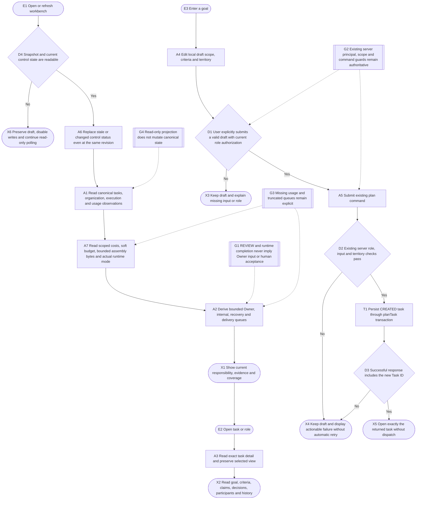
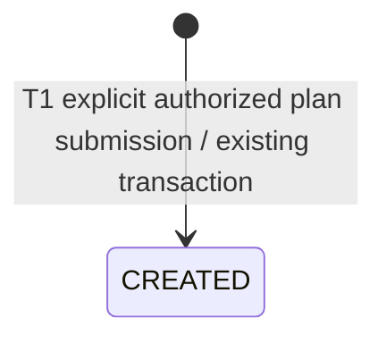

# Personal workbench and task journey

The user opens a personal workbench, distinguishes actual Owner configuration decisions from internal Supervisor work, reads task evidence and scoped costs, and explicitly submits an editable task draft through the existing authorized Chancellor command. Read-only navigation and drafts have no model calls or governance side effects. Memory is out of scope. Budget management links to the independent gui.owner-control flow; opening that page grants no authority.

## Flow



## Sequence

```mermaid
sequenceDiagram
    actor User
    participant GUI
    participant Projection
    participant Store
    participant Control
    User->>GUI: Open workbench or task
    GUI->>Projection: Snapshot or exact task detail
    Projection->>Store: Read existing facts, scoped role costs, budget and assembly observations
    Store-->>Projection: Canonical rows and task-scoped events
    Note over Projection,GUI: Current runtime mode is injected separately; missing configuration stays explicitly unconfirmed
    Projection-->>GUI: Bounded queues and distinct evidence layers
    GUI-->>User: Current responsibility and partial usage coverage
    User->>GUI: Edit local draft and explicitly submit
    GUI->>Control: Existing plan command with supported parameters
    alt Authenticated authorized Chancellor and valid territory
        Control->>Store: Existing planTask transaction creates CREATED task
        Store-->>Control: Exact new Task ID
        Control-->>GUI: Successful command result
        GUI-->>User: Open returned task; no automatic assignment or dispatch
    else Missing role, invalid input or command failure
        Control-->>GUI: Stable failure code
        GUI-->>User: Preserve draft and show next step
    end
```

## State



## Evidence and failure boundaries

- Owner queue contains current configuration decisions supported by canonical missing bindings or territory ownership; REVIEW and REWORK stay internal. Recovery responsibility follows the actual territory Supervisor, and absent evidence stays unconfirmed.
- A Worker Claim, runtime terminal evidence, Supervisor ACCEPT and human acceptance remain separate. No human acceptance ledger exists in this stage; it is always shown as not recorded.
- The original usage summary still covers Worker Dispatch records only. Separate panels show Chancellor/Supervisor observations and the kingdom soft budget. Exact task detail includes only TASK-attributed role usage; shared and unattributed observations are not allocated or counted twice. Missing coverage never becomes zero cost or a platform-wide total.
- Budget displays distinguish provider reports, reserved estimates, estimated exposure, remaining admission capacity, pending/unconfirmed/recovering units and attribution gaps. The browser renders Core budget states without deciding admission. Amount stays unconfirmed. The /owner management link requires a separately activated Owner window; tightening or disabling policy does not terminate in-flight work, release recovery occupancy or reset accounting.
- Current off/pilot and observer availability remain separate from historical assembly mode; absent injection stays explicitly unconfirmed with null availability. Cost projection bounds recent rows at 40 and each section/context list at 24 with truncation. Runtime/session/source-unit references and prompt text are omitted. Assembly bytes are not final-request Tokens or savings; historyBytes and tokenEstimate stay null.
- Browsing performs reads only. Draft fields stay in GUI memory and do not call a model. Existing plan transaction, authorization and rejection behavior are reused; no new authority, fact store, automatic retry or dispatch is introduced. Successful submission consumes only the submitted draft; edits made while the command is in flight remain intact. Rejection or a missing returned identity preserves the draft and never resubmits automatically.
- Task history is scoped to the exact task before applying its display bound, with explicit truncation. Supervisor decisions have their own task-scoped window and require a Supervisor actor; runtime failure and Owner topology events do not become Supervisor reviews. Refresh keeps navigation, draft, detail and keyboard state in the GUI.
- Root performs local HTTP validation of four themes, narrow screen, keyboard and reduced motion. Motion preserves existing larger character actions.
- Failed snapshot reads disable writes and preserve the draft. Reconnect at the same revision, control revocation and reactivation update the status message; read-only polling never retries a write.

## Validation

- 1.4 maps the four tests in tests/v14-cost-gui.test.ts for attribution, current versus historical mode, bounded byte projection, explicit estimates/unconfirmeds and typed Owner form payloads. Coordinating-task browser-cost-report.json records 16 theme/width scenarios, keyboard budget preparation/commit and actual GUI/Core budget-state changes with zero JavaScript errors; Owner identity and usage inputs are synthetic. This documentation-only pass does not rerun product tests or claim real Provider/human acceptance.
- Projection and affected runtime/stage regression: `node --test tests/gui-personal-workbench.test.ts tests/m3s2-v4-gui.test.ts tests/gui-stage-cardinality.test.ts` — 31/31 passed, including seven new workbench cases.
- Construction A reported 41/41 affected frontend tests passed, including eight new workbench interaction cases. Browser visual acceptance remains root evidence, independent of these source and behavior checks.
- Final failure-path regression: workbench 9/9; local HTTP browser confirms retained draft, disabled writes while unavailable/revoked, restored status and zero command/model requests.
