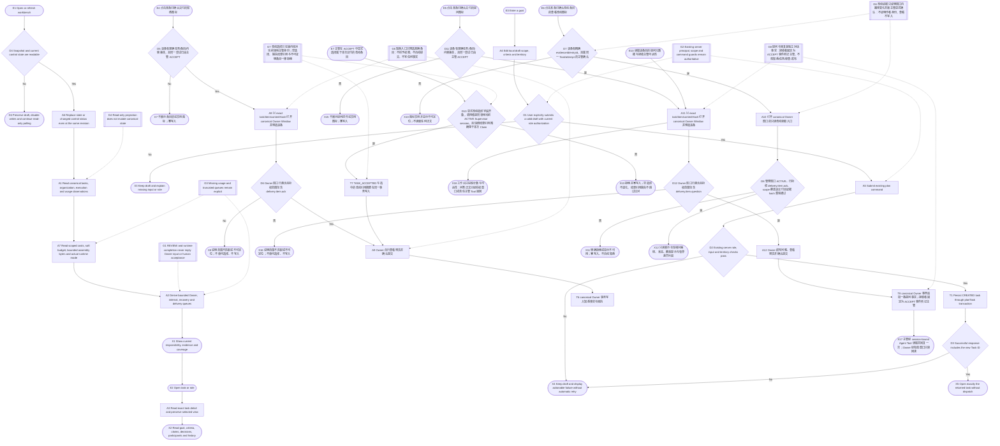
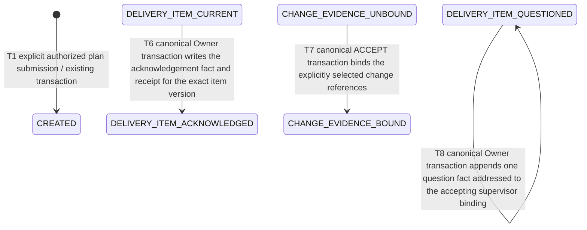

# Personal workbench and task journey

The user opens a personal workbench, distinguishes actual Owner configuration decisions from internal Supervisor work, reads task evidence and scoped costs, and explicitly submits an editable task draft through the existing authorized Chancellor command. Read-only navigation and drafts have no model calls or governance side effects. Memory is out of scope. Budget management links to the independent gui.owner-control flow; opening that page grants no authority.

已确认交付按「成果摘要 → 模块/事项 → 证据/改动」三层展示，每条有稳定条目 ID 与内容版本，外层摘要知悉不覆盖子条。每条知悉图标按钮只做一件事：把 exact `task/item/contentHash` 作为 URL 参数交给 canonical Owner Window 并预选该条。工作台不写事实、不代替 Owner 授权、预览、提交或回执；图标按钮不再重复长文案，accessible name 与 tooltip 保留在 `aria-label`/`title`，键盘可操作，知悉/待知悉状态由相邻状态文本与图标共同表达。改动定位只在主管于 ACCEPT 中显式选择、且本地内容寻址证据 hash 重验通过时可定位，并固定标注「主管确认的改动证据」；其余条目保持不可定位，不把执行者自述文本、本机绝对路径或既有 `SourceRef` 变成链接。查看差异正文需要有效的人类管理窗口，查看不写入、不自动知悉。该证据是有界窗口观测 + 主管确认，绝不声称 Git 证明作者身份。条目提问已由 17 号 Work Order 实现：每条（摘要层与证据层各条）都有独立提问图标，只把 exact `task/item/contentHash` 交给 canonical Owner Window 并预选该条；问题文本由 Owner 在窗口内填写、预览并提交，接收者固定为接受该交付的主管。工作台只投影提问的**最小元数据**（计数、时间、接收主管是否可达），绝不携带问题或回复正文；未回复的问题只显示「待领取」，不代表已通知或已阅读。

## Flow

```mermaid
flowchart TD
    E1(["E1 Open or refresh workbench"]) --> D4{"D4 Snapshot and current control state are readable"}
    D4 -->|No| X6(["X6 Preserve draft, disable writes and continue read-only polling"])
    D4 -->|Yes| A6["A6 Replace stale or changed control status even at the same revision"]
    A6 --> A1["A1 Read canonical tasks, organization, execution and usage observations"]
    A1 --> A7["A7 Read scoped costs, soft budget, bounded assembly bytes and actual runtime mode"]
    A7 --> A2["A2 Derive bounded Owner, internal, recovery and delivery queues"]
    A2 --> X1(["X1 Show current responsibility, evidence and coverage"])
    X1 --> E2(["E2 Open task or role"])
    E2 --> A3["A3 Read exact task detail and preserve selected view"]
    A3 --> X2(["X2 Read goal, criteria, claims, decisions, participants and history"])
    E3(["E3 Enter a goal"]) --> A4["A4 Edit local draft scope, criteria and territory"]
    A4 --> D1{"D1 User explicitly submits a valid draft with current role authorization"}
    D1 -->|No| X3(["X3 Keep draft and explain missing input or role"])
    D1 -->|Yes| A5["A5 Submit existing plan command"]
    A5 --> D2{"D2 Existing server role, input and territory checks pass"}
    D2 -->|No| X4(["X4 Keep draft and display actionable failure without automatic retry"])
    D2 -->|Yes| T1["T1 Persist CREATED task through planTask transaction"]
    T1 --> D3{"D3 Successful response includes the new Task ID"}
    D3 -->|Yes| X5(["X5 Open exactly the returned task without dispatch"])
    D3 -->|No| X4
    E4(["E4 点击某条已确认交付的知悉图标"]) --> D5{"D5 该条有准确任务/条目/内容版本，且同一尝试已由主管 ACCEPT"}
    D5 -->|No| X7(["X7 不展示条目层或禁用图标；零写入"])
    D5 -->|Yes| A8["A8 以 exact task/item/contentHash 打开 canonical Owner Window 并预选该条"]
    A8 --> D6{"D6 Owner 窗口已激活且授权范围包含 delivery.item.ack"}
    D6 -->|No| X8(["X8 说明范围不匹配或不可定位；不替代选择、不写入"])
    D6 -->|Yes| A9["A9 Owner 自行查看预览并确认提交"]
    A9 --> T6["T6 canonical Owner 事务写入知悉事实与回执"]
    E5(["E5 点击某条已确认交付的提问图标"]) --> D11{"D11 该条有准确任务/条目/内容版本，且同一尝试已由主管 ACCEPT"}
    D11 -->|否| X15(["X15 不展示提问控件或禁用图标；零写入"])
    D11 -->|是| A11["A11 以 exact task/item/contentHash 打开 canonical Owner Window 并预选该条"]
    A11 --> D12{"D12 Owner 窗口已激活且授权范围包含 delivery.item.question"}
    D12 -->|否| X16(["X16 说明范围不匹配或不可定位；不替代选择、不写入"])
    D12 -->|是| A12["A12 Owner 填写问题、查看预览并确认提交"]
    A12 --> T8["T8 canonical Owner 事务追加一条提问事实；接收者固定为 ACCEPT 事件所记主管"]
    T8 --> X17(["X17 主管经 session-bound Agent Tool 读取并回复一次；Owner 经有效窗口只读回读"])
    E10(["E10 读取该条目的提问元数据与接收主管可达性"]) --> A11
    A11 --> X18(["X18 工作台只投影计数与可达性：问答正文只经授权窗口或责任主管 Tool 返回"])
    E6(["E6 点击某条已确认改动条目的查看改动图标"]) --> D7{"D7 该条有精确 evidenceId/entryId，且属同一 Task/attempt 的主管确认"}
    D7 -->|否| X10(["X10 图标禁用并显示不可定位；不读取任何正文"])
    D7 -->|是| A10["A10 打开 canonical Owner 窗口的只读改动读取入口"]
    A10 --> D8{"D8 管理窗口 ACTIVE、已授权 delivery.item.ack、scope 覆盖该交付且证据 hash 重验通过"}
    D8 -->|否| X11(["X11 明确拒绝或显示不可用；零写入、不自动知悉"])
    D8 -->|是| X12(["X12 只读展示仓库相对路径、状态、覆盖提示与有界差异片段"])
    E7(["E7 主管在 ACCEPT 中显式选择属于本次交付的改动条目"]) --> D10{"D10 显式改动选择字段齐备，调用者是同领地当前 ACTIVE Supervisor session，且快照结果引用精确等于本次 Claim"}
    D10 -->|否| X13(["X13 拒绝并零写入；空选择不退化，结果引用缺失不跳过比对"])
    D10 -->|是| T7["T7 TASK_ACCEPTED 与选中的改动引用摘要在同一事务写入"]
    T7 --> A9
    G1[["G1 REVIEW and runtime completion never imply Owner input or human acceptance"]] -.-> A2
    G2[["G2 Existing server principal, scope and command guards remain authoritative"]] -.-> D1
    G2 -.-> A5
    G3[["G3 Missing usage and truncated queues remain explicit"]] -.-> A2
    G3 -.-> A7
    G4[["G4 Read-only projection does not mutate canonical state"]] -.-> A1
    G5[["G5 知悉入口只预选准确条目：不授予权限、不自动提交、不写任何事实"]] -.-> A8
    G5 -.-> A9
    G6[["G6 改动证据只证明窗口内路径变化并被主管显式确认：不证明作者身份，查看不写入"]] -.-> D7
    G6 -.-> A10
    G7[["G7 改动选择只在锁内核对当前领地主管身份；空选择、缺失结果引用与不可证明条目一律拒绝"]] -.-> D10
    G7 -.-> T7
    G8[["G8 提问与回复是独立对话事实：接收者固定为 ACCEPT 事件所记主管，不改知悉/任务/审查/发布"]] -.-> T8
    G8 -.-> A11
```

## Sequence

```mermaid
sequenceDiagram
    actor User
    participant GUI
    participant Projection
    participant Store
    participant Control
    User->>GUI: Open workbench or task
    GUI->>Projection: Snapshot or exact task detail
    Projection->>Store: Read existing facts, scoped role costs, budget and assembly observations
    Store-->>Projection: Canonical rows and task-scoped events
    Note over Projection,GUI: Current runtime mode is injected separately; missing configuration stays explicitly unconfirmed
    Projection-->>GUI: Bounded queues and distinct evidence layers
    GUI-->>User: Current responsibility and partial usage coverage
    User->>GUI: Edit local draft and explicitly submit
    GUI->>Control: Existing plan command with supported parameters
    alt Authenticated authorized Chancellor and valid territory
        Control->>Store: Existing planTask transaction creates CREATED task
        Store-->>Control: Exact new Task ID
        Control-->>GUI: Successful command result
        GUI-->>User: Open returned task; no automatic assignment or dispatch
    else Missing role, invalid input or command failure
        Control-->>GUI: Stable failure code
        GUI-->>User: Preserve draft and show next step
    end
```

## State

```mermaid
stateDiagram-v2
    [*] --> CREATED: T1 explicit authorized plan submission / existing transaction
    DELIVERY_ITEM_CURRENT --> DELIVERY_ITEM_ACKNOWLEDGED: T6 canonical Owner transaction writes the acknowledgement fact and receipt for the exact item version
    CHANGE_EVIDENCE_UNBOUND --> CHANGE_EVIDENCE_BOUND: T7 canonical ACCEPT transaction binds the explicitly selected change references
    DELIVERY_ITEM_QUESTIONED --> DELIVERY_ITEM_QUESTIONED: T8 canonical Owner transaction appends one question fact addressed to the accepting supervisor binding
```

## Evidence and failure boundaries

- Owner queue contains current configuration decisions supported by canonical missing bindings or territory ownership; REVIEW and REWORK stay internal. Recovery responsibility follows the actual territory Supervisor, and absent evidence stays unconfirmed.
- A Worker Claim, runtime terminal evidence, Supervisor ACCEPT and human acceptance remain separate. No human acceptance ledger exists in this stage; it is always shown as not recorded.
- The original usage summary still covers Worker Dispatch records only. Separate panels show Chancellor/Supervisor observations and the kingdom soft budget. Exact task detail includes only TASK-attributed role usage; shared and unattributed observations are not allocated or counted twice. Missing coverage never becomes zero cost or a platform-wide total.
- Budget displays distinguish provider reports, reserved estimates, estimated exposure, remaining admission capacity, pending/unconfirmed/recovering units and attribution gaps. The browser renders Core budget states without deciding admission. Amount stays unconfirmed. The /owner management link requires a separately activated Owner window; tightening or disabling policy does not terminate in-flight work, release recovery occupancy or reset accounting.
- Current off/pilot and observer availability remain separate from historical assembly mode; absent injection stays explicitly unconfirmed with null availability. Cost projection bounds recent rows at 40 and each section/context list at 24 with truncation. Runtime/session/source-unit references and prompt text are omitted. Assembly bytes are not final-request Tokens or savings; historyBytes and tokenEstimate stay null.
- Browsing performs reads only. Draft fields stay in GUI memory and do not call a model. Existing plan transaction, authorization and rejection behavior are reused; no new authority, fact store, automatic retry or dispatch is introduced. Successful submission consumes only the submitted draft; edits made while the command is in flight remain intact. Rejection or a missing returned identity preserves the draft and never resubmits automatically.
- Task history is scoped to the exact task before applying its display bound, with explicit truncation. Supervisor decisions have their own task-scoped window and require a Supervisor actor; runtime failure and Owner topology events do not become Supervisor reviews. Refresh keeps navigation, draft, detail and keyboard state in the GUI.
- Root performs local HTTP validation of four themes, narrow screen, keyboard and reduced motion. Motion preserves existing larger character actions.
- Failed snapshot reads disable writes and preserve the draft. Reconnect at the same revision, control revocation and reactivation update the status message; read-only polling never retries a write.
- 每个知悉图标按钮只携带 exact `task/item/contentHash` 导航到 `/owner?ack_task=…&ack_item=…&ack_hash=…`；它不写入、不自动提交，也不进入 sessionStorage 或别名链。条目层仍只在同一 Task/attempt 的主管 ACCEPT 后出现，Worker Claim 不升格。图标按钮的 accessible name 与 tooltip 保留在 `aria-label`/`title`，可见状态文本与不靠颜色的图标共同表达已知悉/待知悉；`contentHash` 或条目 ID 缺失时按钮禁用且不提供替代选择。
- 未激活路径提供「复制本条 Owner 激活命令」图标按钮：复制的是 direct `/kingdom owner.gui` 文本，只申请 `delivery.item.ack` 与**本条领地范围**（`territoryIds` 单元素），并携带非授权 `taskHint`/`itemHint`/`contentHashHint`。范围刻意不引用快照里的主管 `bindingId`：绑定可能在快照之后退任或更换，领地范围由 direct 入口按当前真实状态校验。复制只使用浏览器 Clipboard API；没有它时按钮明确报告「命令未复制」，不做无法验证结果的旧式回退，也不假装成功。复制本身不授权、不预选、不写入。
- 「查看改动」只在主管显式选择且本地 hash 重验通过时可用，并固定标注「主管确认的改动证据」；其余条目一律不可定位并禁用，不把任意 Claim 文本、本机绝对路径或既有 `SourceRef` 当作链接。差异正文不进入工作台投影，只经有效 Owner 窗口的只读接口返回；查看不写入、不自动知悉、不改变 Task/Claim。不可定位与「已知悉」图标的不可用原因写进随控件可读的可见提示（`aria-disabled` + `aria-describedby`），不只在 `title`；可用图标按钮在同一包装层登记 hover / 键盘聚焦时可见的操作说明（`data-control-status="AVAILABLE"`），禁用原因则常驻可见（`data-control-status="DISABLED"`）；图标按钮的 `:focus-visible` 有可见焦点环，禁用态用虚线焦点环区分。
- 执行路径在**实际副作用前**冻结有界 PRE、在 terminal/WorkerResult 前冻结 POST：候选路径只由 Git 自己枚举（`ls-files --cached/--others --exclude-standard` 加 `diff --name-only HEAD`），且始终从 Git 仓库根解析工作区路径，因此子目录领地也能解析到真实改动；因此 `.gitignore` 排除的私有内容既不会成为候选、正文也不会被打开或复制；文件数、单文件大小、总读取量、正文保留量与差异行数都有上限。超限、不可读、符号链接与被 ignore 排除都如实标为部分覆盖，并由主管在 ACCEPT 中显式选择条目。未跟踪文件、任务前已脏文件与并行变化按各自真实标签呈现，绝不声称 Git 证明作者身份；无法证明是否变化的候选标为不可确认，不能成为改动条目。符号链接只观测不跟随，链接自身没有可比较摘要，因此两侧都观察到链接也一律记不可确认状态（`SYMLINK_CHANGE_UNPROVEN`）、不可被确认，绝不把未变化的链接写成改动。增删判定要求两时点都有完整可信的候选枚举，且两时点被 ignore 规则排除的路径身份都可完整确认：只有文件/读取预算截断（`ENUMERATION_INCOMPLETE`）才使「该路径不在快照里」不再等于「它当时不存在」；`.gitignore` 有意排除内容与工作区内证据目录自身属于候选集合的**有意范围限定**，只让 `coverage.complete=false`（`IGNORED_CONTENT_EXCLUDED`/`EVIDENCE_ROOT_EXCLUDED`），不据此把未忽略路径的存在性判成不可证明，否则窗口内真实新增会无法确认。窗口内只改忽略规则时，内容未变的旧文件会离开或进入候选集合：快照保留的 ignored 路径身份（只含路径名、绝不含正文）用于识别「那个缺项其实是被 ignore」，这类条目记不可确认状态（`IGNORED_TRANSITION_UNPROVEN`）而不是新增或删除；被排除的路径身份无法完整确认时记 `IGNORED_SCOPE_UNCONFIRMED`，绝不默认「未忽略」；被排除路径的身份集合**无条件**由 Git 自己结算，不做「本仓库/本工作区看起来有没有规则」的预判，因此工作区**内部**任意深度的 `.gitignore` 与 linked worktree 的排除文件都在覆盖范围内。同理，单文件摘要始终覆盖完整内容，无法完整比较时记不可确认而不是「未变化」；命中 PEM 私钥/证书标记的路径在写正文前即判定，两侧正文都不保留。条目展示路径一律是**仓库相对路径**（子目录领地里 `app.ts` 显示为 `src/app.ts`），工作区相对路径只用于本地读取与条目身份。普通 ACCEPT 不自动确认全部 diff；证据缺失、漂移、不属于当前领地工作区，或 manifest 的 Territory ID 与本 Task 领地不一致时，只显示不可定位。显式改动选择与候选查看在默认 `declarative` 配置下也强制要求真实、当前、同领地的 ACTIVE Supervisor session（普通 review/ACCEPT 语义不变）。
- Owner 交付目录与工作台「最近交付」按同一「交付最近更新/被接受」顺序排列：主管 ACCEPT 会更新 `tasks.updated_at`，因此旧建但最近接受的交付仍在 Owner 目录内，可被逐条知悉与读取差异；目录条目上限仍然只截断最旧的交付，不新增第二套任务索引。
- 条目提问已实现（17 号 Work Order）：摘要层与每个证据层条目各有独立提问图标，只把 exact `task/item/contentHash` 交给 canonical Owner Window，并在受权窗口内填写、预览、提交。问题与回复是**两条独立事件**，接收者固定为接受该交付的主管；原主管退任、换 session 或领地改绑时问题保持可见但明确不可达，不会自动转给继任者。工作台只投影提问的最小元数据（总数、待回复、已回复、旧版本历史、接收主管是否可达），绝不携带问题或回复正文——正文只经有效 Owner 窗口或当前责任主管的 session-bound Agent Tool 读取。未回复的问题只显示「待领取」，不声称已通知或已阅读；提问不是知悉，也不改 Task/Claim/审查/Owner acceptance/发布。

## Validation

- 1.4 maps the four tests in tests/v14-cost-gui.test.ts for attribution, current versus historical mode, bounded byte projection, explicit estimates/unconfirmeds and typed Owner form payloads. Coordinating-task browser-cost-report.json records 16 theme/width scenarios, keyboard budget preparation/commit and actual GUI/Core budget-state changes with zero JavaScript errors; Owner identity and usage inputs are synthetic. This documentation-only pass does not rerun product tests or claim real Provider/human acceptance.
- Projection and affected runtime/stage regression: `node --test tests/gui-personal-workbench.test.ts tests/m3s2-v4-gui.test.ts tests/gui-stage-cardinality.test.ts` — 31/31 passed, including seven new workbench cases.
- Construction A reported 41/41 affected frontend tests passed, including eight new workbench interaction cases. Browser visual acceptance remains root evidence, independent of these source and behavior checks.
- Final failure-path regression: workbench 9/9; local HTTP browser confirms retained draft, disabled writes while unavailable/revoked, restored status and zero command/model requests.
- 本轮改动证据：`node --test --experimental-test-isolation=none tests/delivery-change-evidence.test.ts` — 7/7 passed。使用真实临时 Git 仓库、临时证据根与临时内存 DB，覆盖：未提交改动经 POST/主管确认后被 Owner 只读打开；任务前已脏、未跟踪、二进制、超限标签；declarative/错误 session/伪造 evidence/空选择/漂移证据/重复 ACCEPT 的零写入拒绝；越界窗口、冒充条目与路径穿越；真实 HTTP 只读路由的 401/400/409 与成功读取且零事实写入。`npm run typecheck`、`npm run build` 与受影响定向套件（owner-delivery-ack/owner-window/gui-owner-ui/gui-personal-workbench/v12-workbench-console/gui-owner-control）100/100 passed。未运行全套 `npm test`，未运行真实 DSH/Provider。
- R3 返工定向：`node --test --experimental-test-isolation=none tests/delivery-change-boundary.test.ts` — 10/10 passed；`tests/delivery-change-tool-entry.test.ts` — 1/1 passed。覆盖 Git 忽略的私有内容不成为候选/不落正文且记部分覆盖、未变化的超限文件不产生改动条目、普通目录不被静默跳过、工作区内证据目录自身不算改动、显式空选择与空白条目 id 拒绝、结果引用缺失不得跳过比对、并发改绑后过期身份零写入、同领地但未授权 `delivery.item.ack` 的 Owner 窗口读不到正文、无 Git 基准零采集，以及默认 `declarative` 配置下真实/失活 session 的显式选择与候选查看行为。
- R4 返工定向：`tests/delivery-change-boundary.test.ts` — 19/19 passed，新增子目录领地真实改动、262145 字节仅尾部变化、无法完整 hash 只能不可确认、枚举预算截断不产生假删除、枚举完整时新增仍可证明、tracked PEM 正文不入证据目录、受控注入的锁前改绑零写入，以及「Runtime cwd 回退保持原行为、采集只认 canonical workspace」的源级回归。`tests/delivery-change-evidence.test.ts` 7/7、`tests/delivery-change-tool-entry.test.ts` 1/1 保持通过；本轮验证未运行真实 DSH/Provider 与正式 DB。
- R5 定点返工定向（本机以直接 `node tests/<file>.test.ts` 运行，`node --test` 因沙箱拒绝父子进程管道的 spawn EPERM 不可用）：`tests/delivery-change-boundary.test.ts` — 22 passed / 0 failed / 1 skipped（`an unchanged symbolic link is never reported as a confirmable change` 因本机不允许 `symlink(2)`（EPERM）跳过，同形状的两侧同值观察反例在隔离 manifest 中通过）；`tests/delivery-change-evidence.test.ts` — 8/8；`tests/delivery-change-tool-entry.test.ts` — 1/1；`tests/owner-delivery-ack.test.ts` — 41/41；相邻回归 `gui-personal-workbench` 7/7、`v12-workbench-console` 9/9、`owner-window` 25/25、`gui-owner-ui` 2/2、`v13-owner-direct-ingress` 1/1。`npm run typecheck` 与 `npm run build` 通过。未运行全套 `npm test`（其中无关的 `r13-runner-context-broker` 在早前轮次为 INTERRUPTED/NOT_RUN），未运行真实 DSH/Provider、正式 DB 与真实浏览器人工交互。本候选树内没有 `flowctl.py`，`Flow validate --changed` 为 NOT_RUN，只做文档与符号对账。
- R6 定点返工定向（本机以直接 `node tests/<file>.test.ts` 运行，`node --test` 因沙箱拒绝父子进程管道的 spawn EPERM 不可用）：`tests/delivery-change-boundary.test.ts` — 26 passed / 0 failed / 1 skipped（同一 symlink EPERM 跳过）。新增两个一次性 Git 正反例：窗口内只去掉某条忽略规则不把内容未变的旧文件写成 `ADDED`，只新增一条忽略规则也不把它写成 `DELETED`，两者都记 `IGNORED_TRANSITION_UNPROVEN` 且 `validateChangeSelection` 拒绝；同一窗口里真实新增的无关普通文件仍为 `ADDED` 且可确认，被排除路径的正文从未落盘（canary 不在证据目录或 manifest 里）。另一个反例：ignore 清单被字节预算截断（`IGNORED_SCOPE_UNCONFIRMED`）时不默认「未忽略」，窗口新增同样不可确认。另加子目录领地用例：排除内容只由仓库根 `.gitignore` 决定时仍枚举出工作区相对的排除路径身份，且在 `git init` 自带的 `.git/info/exclude` 被删除后也成立。`tests/owner-delivery-ack.test.ts` — 41/41：可用的「查看改动/知悉/复制」图标在同一包装层登记 hover/键盘聚焦时可见的操作说明（`data-control-status="AVAILABLE"` 且 `aria-describedby` 指向真实提示节点），禁用原因仍常驻可见；相邻回归 `delivery-change-evidence` 8/8、`delivery-change-tool-entry` 1/1、`owner-window` 25/25、`gui-personal-workbench` 7/7、`v12-workbench-console` 9/9、`gui-owner-ui` 2/2、`gui-owner-control` 10/10、`gui-interactive-console` 27/27、`v13-owner-direct-ingress` 1/1。`npm run typecheck` 与 `npm run build` 通过；`python C:\Users\ADMIN\.codex\skills\feature-flow-contract\scripts\flowctl.py --project D:\dsh\kingdom-owner-ack-dev-20260927 validate --changed` 为 0 error / 0 warning。未运行全套 `npm test`，未运行真实 DSH/Provider、正式 DB 与真实浏览器人工交互。
- R7 定点返工定向（本机以直接 `node tests/<file>.test.ts` 运行，`node --test` 因沙箱拒绝父子进程管道的 spawn EPERM 不可用）：`tests/delivery-change-boundary.test.ts` — 28 passed / 0 failed / 1 skipped（同一 symlink EPERM 跳过）。新增两个一次性 Git 正反例，覆盖工作区**内部**嵌套 `.gitignore`（仓库根无规则、`git init` 自带的 `.git/info/exclude` 已删除）：窗口内只删掉 `src/.gitignore` 的嵌套规则时，内容一字未改的 `src/secret.txt` 记不可确认状态（`IGNORED_TRANSITION_UNPROVEN`）且 `validateChangeSelection` 拒绝，绝不写成 `ADDED`；窗口内只新增该嵌套规则时同样记不可确认、绝不写成 `DELETED`。两个用例都证明嵌套排除身份确已被枚举（以工作区相对形式出现），同一窗口里真实新建的无关普通文件仍为 `ADDED` 且可确认，被排除正文从未落盘（canary 不在证据目录或 manifest 里）。相邻回归 `delivery-change-evidence` 8/8、`delivery-change-tool-entry` 1/1、`owner-delivery-ack` 41/41、`owner-window` 25/25、`gui-owner-ui` 2/2、`gui-owner-control` 10/10、`gui-personal-workbench` 7/7、`v12-workbench-console` 9/9、`v13-owner-direct-ingress` 1/1、`gui-interactive-console` 27/27，全部 0 failed。`npm run typecheck` 与 `npm run build` 通过；`python C:\Users\ADMIN\.codex\skills\feature-flow-contract\scripts\flowctl.py --project D:\dsh\kingdom-owner-ack-dev-20260927 validate --changed` 为 0 error / 0 warning。未运行全套 `npm test`，未运行真实 DSH/Provider、正式 DB 与真实浏览器人工交互。
- R9（17 号 Work Order：条目提问闭环）定向：`tests/delivery-question-loop.test.ts` — 13/13、`tests/owner-delivery-ack.test.ts` — 42/42。覆盖 Owner 经 canonical 窗口提交提问（幂等重试、同文本不新增事实、不同问题各自独立、空/超长/旧版本/伪造条目/错误交付 ID 零写入）、窗口只授权知悉时既不能提问也不能读正文、主管经 session-bound 入口从权威 events 账本读取只属于自己的问题并回复一次（同文本幂等、冲突回复拒绝、declarative/错 session/伪造 questionId/空回复零写入）、退任/换 session/领地改绑一律不可达且不改投继任者、条目改版后旧问答只留历史、以及快照/TaskDetail.relatedEvents/recentEvents/事件轮询/工作台投影都不含问题或回复正文（事件投影只保留 `[redacted]` 元数据），正文只经有效 Owner 窗口返回。HTTP 只读路由 `/api/owner/delivery-questions` 在真实本机服务上核对 401/400/409 与零写入。相邻回归 `owner-window` 25/25、`delivery-change-evidence` 8/8、`delivery-change-boundary` 28 passed/1 skipped、`delivery-change-tool-entry` 1/1、`gui-personal-workbench` 7/7、`v12-workbench-console` 9/9、`gui-owner-ui` 2/2、`gui-owner-ui-recovery` 4/4、`gui-owner-control` 10/10、`gui-interactive-console` 27/27、`v13-owner-direct-ingress` 1/1、`owner-control-plane` 3/3。`npm run typecheck` 与 `npm run build` 通过；`python C:\Users\ADMIN\.codex\skills\feature-flow-contract\scripts\flowctl.py --project D:\dsh\kingdom-owner-ack-dev-20260927 validate --changed` 为 0 error / 0 warning。未运行全套 `npm test`（`node --test` 在本机沙箱因父子进程管道 spawn EPERM 不可用），未运行真实 DSH/Provider、正式 DB 与真实浏览器人工交互。
- R2 定点返工（19 号 Code Review QA R1 的七项 + 20 号事务门修复；本机 `node --test --experimental-test-isolation=none`，默认子进程隔离因沙箱父子进程管道 spawn EPERM 不可用）：`tests/delivery-question-loop.test.ts` — 17/17、`tests/owner-delivery-ack.test.ts` — 42/42、`tests/delivery-change-evidence.test.ts` — 9/9、`tests/delivery-change-boundary.test.ts` — 28 passed/1 skipped（symlink EPERM）、`tests/delivery-change-tool-entry.test.ts` — 1/1、`tests/gui-owner-control.test.ts` — 10/10、`tests/v13-owner-direct-ingress.test.ts` — 1/1；相邻回归 `owner-window`/`owner-control-plane`/`owner-binding-intent`/`index-owner-binding-integration`/`gui-personal-workbench`/`gui-owner-ui`/`gui-owner-ui-recovery`/`gui-control-server`/`gui-local-control-security`/`r8-tx4-integrity`/`gui-v1-command-surface`/`v12-workbench-console` 合计 95/95；GUI 渲染批 `gui-visual-language`/`gui-stage-cardinality`/`gui-interactive-console`/`gui-v1-vertical-flow`/`gui-governed-vertical-flow`/`m3s2-v4-gui`/`v15-collaboration-gui`/`v14-cost-gui` 合计 65/65。反例实测：①新 operation 的同文问题不再被历史问文吞掉（两条独立事实、事件 ID 由 operationId 决定）；②接收主管要求 `actor_id` 与 payload `reviewer_binding_id` 同时非空且相等，伪造/缺一字段零写；③主管显式选择的 CHANGE 条目可提问并回复，证据漂移后 fail-closed；④同一交付第二个条目保留自己的问答线程；⑤提问专用最小 direct 命令 + `hintAction` 兑换后回到 `ask_*`，非法动作激活前拒绝；⑥收件箱枚举该 session 全部 ACTIVE SUPERVISOR binding；⑦回复事件 ID 只由 questionId 决定、重验与唯一写入在 `store.withImmediateTransaction` 内，双连接同库不产生双事实，BEGIN 失败原样传播零写（BEGIN-fallback 已删除）。`npm run typecheck` 与 `npm run build` 通过；`flowctl.py validate --changed` 为 0 error / 0 warning。未运行全套 `npm test`，未运行真实 DSH/Provider、正式 DB、真实浏览器人工交互与 Owner acceptance。
- R5 定点返工（25 号 Code Review QA R4 的唯一定点：历史列表点击后无焦点/视口反馈；本机以直接 `node tests/<file>.test.ts` 运行，`node --test` 因沙箱拒绝父子进程管道的 spawn EPERM 不可用）：`tests/owner-delivery-ack.test.ts` — 49/49；相邻回归 `delivery-question-loop` 21/21、`delivery-change-evidence` 9/9、`gui-owner-ui` 2/2、`gui-owner-ui-recovery` 4/4、`gui-owner-control` 10/10、`v13-owner-direct-ingress` 1/1、`v12-workbench-console` 9/9、`gui-personal-workbench` 7/7、`owner-window` 25/25，全部 0 failed。反例实测：把编译产物里的 `'THREAD'` 焦点分支临时停用后，恰好这 2 个焦点用例失败（47 pass / 2 fail），`npm run build` 恢复后 49/49；新用例用真实 Core→UI 断言「A 的读取仍在途中不抢焦点/视口、改点 B 后焦点与视口落到 B 的真实线程标题、过期的 A 响应回来既不覆盖面板也不跳焦点」。`npm run typecheck` 与 `npm run build` 通过；`python C:\Users\ADMIN\.codex\skills\feature-flow-contract\scripts\flowctl.py --project D:\dsh\kingdom-owner-ack-dev-20260927 validate --changed` 为 0 error / 0 warning。未运行全套 `npm test`，未运行真实 DSH/Provider、正式 DB、真实浏览器人工交互与 Owner acceptance。
- R6 定点返工（26 号 Code Review QA R5 的唯一定点：历史列表点击后的**新鲜失败**反馈不可见；本机以直接 `node tests/<file>.test.ts` 运行，`node --test` 因沙箱拒绝父子进程管道的 spawn EPERM 不可用）：`tests/owner-delivery-ack.test.ts` — 50/50；相邻回归 `delivery-question-loop` 21/21、`delivery-change-evidence` 9/9、`gui-owner-ui` 2/2、`gui-owner-ui-recovery` 4/4、`gui-owner-control` 10/10、`v13-owner-direct-ingress` 1/1、`v12-workbench-console` 9/9、`gui-personal-workbench` 7/7、`owner-window` 25/25，全部 0 failed。新用例用真实 Core→UI 历史条目加受控失败/乱序失败断言：新鲜失败消息本身获得程序化焦点与 `scrollIntoView`，因此停在下方列表的 Owner 也在当前视口看到错误；A 的失败停在途中时改点 B，焦点与视口落到 B 的真实 Core 线程标题；过期的 A 失败回来既不覆盖面板也不抢焦点；三条读取路径全程零 POST。反例实测：把编译产物里的失败焦点分支临时停用（`if (focusAfterRender === 'THREAD')` 改为 `if (false)`）后，恰好此用例失败为 49 pass / 1 fail，`npm run build` 恢复后 50/50。`npm run typecheck` 与 `npm run build` 通过；`python C:\Users\ADMIN\.codex\skills\feature-flow-contract\scripts\flowctl.py --project D:\dsh\kingdom-owner-ack-dev-20260927 validate --changed` 为 0 error / 0 warning。未运行全套 `npm test`，未运行真实 DSH/Provider、正式 DB、真实浏览器人工交互与 Owner acceptance。
