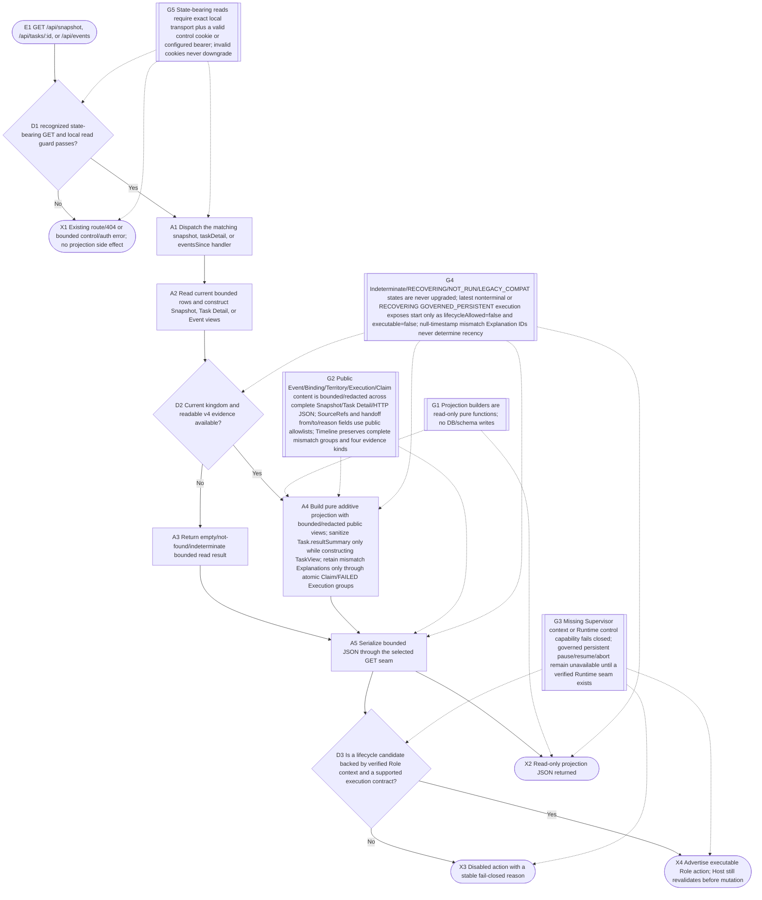

# Read-only Projection Console

## Purpose

在 v0.9 四类证据分层上提供 v1.0 additive read projection：通过
`GET /api/snapshot`、`GET /api/tasks/:id` 与 `GET /api/events` 输出状态总览、
Task Detail、Timeline、Attention、有界 Organization 与 Execution history。
Task Detail additive 暴露脱敏 Assignment Ledger history 与 `TASK_HANDED_OFF`
Supervisor decision；Event payload、Binding 私有配置、Territory 路径/摘要、
Execution detail、Claim 展示内容与 `Task.resultSummary` 都只在 public Projection
输出边界统一做有界脱敏。这里不声称 `Task.resultSummary` 在 DB write 边界已经
脱敏。

当前 `/console` 返回可提交受控命令的交互式 `CONSOLE_APP_HTML`；它消费本流程
的 read projection，但不属于“只读 shell”。本流程自身不写 Kingdom Ledger、
Projection、正式 DB 或 Runtime，也不改变既有 HTTP POST 写路由；Owner-only
操作必须回到 direct `/kingdom` Slash。

## Entry, preconditions, and terminal outcomes

- Entry: Console 或其他本地消费者请求 `GET /api/snapshot`、`GET /api/tasks/:id` 或 `GET /api/events`。
- Preconditions: server seam 已启动；请求通过 state-bearing GET 的精确本地 Origin/Host 与有效 control cookie 或已配置 bearer 校验。
- Success outcome: JSON 以 additive 字段提供 Overview、Organization、Task、Execution、Timeline 与 Attention，重要状态、分类、reason 与 sourceRefs 可追溯；旧消费者字段保持兼容。
- Rejection outcome: 未识别路径沿既有路由/404 处理；未通过 read guard 的请求返回稳定 control/auth 错误，均不调用 projection handler。
- Failure outcome: 空库、非 v4、缺上下文、DENIED、RECOVERING、Claim/Execution 不一致保持 empty、indeterminate 或对应负向状态；handler 异常返回 bounded error，不触发 retry 或写副作用。

## Runtime flow



## Component sequence

```mermaid
sequenceDiagram
    actor Browser
    participant GUI as GUI HTTP server
    participant Projection as Projection handlers/builders
    participant Store as KingdomStore
    Browser->>GUI: GET /api/snapshot, /api/tasks/:id, or /api/events
    GUI->>GUI: validate route, exact local transport, control cookie/bearer
    alt read guard rejected
        GUI-->>Browser: bounded control/auth error or existing 404
    else read guard accepted
        GUI->>Projection: snapshot / taskDetail / eventsSince
        Projection->>Store: read current bounded rows and v4 observations
        Store-->>Projection: source rows
        Projection->>Projection: build bounded/redacted public view
        Projection-->>GUI: Snapshot, Task Detail, or Event result
        GUI-->>Browser: JSON response
    end
    Note over Browser,Store: /console is an interactive consumer with a separate governed POST path; this contract covers only the three read Projection APIs
```

## Safeguards

- `G1`：Projection 只读、可重建，不产生持久化或外部 Runtime 副作用。
- `G2`：公共 view 保持既有字段/type shape：EventView payload 与 Binding `sessionMeta` 的敏感 key 递归替换为 `[REDACTED]`，Binding model/agent/execution-profile 配置只返回稳定脱敏标记，Territory workspacePath/summary、Execution detail、Claim summary/artifacts/risks 统一做路径/私有标记/inline secret 脱敏和字符串/数组限制，Claim/Execution session 字段仅保留掩码。`toTaskView` 在输出时脱敏 `Task.resultSummary`；这不是 DB write sanitizer。完整 `buildSnapshot`、`buildTaskDetail`、events 及三条 HTTP GET JSON 均覆盖；必要组织 ID/name/status/roleName/runtimeType 与非敏感 Claim 内容保持可读。sourceRefs 最多 8 条，只允许公开 table/event/rule 类型与安全 ID；Organization roles/territories 最多各 64 条，Execution history 最多 100 条且有 truncation truth；Task Detail Assignment Ledger history 与 `TASK_HANDED_OFF` decision 的 from/to assignment/worker/reason 均有界脱敏；Timeline 继续明确区分四类证据并原子保留 mismatch 组。
- `G3`：Owner-only action 始终 `executable=false / DIRECT_SLASH_REQUIRED`；Agent-role action 缺 Host-only opaque Supervisor session、Task Territory scope、Host context 或 command coverage 时 fail-closed。HTTP command 名只证明路由存在，不证明 Runtime capability；在匹配 Runtime control seam 仍 `NOT_RUN / indeterminate` 时，`GOVERNED_PERSISTENT` 的 pause/resume/abort 固定 `executable=false / GOVERNED_RUNTIME_CONTROL_UNAVAILABLE`，而已有 `LEGACY_COMPAT` 合法路径保持可用。
- `G4`：Schema v4 不可用、terminal evidence 缺失、indeterminate/`RECOVERING/NOT_RUN/LEGACY_COMPAT` 或 Claim/Execution mismatch 保持原始/负向事实；只要 latest `GOVERNED_PERSISTENT` Execution 为 `STARTING/RUNNING/PAUSED/RECOVERING`，Task Detail 中 `start` 必须 `lifecycleAllowed=false / executable=false`，不自动 retry、new attempt 或 dispatch；超限 mismatch 仍成组保留。
- `G5`：三个 state-bearing GET 只接受精确本地 transport，并要求有效 control cookie 或已配置且匹配的 bearer；显式无效/过期 cookie 不会降级为 bearer 或匿名读取。

## Failure, recovery, and observability

本流程没有外部调用、持久化状态转换或自动重试；读取异常直接返回 bounded error/indeterminate
视图。观察到的 `RECOVERING`、missing terminal evidence 或 mismatch 只进入 Attention，
由授权方人工对账，Console 不执行恢复动作。

## Implementation notes

机器可读的代码和测试映射维护在 `traceability.yaml`。本轮只依据 current live
source/tests 对账；产品测试不在本任务授权范围内，验证仅使用 `flowctl`。
