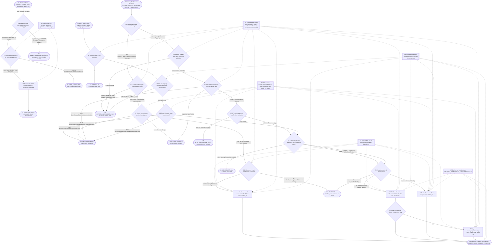
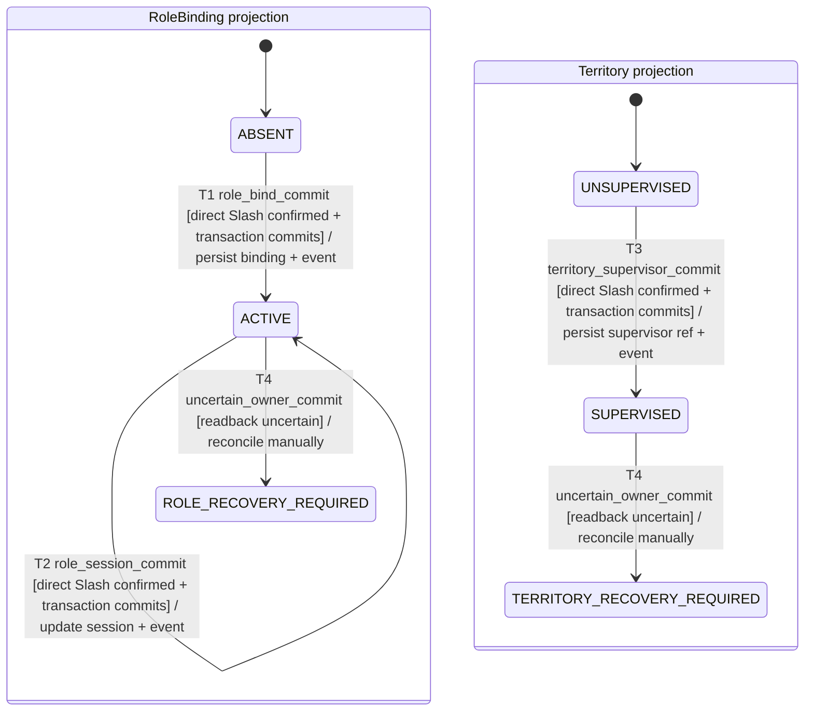

自然语言与本 Draft module 只形成可回显的 zero-write Draft。该阶段不读取或
写入 KingdomStore，不写 event/binding/role/territory，不 mint capability，也
不把 Agent 或 target session ref 解释为 Owner authority。最终可执行输入仍必须
是用户直接确认的 canonical `/kingdom` Slash；只有该 direct Owner ingress 在
自己的 transaction boundary 中持久化 binding/session/Territory 与 event。

本 Flow 同时记录 Primary-owned integration：`src/index.ts` 的
`resolveTrustedToolSession` 只有在 current initiator、`agents.get` 与
`sessions.get` 返回 exact object identity、`agent.id === session.id`、Agent
处于 `running` 且 signal 未 aborted 时，才传入
`target_session_classification: ACTIVE`；否则保留显式失败分类，不能用非空
session id fallback。Draft Tool 传入该分类、`target_session_ref`、role
snapshots 和包含 `supervisor_binding_id` 的 Territory snapshots。
`ownerToolDenied`、`kingdom_bind_role`、`kingdom_bind_session` 的结构化拒绝
路径调用 `draftOwnerBindingIntentFromRejectedWrite`，只返回 zero-write Draft；
本产品 Tool 只转发 `role_type`、`binding_id`、`session_id`，不执行写入，也不把
Territory 解析器暴露为独立产品 Tool。`resolveTerritory`/
`resolveTerritoryById` 是 helper-only 的 bounded snapshot resolver，只为 Draft
提供 Territory 事实，不能代替 direct Owner ingress 或产生 `supervisor_binding_id`。
结构化入口统一按实际顺序处理：先做 Owner gate（generic 的显式 OWNER，或 exact
`binding_id` 探测到 OWNER）；非 Owner 结果随后都进入同一个
`resolveRequestedTargetSession` request/target identity proof（request foreign、
unresolved、expired 等）；只有 proof 成功后，才做 invalid role hint、binding
foreign/mismatch、Territory 等 remaining validation。exact binding 无解、多解、
foreign 或 unsafe 均保持 zero-write `AMBIGUOUS`，不产生 Slash；因此 exact/generic
不会因分支不同而改变拒绝优先级。
Direct `/kingdom role.session` 先解析 strict JSON object envelope，并在进入
binding/role 解析前拒绝重复字段、未允许字段和非法 JSON；只有合法 envelope
才进入 D16 的 explicit `role_type=OWNER` 或 exact `binding_id`→OWNER gate。
该 Owner gate 随后先于 `role_type`/`binding_id` 二选一、字段类型和 live-session
proof；因此 envelope grammar 与 Owner projection gate 是两个连续边界。
Owner 直接确认 canonical Slash 后，`validateDirectSessionPayload` 必须再次
通过 `validateLiveDirectSession` 验证非空 `session_id`；任何 agents/sessions
registry seam 缺失、对象不一致、foreign/multiple/过期或不可用状态均拒绝且不写入。
本 Flow 仍保持 `proposed`，因为当前 run 的 capability R3 独立复审尚未解除最终
Flow finalize 门禁。

## Runtime flow



## Component sequence

```mermaid
sequenceDiagram
    actor User
    participant Caller as Agent or local caller
    participant Draft as owner-binding-intent.ts
    participant Context as invocation context
    participant Slash as direct /kingdom Owner ingress

    alt structured OWNER_CONTROL_REQUIRED rejection handoff
        Caller->>Draft: operation + request + trusted context
        alt binding_id is present for kingdom_bind_session or role.session
            Draft->>Draft: probe binding_id role and inspect optional role_type only for OWNER gate
            alt explicit OWNER hint or exact binding resolves OWNER
                Draft-->>Caller: OWNER_ROLE_DIRECT_ONLY; no operation, no Slash, and no write
            else non-Owner or unresolved exact candidate
                Draft->>Context: resolveRequestedTargetSession(request, target)
                alt request/target proof missing/foreign/expired/multiple/aborted/unproven
                    Context-->>Draft: AMBIGUOUS session classification
                    Draft-->>Caller: no operation, no Slash, and no write
                else request and target proof succeeds
                    Draft->>Draft: validate role hint, binding locality, and exact binding eligibility
                    alt one eligible exact binding
                        Draft-->>Caller: canonical role.session Draft + confirmation code
                    else invalid hint or none/multiple/foreign/unsafe/mismatched binding
                        Draft-->>Caller: AMBIGUOUS exact-binding question; no Slash/no write
                    end
                end
            end
        else no binding_id; generic role_type Tool path
            Draft->>Draft: detect explicit OWNER; defer other role validation
            alt explicit OWNER
                Draft-->>Caller: OWNER_ROLE_DIRECT_ONLY; no Owner binding Draft
            else non-Owner or invalid role hint
                Draft->>Context: resolveRequestedTargetSession(request, target)
                alt request/target proof missing/foreign/expired/multiple/aborted/unproven
                    Context-->>Draft: AMBIGUOUS session classification
                    Draft-->>Caller: no operation, no Slash, and no write
                else request and target proof succeeds
                    Draft->>Draft: validate role_type, then buildDraftFromParsed and generic D4/D5
                    alt role_type missing or invalid
                        Draft-->>Caller: REJECTION_UNSUPPORTED; no operation, no Slash, and no write
                    else valid non-Owner role
                        Draft-->>Caller: generic role.session/role.bind Draft or AMBIGUOUS result
                    end
                end
            end
        end
    else natural-language handoff
        Caller->>Draft: bounded text + exact target_session_ref + read-only snapshots
        Draft->>Draft: normalize aliases and reject extra/injection tokens
        Draft->>Draft: buildDraftFromParsed after natural-language parse
        alt parsed role is OWNER
            Draft-->>Caller: OWNER_ROLE_DIRECT_ONLY; no Owner binding Draft
        else parsed role is non-Owner
            Draft->>Context: resolveTargetSession inside buildDraftFromParsed
            alt target proof missing/foreign/expired/aborted/unproven/multiple
                Context-->>Draft: AMBIGUOUS session classification
                Draft-->>Caller: no operation, no Slash, and no write
            else target proof succeeds
                Draft->>Draft: generic D4/D5 resolution from invocation snapshots
                alt existing CHANCELLOR singleton
                    Draft-->>Caller: role.session Draft + canonical Slash + confirmation code
                else existing Territory Supervisor binding
                    Draft-->>Caller: exact role.session Draft + confirmation code
                else new role and resolved context
                    Draft-->>Caller: role.bind Draft + canonical Slash + confirmation code
                    Draft-->>Caller: Supervisor adds territory.supervisor dependent step
                end
            end
        end
    end
    Caller-->>User: safe Draft echo only
    User->>Slash: direct canonical /kingdom Slash confirmation
    Slash->>Slash: strict JSON object + duplicate/unrecognized-field grammar
    Slash->>Slash: valid envelope -> direct role.session OWNER gate: explicit role_type or current binding_id role
    alt Owner projection targeted by role.session
        Slash-->>User: OWNER_CONTROL_REQUIRED; zero event and zero binding change
    else non-Owner role/session operation
    alt session_id is absent/null
        Slash->>Slash: validateDirectSessionPayload permits an unbound role/session write
    else session_id is non-empty
        Slash->>Context: validateLiveDirectSession(session_id)
        alt registry proof succeeds
            Context-->>Slash: exact live Agent/Session and valid status
        else seam missing or target invalid
            Context-->>Slash: INPUT_DENIED; no Owner write
        end
    end
    Slash->>Slash: ownerWrite commits the confirmed direct step
    end
    Note over Slash: Owner ingress executes only after the live-target gate; the Draft module never calls it.
```

## State and side-effect boundary

Draft construction has no persisted state transition. `DRAFT_READY` and
`AMBIGUOUS` are in-memory result statuses only; neither is a Kingdom fact. After
the user confirms the canonical Slash, the separate direct Owner ingress persists
the resulting binding/session/Territory fact and audit event in one transaction.
Supervisor 的唯一 Territory 会保留为 Draft target。没有现有 Supervisor
binding 时，Draft 明确列出 `role.bind` 后接依赖其结果的
`territory.supervisor`；已有 Territory `supervisor_binding_id` 时只列出对
该 exact binding 的 `role.session`。本模块不生成 binding ID；两步中任一步
失败都停止交给 Owner 控制面处理，Agent 不自动重试或补偿。

## Persisted Owner write lifecycle

Draft 状态本身不进入下图；下图只描述 direct canonical Slash 通过 Owner
transaction boundary 后产生的持久化 RoleBinding/Territory 事实。两步 Supervisor
计划允许第一步提交后第二步尚未提交，不能由 Agent 自动回滚或补偿。
Product `kingdom_bind_role`/`kingdom_bind_session` Tools 在结构化
zero-write handoff 处停止；helper-only Territory resolver 只消费 bounded
snapshots，不能成为另一个 Product Tool 或写入路径。因此唯一写链保持为
`Draft -> direct /kingdom Slash -> ownerWrite -> persisted state + event`。



## Safeguards and failure behavior

- `G1` pure zero-write boundary: module imports no store, database, event, runtime,
  filesystem, or capability surface. Any parse result has `write_effect=ZERO_WRITE`.
- `G2` exact target boundary: only an explicit `ACTIVE` classification backed by
  current initiator, `agents.get`/`sessions.get` object identity, matching IDs,
  `running`, and a non-aborted signal may become a session target. Missing,
  foreign, expired, aborted, unproven, unclassified, or multi-match context returns
  `AMBIGUOUS` and never falls back to a non-empty string.
- `G3` allowlisted canonicalization: role aliases, binding IDs, Territory IDs,
  and session refs are validated before constructing JSON; raw natural-language
  suffixes never enter the Slash.
- `G4` Owner separation: the result carries `authority_source=NONE` and
   `owner_authority=false`; only direct canonical `/kingdom` confirmation can be
   handed to the Owner Control Plane.
- Structured rejection priority is shared by generic and exact branches:
  `OWNER gate (including exact binding probe) -> request/target session identity
  proof -> remaining role/binding/Territory validation`. A rejected branch never
  emits a canonical Slash.
- `G5` step failure boundary: every canonical step carries
  `STOP_NO_AGENT_RETRY_OR_COMPENSATION`; the Draft helper never executes,
  retries, or compensates either direct Owner step.
- `G6` direct live-session gate: a non-empty direct Slash `session_id` must be
  resolved through `agents.get` and `sessions.get` with exact object identity,
  matching ids, and an idle/running live status; missing registry seams and
  invalid/ambiguous targets return `INPUT_DENIED` before `ownerWrite`.

## Primary integration and failure paths

- `resolveTrustedToolSession` 是 Tool invocation classification seam；它的
  未证明/`FOREIGN`/`EXPIRED`/`ABORTED`/`MULTIPLE`/`ABSENT` 结果不能被
  `target_session_ref` 覆盖。
- `kingdom_draft_owner_binding_intent` 通过 `ownerBindingIntentContext` 传入
  `target_session_ref`、`target_session_classification`、`role_bindings` 和含
  `supervisor_binding_id` 的 Territory snapshots。
- `ownerToolDenied` 将 `{ code, operation, request, context }` 交给纯 helper；
  `kingdom_bind_role` 与 `kingdom_bind_session` 走同一结构化 zero-write Draft
  路径，Agent Tool 不执行 Owner 写入。
- `resolveTerritory`/`resolveTerritoryById` 只属于 helper-only Territory
  snapshot resolution；Product Tool 不从它们取得写权限或绕过 direct Slash。
- Direct `/kingdom role.session` 先做 explicit `role_type=OWNER` 或 exact
  `binding_id`→OWNER gate，再调用 `validateDirectSessionPayload` →
  `validateLiveDirectSession`。没有完整 agents/sessions/get seam 时保持
  unresolved-session denial，不保留 test-only 或 host-shape bypass；具体 GUI
  fake-host fixture 的补齐由 GUI scope 负责。
