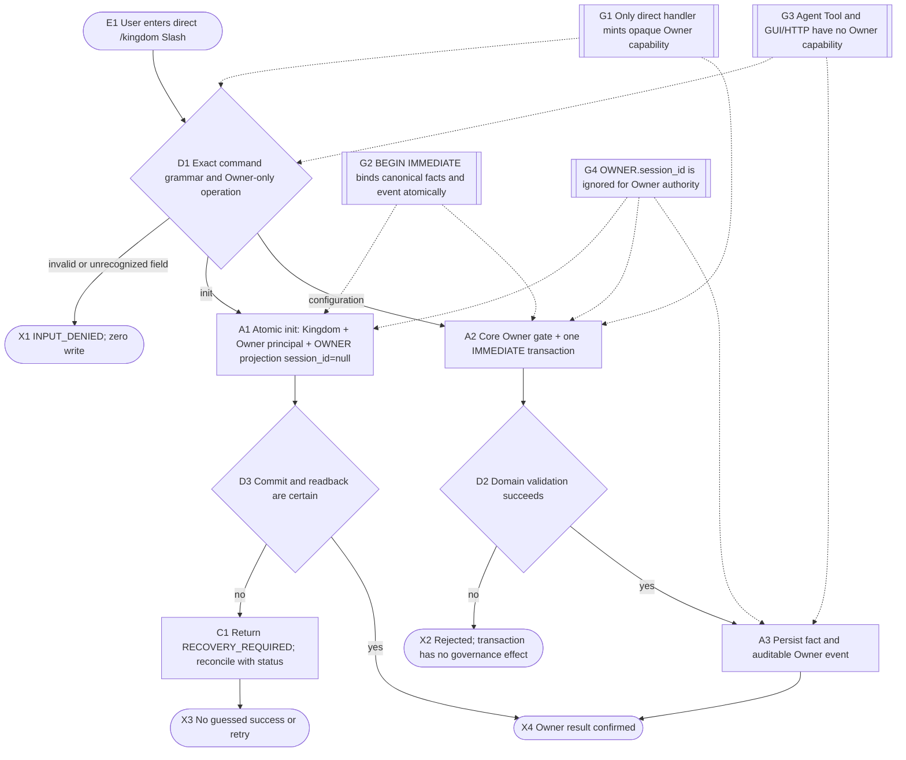
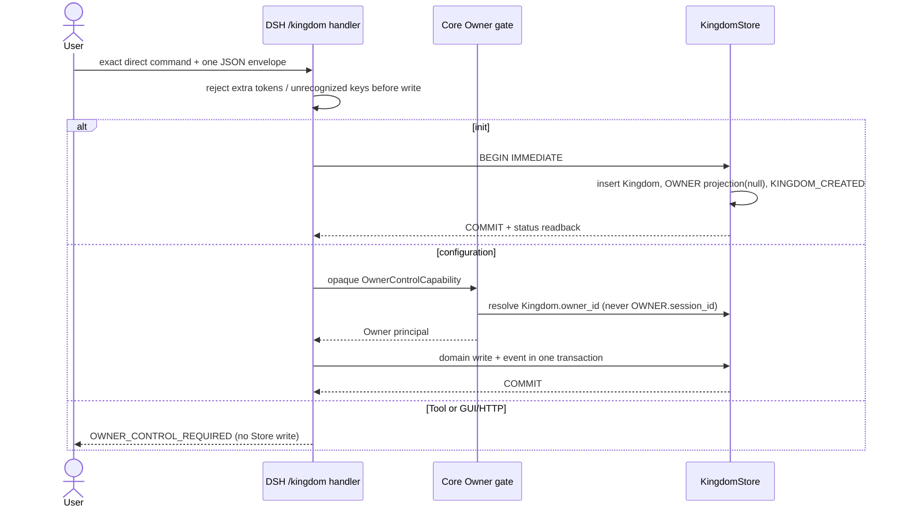
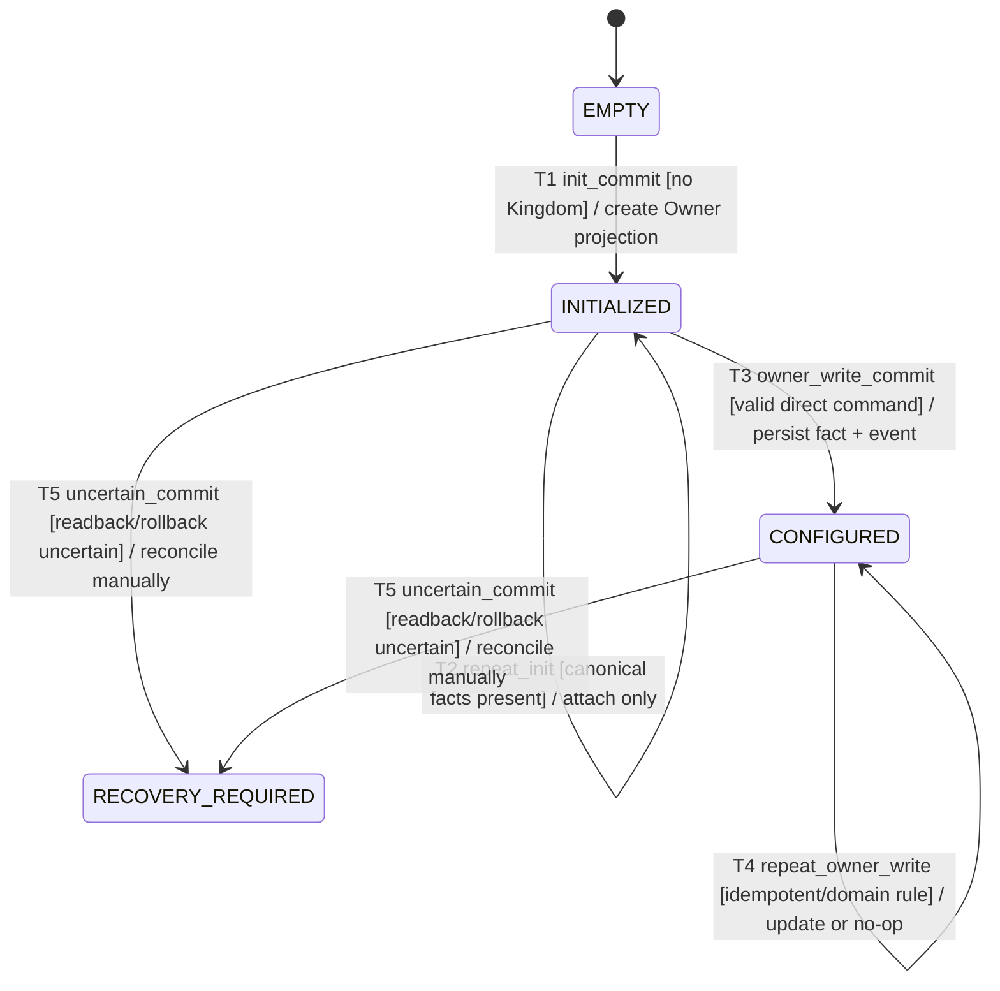

# Direct local Owner Control Plane

Owner is the trusted-local human operator.  A direct `/kingdom` Slash is the
only v1 Owner ingress; an Agent, Tool, GUI/HTTP request, argument, or
`OWNER.session_id` never supplies Owner authority.

## Runtime flow

## Component sequence

## State lifecycle

## Failure and audit guarantees

- Invalid grammar is rejected before any domain write; unrecognized keys and extra
  tokens cannot be interpreted as authority.
- `OWNER.session_id` remains `null`; any legacy non-null value is not read by
  the Owner gate and is never silently cleared.
- Owner event payloads contain `operation`, bounded argument summaries and
  `source_channel=LOCAL_DIRECT_SLASH`; `actor_id` is `Kingdom.owner_id`.
- A transaction error returns `RECOVERY_REQUIRED` with an indeterminate outcome; the adapter does not
  guess that a write committed or retry a potentially committed operation.
- Agent Role Plane remains separate and continues to use real DSH caller
  sessions for Chancellor/Supervisor/Worker authorization.

Implementation and test mapping is maintained in `traceability.yaml`.
