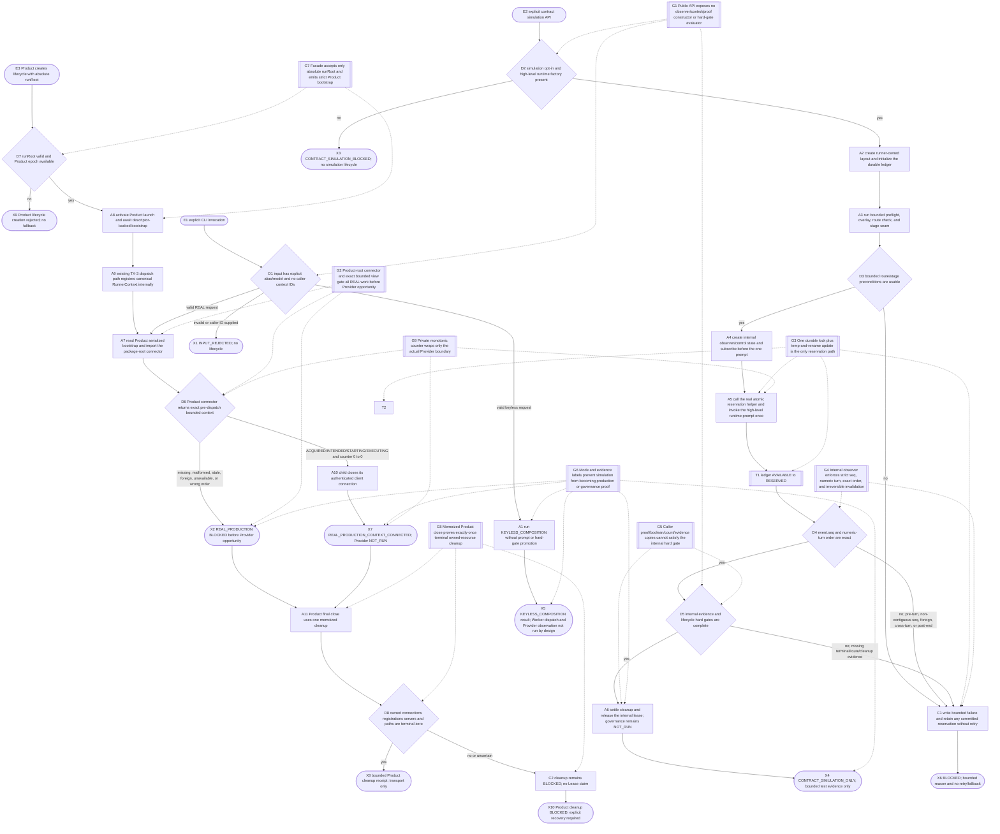
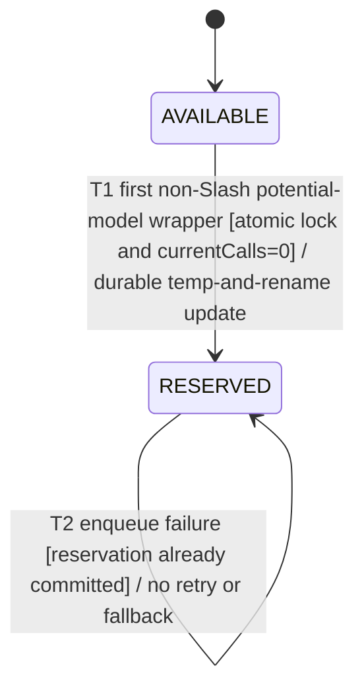

# Bounded runner modes and fail-closed REAL context boundary

## Boundary and evidence level

This contract has three deliberately separate modes:

- `KEYLESS_COMPOSITION` is the no-prompt composition path. It can prove only
  runner-owned setup/subscription/close observations and keeps Worker dispatch
  and Provider observation out of scope.
- `CONTRACT_SIMULATION_ONLY` is an explicit high-level test path. It may use a
  temporary durable ledger, a supplied high-level runtime factory, and
  synthetic official-shaped events. Its correlation values are generated by
  the orchestration for bounded accounting; caller IDs, proof objects,
  booleans, counts, or evidence copies are ignored and cannot promote a hard
  gate. It never calls governance and never produces `GOV_DONE`.
- `REAL_PRODUCTION` is the CLI/production branch. It reads only the
  Product-issued JSON in `DSH_KINGDOM_BROKER_SERIALIZED_ENV`, imports the
  connector from the public `dsh-kingdom` package root, and reads the
  child-owned broker's bounded pre-dispatch view. Missing, malformed, stale,
  foreign, unavailable, or out-of-order context fails closed before any
  opportunity ledger, runtime, route, or Provider surface. A valid context
  connection is reported as context-only; the Provider outcome remains
  `NOT_RUN`.

The Product package root also exposes one additive lifecycle facade. It accepts
only an absolute `runRoot`, owns launch activation, waits for descriptor
readiness before returning a strict serialized bootstrap, and memoizes final
close. Canonical RunnerContext registration remains inside the existing TX-3
Product dispatch path. Client close revokes only its connection/ticket; Product
final close owns server, registration, descriptor, and endpoint cleanup and
returns a bounded receipt only after all owned resource counts are zero. This
transport receipt is not Kingdom terminal evidence, settlement, or Lease
release.

The durable opportunity ledger is the only reservation source. The simulation
path exercises that same atomic helper; a committed enqueue failure remains
`state=RESERVED` with `currentCalls=1`, is consumed, and cannot retry or fall
back. The observer establishes the first accepted event envelope as its
sequence baseline, then requires every later notification envelope to use
exactly `lastEventSeq + 1`; gap, duplicate, and decrease are irreversible
negative evidence. Multiple inserted frames in one
`agent/inbox/spliced` envelope share that envelope's one `event.seq` and are
not counted as separate sequence advances. Numeric turns, receipt-before-turn,
target user/message ordering, one completed turn, bounded route source, and
synchronized idle remain required. After the target `turn/end`, only the
terminal idle status is usable; a next `turn/start`, plugin/inject/goal frame,
or foreign direct user frame is out of bounds. Synthetic same-envelope parser
tolerance is a CONTRACT_SIMULATION_ONLY check, not a real continuation claim.

This document remains `proposed` by route instruction. It is a construction
contract and does not claim Provider, DSH, Audit, Runner closure, or release
acceptance.

## Entry, decisions, and outcomes

- Entries: the explicit CLI parser (`parseRunnerArgs`) and the explicit
  `runContractSimulation({ simulationOptIn: true, ... })` API.
- Caller-controlled task/attempt/dispatch/session IDs are rejected by the
  CLI and are not accepted by either production hard-gate path. Simulation
  correlation is created inside its own bounded orchestration context.
- `REAL_PRODUCTION` accepts no caller governance IDs, Store, port, ticket,
  token, or broker launch object. The only context input is the serialized
  Product bootstrap consumed by the package-root connector.
- A valid Product view must be exactly the pre-dispatch shape
  `ACQUIRED/INTENDED/STARTING/EXECUTING`; the connector is closed before the
  branch returns, and no durable opportunity is consumed by this context-only
  checkpoint.
- A successful simulation result is `CONTRACT_SIMULATION_ONLY` with governance
  `NOT_RUN` and task status `REVIEW`; it is not a production terminal result.
- The module-private monotonic Provider-boundary counter increments only at the
  actual `client.prompt` boundary. `REAL_PRODUCTION` captures its internal
  start/end snapshots; the context-only path must report `0 -> 0` and
  `increments=0`, without accepting a caller counter or reset hook.

## Runtime flow



## Mode and event sequence

```mermaid
sequenceDiagram
    actor Caller
    participant Runner
    participant ProductOwner as Product lifecycle via package root
    participant Product as Product-child broker
    participant Context as Internal simulation context
    participant Ledger as Durable opportunity ledger
    participant Runtime as High-level runtime seam
    participant Observer as Internal bounded observer
    participant Evidence as Bounded evidence

    Caller->>Runner: Select KEYLESS_COMPOSITION, CONTRACT_SIMULATION_ONLY, or REAL_PRODUCTION
    alt REAL_PRODUCTION
        ProductOwner->>ProductOwner: create lifecycle(absolute runRoot)
        ProductOwner->>Product: activate launch and await descriptor readiness
        Product-->>ProductOwner: strict serialized bootstrap
        ProductOwner->>Product: existing TX-3 path registers canonical context internally
        Runner->>Runner: Parse DSH_KINGDOM_BROKER_SERIALIZED_ENV only
        Runner->>Product: import dsh-kingdom root and connect serialized bootstrap
        Product-->>Runner: Authenticated bounded broker client or fail-closed error
        alt missing/invalid/unavailable/wrong-order context
            Runner-->>Caller: BLOCKED before opportunity ledger; Provider NOT_RUN
        else exact ACQUIRED/INTENDED/STARTING/EXECUTING view
            Runner->>Product: read bounded Product view
            Product-->>Runner: Same relation view without governance IDs
            Runner->>Product: Close owned broker connection
            Runner-->>Caller: REAL_PRODUCTION_CONTEXT_CONNECTED; Provider NOT_RUN
        end
        ProductOwner->>Product: final close after either Runner outcome
        ProductOwner->>Product: repeated close joins same cleanup promise
        alt terminal owned resources all zero
            Product-->>ProductOwner: bounded cleanup receipt
        else cleanup absent/zero cannot be proven
            Product-->>ProductOwner: fail closed; no Lease settlement claim
        end
    else KEYLESS_COMPOSITION
        Runner->>Runtime: Use no-prompt composition path
        Runtime-->>Runner: Bounded setup/subscription/close result
        Runner->>Evidence: Mark Worker dispatch and Provider observation not run by design
    else CONTRACT_SIMULATION_ONLY
        Runner->>Context: Generate bounded correlation for this simulation
        Runner->>Ledger: Initialize temporary ledger as AVAILABLE
        Ledger-->>Runner: AVAILABLE
        Runner->>Observer: Subscribe before the single high-level prompt
        Runner->>Ledger: Atomically reserve once after subscription
        Ledger-->>Runner: RESERVED or fail closed
        Runner->>Runtime: Invoke the supplied runtime factory/prompt seam once
        Runtime-->>Observer: Synthetic official-shaped event envelopes with contiguous seq
        Note over Runtime,Observer: Frames inserted in one envelope share one seq; route observation is synthetic and Provider outcome remains NOT_RUN
        Observer-->>Runner: Receipt, numeric turn, target user, assistant route, completed end, idle
        alt invalid order or missing exact evidence
            Runner->>Evidence: Record bounded negative evidence; keep RESERVED/currentCalls=1
        else exact simulation evidence
            Runner->>Evidence: Record simulation-only route observation, Provider outcome NOT_RUN, and governance NOT_RUN
        end
    end
```

## Durable reservation state



`AVAILABLE` and `RESERVED` are the only durable ledger states in this
four-file contract. `currentCalls=1,state=RESERVED` means the opportunity was
persistently consumed, including after enqueue failure; there is no durable
`ACCOUNTED` state or `RESERVED -> ACCOUNTED` read-only transition here. The
synthetic assistant route can support parser correlation in
`CONTRACT_SIMULATION_ONLY`, but the real Provider outcome remains `NOT_RUN`.

The internal observer/control lifecycle is not a caller-facing or durable
proof object. Its ordered transitions are exercised only inside
`runContractSimulation`; any invalid transition stays rejected. This prevents
the old public proof-factory seam from being treated as production provenance.

## Safeguards and failure behavior

- Public proof/control/evaluator constructors are not exports. The only
  caller-facing simulation seam is a high-level runtime factory; the
  orchestration owns observer construction, event correlation, lifecycle
  transitions, and hard-gate evaluation.
- `runRealAttemptBranch` reads only `DSH_KINGDOM_BROKER_SERIALIZED_ENV` and
  calls `connectRunnerContextBroker` through the public `dsh-kingdom` package
  root. It never accepts a Store, governance ID, port, launch object, ticket,
  or token, and it never calls `createRunnerContextBrokerLaunch`.
- The Product connector authenticates the child-owned broker and supplies only
  the bounded wire view. `validateProductContextView` rejects anything other
  than `ACQUIRED/INTENDED/STARTING/EXECUTING`, including unavailable,
  recovering, released, stale, foreign, or terminal state. Connector, view,
  and close failures return BLOCKED before any opportunity reservation.
- `createRunnerContextBrokerProductLifecycle` accepts only an absolute
  `runRoot`. Its bootstrap contains only `environment` and `descriptor`; its
  memoized close returns only a bounded cleanup receipt. Neither surface
  accepts or returns Store, governance IDs, port, handle, ticket, token, caller
  proof, or caller counts.
- Canonical registration remains in `registerProductRunnerContext` after TX-3.
  Client close and Product final close have distinct ownership. Repeated final
  close joins the same promise; an unproven descriptor, endpoint, server,
  registration, or connection terminal state fails closed and cannot be
  described as Lease settlement/release.
- A connected Product context is a pre-provider checkpoint only:
  the module-private Provider-boundary counter reports start=0, end=0 and
  increments=0, `providerOutcome=NOT_RUN`, and no `AVAILABLE -> RESERVED`
  transition occurs in this branch. The counter has no exported setter or
  caller injection path and increments only immediately before `client.prompt`.
- `reserveProviderOpportunityAtomically` performs the durable lock,
  transition, temp write, rename, and one enqueue. Concurrent, repeated,
  Slash, and enqueue-failure cases cannot create a second opportunity.
- The first accepted event envelope establishes the sequence baseline; every
  later envelope must be exactly `lastEventSeq + 1`. Gap, duplicate, and
  decrease permanently invalidate the observer. Frames inserted in one
  `agent/inbox/spliced` envelope share one seq. The target `user/message` is
  exact only after the observed receipt and numeric `turn/start`; pre-turn,
  cross-turn, foreign direct, non-numeric, and post-end events invalidate the
  observer.
- Route source fields are bounded separately from requested route fields. A
  simulation may report synthetic route observation only from its observed
  assistant event; this does not count as a real Provider outcome. Caller
  counts and copied evidence do not count.
- Cleanup uncertainty is blocked and the simulation result never changes into
  governance ACCEPT/DONE. The test path writes only bounded summary evidence.

## Verification boundary

The scoped contract test checks the package-root connector and lifecycle,
fresh-child root-only import, registered-context read, client-close versus
Product-final-close ownership, repeated close, terminal zero receipt,
reconnect rejection, stale rendezvous failure, and the private no-Provider
counter. It does not start DSH, call a Provider, run keyless composition, pack,
or execute the full suite.
Required local checks for this round are:

- `node --check scripts/e2e/real-dsh-provider-v10.mjs`
- `node --test tests/real-dsh-provider-runner-contract.test.ts`
- `flowctl.py validate --allow-proposed`
- scoped `git diff --check`

Formal Audit, Flow finalize, keyless/DSH/Provider execution, pack/full suite,
commit, push, and release remain out of scope.
