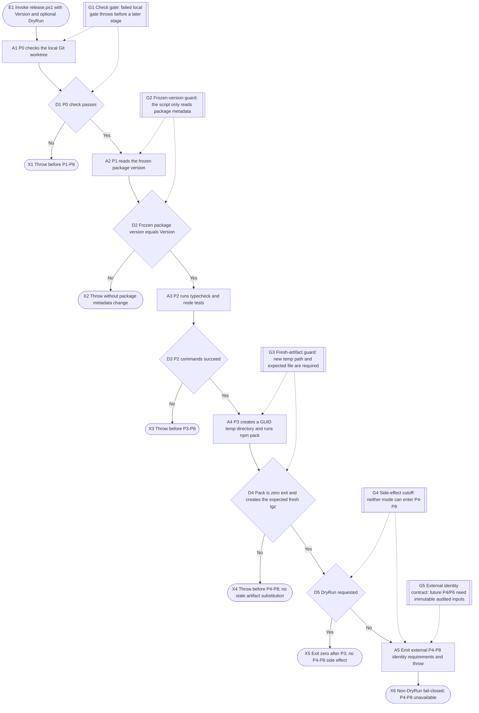
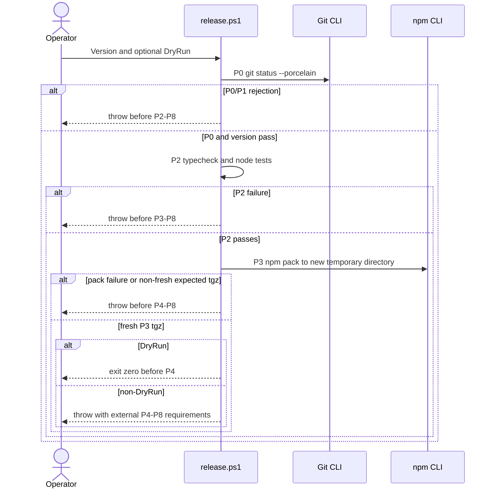

# v1.0 release pipeline P0-P3 local gate and post-audit handoff

## Purpose

`scripts/release.ps1` is only a local P0-P3 validation and pack tool. It reads
the frozen version, runs local quality gates, and creates a fresh tgz in a new
temporary directory. It never stages, commits, tags, pushes, uploads, publishes,
or announces a release.

After P3, `-DryRun` exits before P4. A non-DryRun invocation fails closed with
requirements for a separate post-audit governed command. P4-P8 are not callable
through this script.

## Entry, preconditions, and terminal outcomes

- Entry: `pwsh -File scripts/release.ps1 -Version <version>`, with or without
  `-DryRun`.
- Preconditions: P0 passes, `package.json` is already frozen at the requested
  version, and local TypeScript/test/pack tools are available.
- Success: P2/P3 pass and a DryRun exits zero before P4.
- Non-DryRun: P0-P3 may complete, then the script throws before P4-P8.
- Failure: a failed local gate, mismatch, failed pack, stale target, or missing
  target stops before a later stage.

## Runtime flow

## Component sequence

## External post-audit contract

The script does not implement an external release command. Its fail-closed
handoff requires that a separately authorized post-audit governed command:

- consumes a frozen explicit path manifest plus exact commit/tag identity for
  future P4 and stops before Git side effects on a missing or mismatched input;
- receives an exact audited tgz path plus expected SHA-256 for future P6, verifies
  both before side effects, and invokes `npm publish <exact-audited-tgz>` rather
  than repacking the working directory;
- remains separately governed and hard blocked here. These requirements neither
  authorize nor prove P4-P8.

## State lifecycle

The script persists no release state, so this contract has no state diagram.

## Safeguards

- G1: `Check` throws immediately on a failed local gate.
- G2: P1 reads the frozen package version and never changes package metadata.
- G3: P3 accepts only an invocation-specific expected tgz in a new temporary directory.
- G4: neither DryRun nor non-DryRun can execute P4-P8 through this script.
- G5: an external immutable-identity contract prevents fixed two-file staging,
  broad tag pushes, and working-directory publish from becoming callable routes.

## Failure, recovery, and observability

`Check` writes bounded PASS/FAIL detail and throws on failure. There is no retry,
Git mutation, registry mutation, or remote operation. A non-DryRun completion at
P3 is not release success: it ends in a fail-closed handoff requiring separate
audited evidence and authority.

## Implementation notes

The machine-readable code and test mapping is maintained in `traceability.yaml`.
