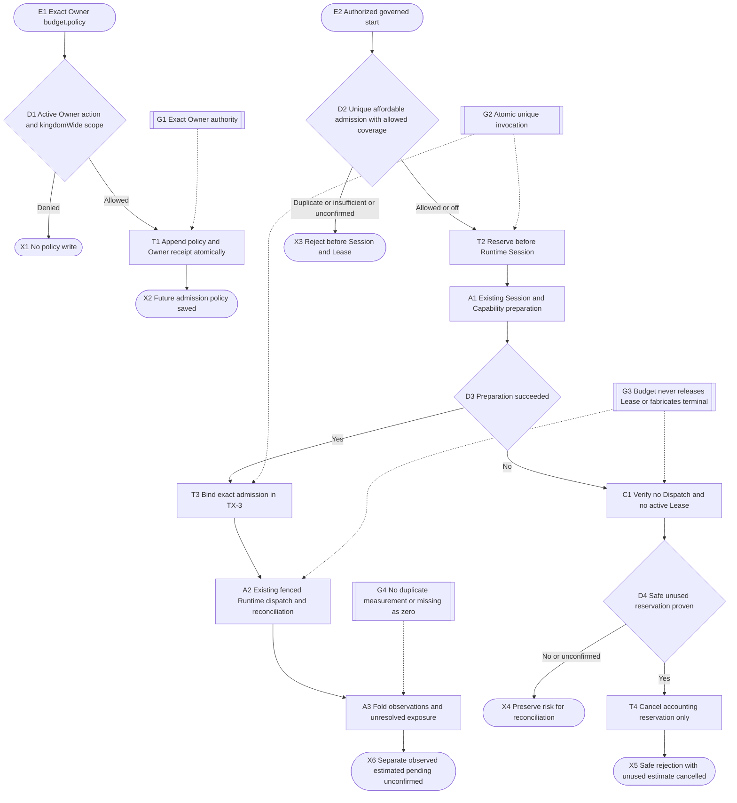
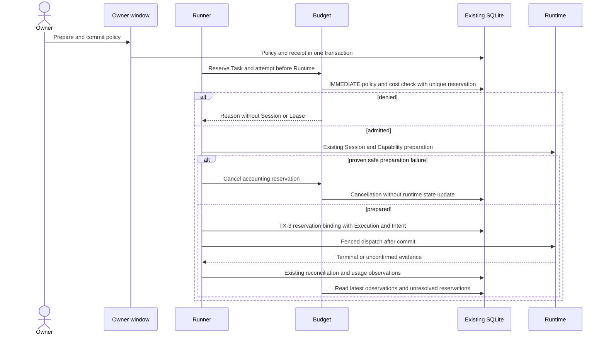
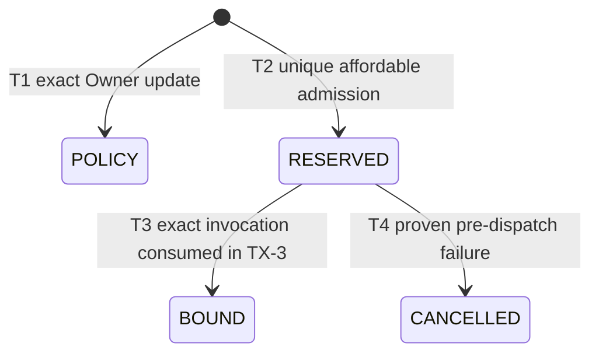
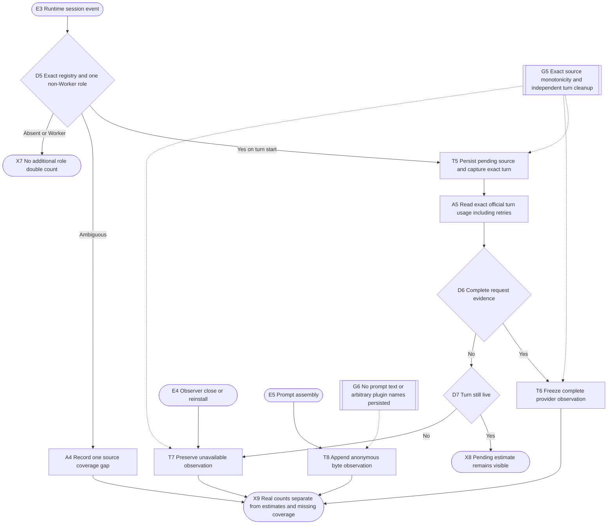
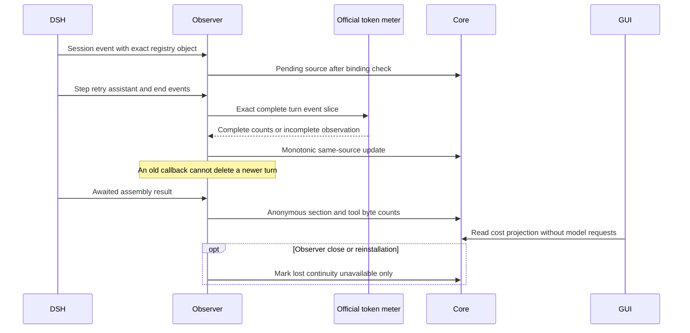
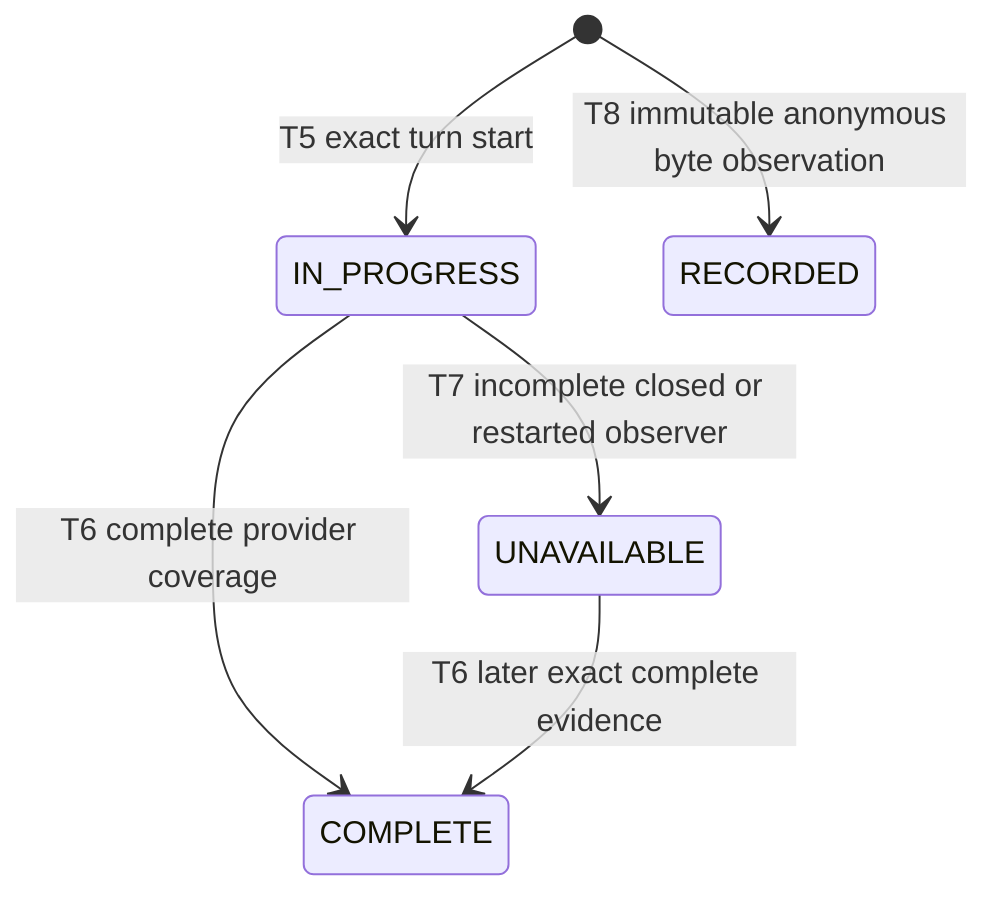

# Runtime cost observation and soft budget admission

Exact Owner budget.policy saves a prospective kingdom-wide policy with a fixed first accounting boundary. Default is off; editing, disabling or re-enabling never resets cost. Running work does not prevent reducing future admissions.

The first policy freezes exact carry-in admissions, unsettled Dispatches and incomplete non-Worker source references. Their exposure survives subsequent completion and policy edits. Previously complete role observations remain outside the new accounting period; public policy data does not reveal internal carry-in identifiers.

Governed start keeps existing Supervisor, model and active-Lease guards. Before ensureWorkerSession it atomically reserves an exact Task/attempt. Duplicate admission cannot authorize a second invocation. Existing TX-3 binds the reservation with Execution and Intent. Accepted preparation remains in flight after policy changes.

In 1.5 the same IMMEDIATE transaction checks an adopted plan's budget and dependencies,
reserves workspace access, and reserves kingdom budget. TX-3 binds both exact handles.
Read sharing requires the frozen Gate to prove read-only; unresolved ownership stays held.
The additional composition and its tests are in [bounded collaboration](../collaboration-bounded-plan/flow.md).

A reservation is an estimate, not authority, a monetary bill, execution termination or Lease release. Only proven failure before any Dispatch, with no active Lease or unsettled execution for that attempt, cancels it. unconfirmed/restart/RECOVERING retain risk. Runtime terminal and Lease cleanup remain owned by existing reconciliation.

Worker cost folds once per Dispatch using the latest complete provider report. readAdditionalBudgetUsage contributes verified non-Worker observations and explicit unconfirmed, pending and attribution gaps. Missing observations are not zero, and Worker-only data is never labelled full task cost.

Each pending non-Worker source receives an estimated reserve. A proven kingdom-owned shared or unattributed turn contributes to the kingdom total without allocation to individual tasks; its attribution gap warns but does not independently block admission. Missing usage follows the Owner BLOCK/WARN policy.

## Runtime flow

## Component sequence

## Persisted lifecycle

BOUND exposure is derived from the current cost observations. Complete terminal observation replaces the estimate; incomplete or in-flight work retains estimated exposure and coverage warnings. Restart never restores a historical reservation as live invocation authority.

## Required verification

## Role and prompt observations

Only the exact live registry object and Core role binding identify a role. Worker
Dispatch usage stays separate. Actor events identify related tasks, never an
exclusive allocation of the entire turn. One source freezes when complete;
sampling again cannot move it across the accounting boundary. The first policy
freezes incomplete role and identity-gap sources for carry-in. Close/restart
changes observation continuity only, never Execution or Lease state.

In-flight collections have their own cleanup set; removing a Session lookup
requires the same captured turn object. Installation marks only this runtime's
old pending observations unavailable, keeping source and accounting identity.
Completed reports and other runtime observations are untouched. There is no
claim that a disconnected observer stopped the Runtime.

The executable budget cases are in `tests/budget.test.ts`: exact Owner scope and receipt rollback; fixed accounting start and carry-in; last-slot competition; replay rejection; rejection before Session side effects; TX-3 identity checks and rollback; safe preparation cancellation and retry; unconfirmed and RECOVERING preservation; prospective policy reduction; deduplicated Worker observations and additional-role pending/shared/missing coverage. No paid-provider, formal migration or human acceptance evidence is claimed.
