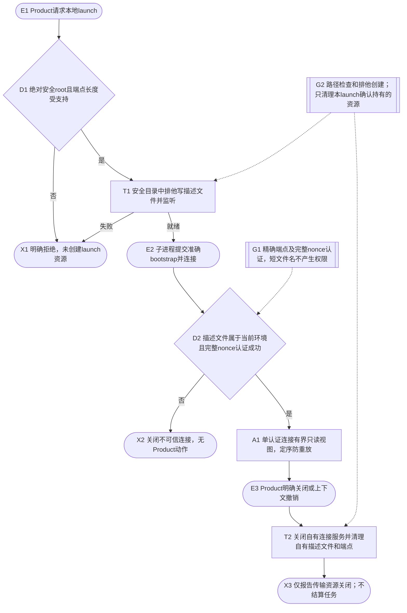
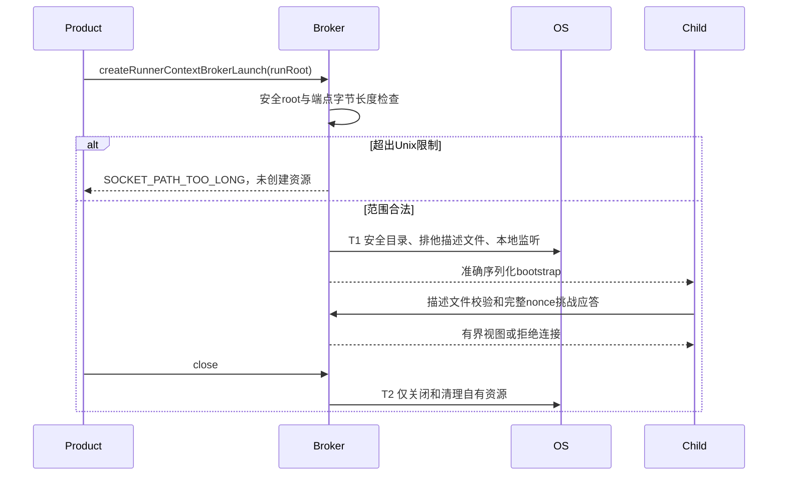
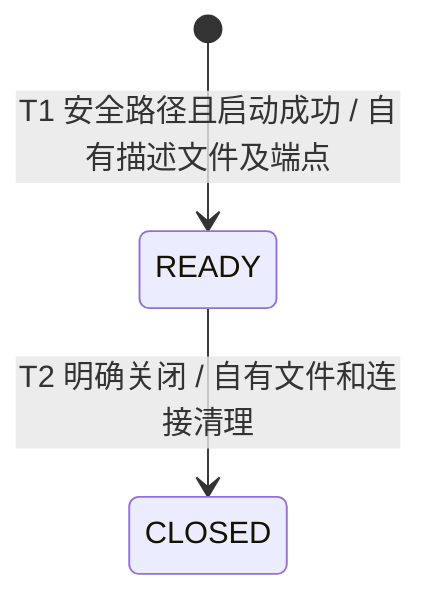

# 本地 RunnerContext 传输

本文只覆盖已实现的本地启动、认证连接、读取与关闭，不把进程间通信成功当作 Provider 执行、治理结算或 Lease 释放。真实 Provider runner 模式仍由原合同说明。

Product 使用绝对 runRoot，在其 .local/runner-context-broker 目录创建一次性描述文件和本地端点。Windows 使用原命名管道；Unix 使用 nonce 前20个base64url字符（120 bits）作为文件名，完整nonce继续参加认证。依照 [Node net 文档](https://nodejs.org/api/net.html#ipc-support)，Unix端点在任何文件或服务副作用前限制为103个UTF-8字节；超过时要求缩短runRoot。不会移到公共临时目录或删除无主socket。

认证前每个连接有五秒超时，消息大小、FIFO、版本及请求重放继续受原broker约束。监听失败只清理已能证明本launch拥有的资源；不删除造成冲突的外来socket。创建前路径拒绝没有重试，用户可选择更短root重新启动。关闭不确定性保持拒绝，不产生执行结算证据。

验证涵盖：当前公共连接及跨进程bootstrap、错误描述文件/nonce/重放、单连接、关闭所有权；Unix UTF-8路径超长时目录保持空。Windows专项与Linux CI分别记录，未执行的平台不推断通过。
