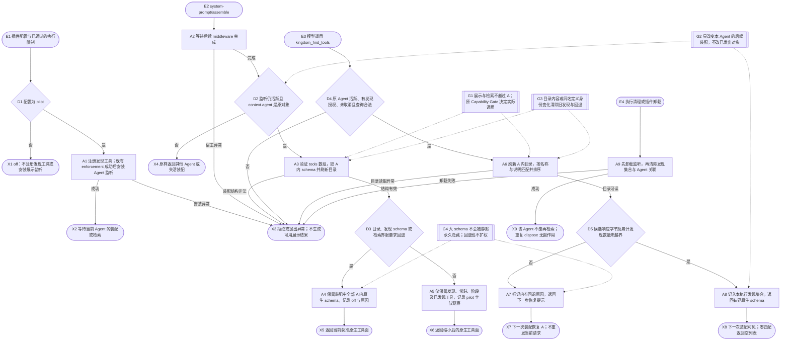
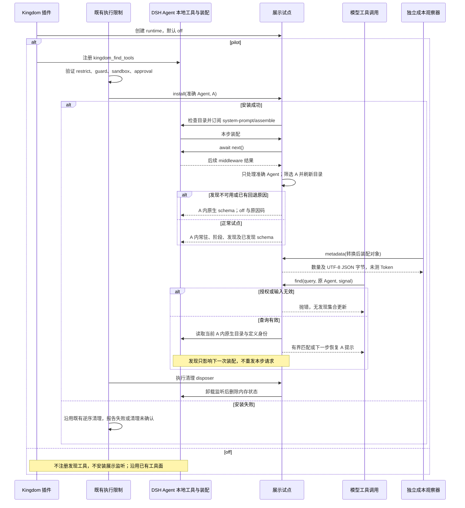

# 已授权原生工具的按需展示

本流程让已受 Capability Gate 限制的 Worker 在有限试点中先看到常驻、阶段和发现工具，再通过 kingdom_find_tools 找到本次执行已获准的其他工具。检索只改变下一步提示中的工具展示，不执行目标工具、不授权、不包装原生调用，也不创建新的持久状态。默认 off。合同按源码及五项结构型测试核对，保持 proposed，等待官方 DSH 接缝探针及最终集成验证；不宣称 Token 或任务总成本已下降。

## 入口、前提与结果

- 插件 apply 读取 toolDisclosure；off 不注册发现工具、不安装展示监听。pilot 注册工具，并将安装接缝交给运行适配器。
- 既有 restrict、单调拒绝 guard、sandbox/approval 证据及当前状态检查全部成功后，materializeDshEnforcement 才以准确 Agent 对象及 request.tools 安装监听。此授权集合记为 A；常驻或阶段配置不会扩大 A。
- 必须具备 Agent 本地 on、tools.schemas、tools.get；同一 Agent 不得重叠安装。安装异常使 materialize 失败并沿用既有清理，不带病派发。
- 成功结果为下一次装配中按原顺序保留的原生 schema，或有原因码的 A 内回退。错误身份、取消、无发现授权、非法查询直接拒绝。零匹配是合法空结果。
- 本流程不增加数据库、审计事件或权限状态。观察持久化属于 runtime.cost-control，本流程只给转换后的装配对象附加内存元数据。

## 运行流程

## 组件时序

## 界限与失败处理

- 常驻、阶段名单各至多 64 项；工具名必须符合限定格式。默认返回 3 项，允许 1–5；默认响应上限 12000 字节，允许 1024–64000。查询只允许 query，去空白后非空，原字符串至多 160 字符，最多取 8 个搜索词。按精确名称优先，再按名称和说明词匹配排序；不调用模型或远程检索。
- 最多累计发现 32 个工具。响应过大置 DISCOVERY_RESULT_TOO_LARGE，累计越界置 DISCOVERY_SET_LIMIT；下一步保留装配里的 A。目录或同名定义对象变化会清空发现集合及回退原因。
- 缺发现授权为 DISCOVERY_NOT_GRANTED；缺发现 schema 为 DISCOVERY_SCHEMA_UNAVAILABLE；装配时目录不可读为 TOOL_CATALOG_UNAVAILABLE。这些路径恢复 A，不自授发现权限。检索时目录异常直接传播；非法装配数组和后续 middleware 异常也直接传播，不伪造成功。
- await next() 沿用宿主装配的超时与失败处理，本层不增加超时、重试或请求重发。检索同步执行，仅在入口检查取消。卸载先调用宿主 disposer，成功后才声明失活；异常由既有 enforcement cleanup 报告，不能宣称清理完成。插件重新配置为 off 后重建 runtime，不恢复旧发现状态。
- 观察只包含 A 内 schema 的筛选前后数量、UTF-8 JSON 字节、实际本步模式及原因码；它不是最终供应商请求、缓存命中或 Token 账单。当前配置与历史观察分开显示。此层不记录查询、prompt 正文或目录内容到持久账本。

## 测试与尚待验证

tests/v14-tool-disclosure.test.ts 的五项测试映射：后续装配与 A 内发现；缺发现授权回退；目录及同名对象变化失效；大 schema 有界回退；off、错 Agent、非法输入、取消、重叠安装和正常清理。既有 S4/S6 测试覆盖原 enforcement 和清理机制。

五项测试使用结构型本地宿主与原 guard fixture，不能证明真实 DSH middleware 顺序、官方加载器接入或供应商收益。累计 32 项越界、目录异常、宿主卸载异常等源码分支在此五项测试中没有独立故障注入；本轮仅维护文档，不补写产品测试。官方接缝、真实模型请求、冷暖缓存配对和阶段验收由主流程记录，未取得证据前保持 proposed。没有新增持久生命周期，因此不绘制状态图。
